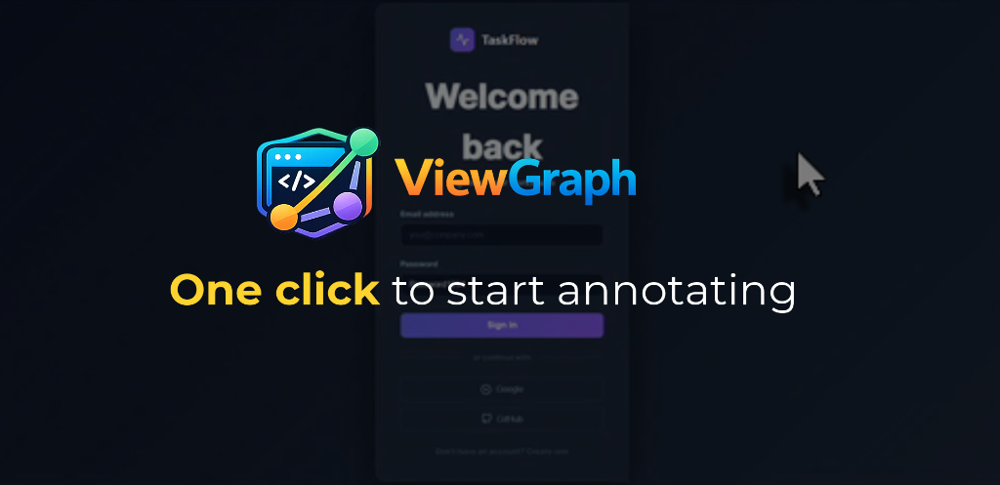

<p align="center">
  
</p>

<p align="center"><strong>The UI context layer for agentic coding.</strong></p>

<p align="center"><em>Built with Kiro, for Kiro - and every MCP-compatible agent.</em></p>

<p align="center">
  <a href="https://chaoslabz.gitbook.io/viewgraph">Documentation</a> -
  <a href="https://chaoslabz.gitbook.io/viewgraph/getting-started/quick-start">Quick Start</a> -
  <a href="https://github.com/sourjya/viewgraph">GitHub</a> -
  <a href="https://www.npmjs.com/package/@viewgraph/core">npm</a>
</p>

<p align="center">
  <a href="https://www.youtube.com/watch?v=ociXQLaY2z4">
    
  </a>
</p>

Browser extension + MCP server for AI-powered UI capture, auditing, and annotation.

ViewGraph captures structured DOM snapshots from any web page and exposes them to AI coding assistants via the [Model Context Protocol](https://modelcontextprotocol.io/). Agents can query page structure, audit accessibility, find missing test IDs, compare captures, track regressions, and act on human annotations - all through 34 MCP tools.

Works with any MCP-compatible agent: **Kiro**, **Claude Code**, **Cursor**, **Windsurf**, **Cline**, **Aider**, and more. No agent-specific code - pure MCP protocol. Tools that don't support MCP can read `.viewgraph.json` capture files directly from disk.

## Components

| Component | Description |
|---|---|
| [`server/`](./server/) | MCP server - 34 query/analysis/request tools, WebSocket collab, baselines |
| [`extension/`](./extension/) | Chrome/Firefox extension - DOM capture, annotate, 14 enrichment collectors, multi-export |
| [`packages/playwright/`](./packages/playwright/) | Playwright fixture - capture structured DOM snapshots during E2E tests |
| [`power/`](./power/) | Kiro Power assets - 3 hooks, 8 prompts, 3 steering docs, MCP config |

## How It Works

ViewGraph runs alongside your project as a standalone tool. It does not embed into your codebase or require changes to your application. It works with any web app regardless of backend technology (Python, Ruby, Java, Go, PHP, etc.).

```
Your app (any language) --> serves HTML --> Browser renders it --> Extension captures DOM
                                                                        |
                                                                        v
Kiro / Claude / Cursor  <-- MCP protocol <-- ViewGraph server <-- .viewgraph.json files
```

The extension captures the DOM from Chrome or Firefox. The server reads those capture files and exposes them to your AI agent via MCP. Your agent then uses this context to modify your source code - it never injects into or manipulates the running application directly.

## Getting Started

### Prerequisites

| Requirement | Minimum Version | Notes |
|---|---|---|
| Node.js | 18.0.0+ (LTS) | Runs the ViewGraph server and builds the extension |
| npm | 9.0.0+ | Workspaces support required |
| Chrome | 116+ | Manifest V3 browser extension |
| Firefox | 109+ | Manifest V3 browser extension |

Build for your browser of choice: `npm run build:ext` (Chrome, default) or `npm run build:ext -- --browser firefox`. See [extension/README.md](./extension/) for details.

### Step 1: Install ViewGraph

```bash
npm install -g @viewgraph/core
```

<!-- TODO: Uncomment when store listings are approved
Or install the browser extension directly:
- [Chrome Web Store](https://chrome.google.com/webstore/detail/viewgraph-capture/PLACEHOLDER)
- [Firefox Add-ons](https://addons.mozilla.org/en-US/firefox/addon/viewgraph-capture/)
-->

### Step 2: Build and load the browser extension

Build the extension:

```bash
npm run build:ext                        # Chrome (default)
npm run build:ext -- --browser firefox   # Firefox
```

**Chrome:**
1. Open `chrome://extensions/`
2. Enable **Developer mode** (toggle in top-right corner)
3. Click **Load unpacked**
4. Select: `<your-viewgraph-path>/extension/.output/chrome-mv3`

**Firefox:**
1. Open `about:debugging#/runtime/this-firefox`
2. Click **Load Temporary Add-on**
3. Select any file inside: `<your-viewgraph-path>/extension/.output/firefox-mv3`

The ViewGraph icon appears in your browser toolbar.

### Step 3: Initialize ViewGraph in your project

Open a terminal in **your project's root directory** and run:

```bash
viewgraph-init
```

The init script does the following automatically:
- Detects your AI agent (Kiro, Claude Code, Cursor, etc.) and writes the appropriate MCP config file
- Creates `.viewgraph/captures/` for storing capture files
- Installs Kiro Power assets (hooks, prompts, steering docs) if using Kiro
- Starts the MCP server as a background process

**How to verify it worked:** The extension sidebar shows a green dot when connected to the server. Click the ViewGraph toolbar icon on any page to check.

**Using a dev server or remote URL?** Add `--url` so the extension routes captures to the right project:

```bash
viewgraph-init --url localhost:3000
```

For multiple projects, multiple URLs, or editing patterns later, see the [Multi-Project Setup Guide](./docs/runbooks/multi-project-setup.md).

### Step 4: Capture and annotate

1. Navigate to your app in the browser
2. Click the **ViewGraph** toolbar icon - annotate mode activates
3. The sidebar opens with two tabs: **Review** (annotations) and **Inspect** (diagnostics)

**Annotating:**
- **Click** any element to select it and add a comment
- **Shift+drag** to select a region
- **Scroll wheel** while hovering to navigate up/down the DOM tree
- Set **severity** and **category** on each annotation via the floating panel

**Exporting:**
- **Send to Agent** - pushes annotations + full DOM capture to your AI agent via MCP
- **Copy MD** - copies a markdown bug report to clipboard (includes network/console data)
- **Report** - downloads a ZIP with markdown, screenshots, network.json, and console.json

Captures are saved to `.viewgraph/captures/` in your project and pushed to the MCP server automatically.

### Step 5: Let your AI agent act on captures

Your AI agent can now query captures through MCP. You don't call these tools directly - your agent does. Example prompts you'd give your agent:

```
"Audit the latest capture for accessibility issues"
"Find all buttons missing data-testid"
"Fix the annotations from my last review"
```

Behind the scenes, the agent calls tools like `audit_accessibility`, `find_missing_testids`, and `get_annotations`.

### Starting the server in subsequent sessions

The init script starts the server automatically on first run. For later sessions:

```bash
npm run dev:server       # run from the ViewGraph directory
```

Or re-run the init script from your project - it kills any stale server and starts a fresh one.

### Try the demo

Open [`docs/demo/index.html`](./docs/demo/) in your browser - a styled login page with 8 planted UI bugs. Annotate the issues, send to Kiro, and watch them get fixed. See the [demo walkthrough](./docs/demo/README.md) for step-by-step instructions.

## Workflows

ViewGraph supports three broad workstreams. For the full list of 27 problems it solves, see [Why ViewGraph?](https://chaoslabz.gitbook.io/viewgraph/why-viewgraph).

### For developers with AI agents

1. Open your app in the browser, click the **ViewGraph** icon
2. Click elements or shift+drag regions, add comments describing what to fix
3. Check the **Inspect** tab for network errors or console issues
4. Click **Send to Agent** - annotations bundle with the full DOM capture + enrichment data
5. Ask your agent to fix the issues - it has full DOM context

### For testers and reviewers (no AI agent needed)

The extension works standalone. No MCP server required.

1. Open the app in the browser, click the **ViewGraph** icon
2. Click or shift+drag to select problem areas, add comments
3. Export:
   - **Copy Markdown** - paste into Jira/Linear/GitHub (includes network failures, console errors, viewport breakpoint)
   - **Download Report** - ZIP with markdown, screenshots, network.json, console.json

### For teams

A tester annotates and exports to markdown. A developer annotates and sends to Kiro. A reviewer compares captures against baselines. Same tool, same workflow, same format - the only difference is where the output goes. See [Why ViewGraph?](https://chaoslabz.gitbook.io/viewgraph/why-viewgraph) for the full list of review, release, and platform workflows.

### For test automation teams

Capture structured DOM snapshots during Playwright E2E tests, or generate tests from browser captures:

- **Generate tests from captures:** Capture a page with the extension, ask your agent `@vg-tests` - it generates a complete Playwright test file with correct locators for every interactive element. 20-30 minutes of manual inspection reduced to one prompt.
- **Capture during tests:** Add `await viewgraph.capture('checkout-page')` to existing tests. The agent can then diff captures between runs, audit accessibility, and detect structural regressions.
- **Annotate from tests:** `await viewgraph.annotate('#email', 'Missing aria-label')` flags issues for the agent to fix with full DOM context.

See [`@viewgraph/playwright`](./packages/playwright/) for setup, API, and examples.

## Capture Accuracy

ViewGraph's capture accuracy is measured automatically against 150 diverse real-world websites using a [bulk capture experiment](./scripts/experiments/bulk-capture/). The experiment runs ViewGraph's DOM traverser via Puppeteer, then compares the output against live DOM ground truth across 7 dimensions.

**Latest results** (Set A - Breadth, 48 sites across 12 categories, 4 rendering types, 6 writing systems):

| Dimension | Median | What it measures |
|---|---|---|
| **Composite** | **92.1%** | Weighted combination of all dimensions |
| Selector accuracy | 99.7% | VG's CSS selectors resolve to real DOM elements |
| Testid recall | 100.0% | All `data-testid` elements captured |
| Interactive recall | 97.9% | Buttons, links, inputs captured |
| Bbox accuracy | 100.0% | Bounding boxes preserved through serialization |
| Semantic recall | 88.2% | Landmark elements (nav, main, header) captured |
| Text match | 53.1% | `visibleText` matches element text (see note) |

Full methodology, per-site breakdowns, and run history: [`scripts/experiments/bulk-capture/`](./scripts/experiments/bulk-capture/)

## Documentation

- [User Guide](https://chaoslabz.gitbook.io/viewgraph) - getting started, tutorials, feature guides
- [Quick Start](https://chaoslabz.gitbook.io/viewgraph/getting-started/quick-start) - zero to first fix in 5 minutes
- [Why ViewGraph?](https://chaoslabz.gitbook.io/viewgraph/why-viewgraph) - 27 problems it solves
- [Who Benefits?](https://chaoslabz.gitbook.io/viewgraph/who-benefits) - developers, testers, PMs, career switchers
- [Multi-Project Setup](https://chaoslabz.gitbook.io/viewgraph/getting-started/multi-project) - URL patterns, routing
- [@viewgraph/playwright](https://www.npmjs.com/package/@viewgraph/playwright) - Playwright fixture on npm
- [Roadmap](./docs/roadmap/roadmap.md) - milestone plan and completion status
- [Security Assessment](./docs/architecture/security-assessment.md) - threat model and mitigations
- [Spec Index](./.kiro/specs/README.md) - Kiro specs, ADRs, architecture docs
- [ViewGraph v2 Format Spec](./docs/architecture/viewgraph-v2-format.md) - capture format (v2.1.0)
- [Format Research](./docs/architecture/viewgraph-format-research.md) - format analysis and design rationale
- [Competitive Analysis](./docs/architecture/competitive-analysis-browser-mcp.md) - browser MCP comparison
- [Product Analysis](./docs/architecture/product-analysis.md) - user journeys, pain points, competitor matrix

## License

AGPL-3.0 - see [COPYING](COPYING) for the full license text.

Copyright (c) 2026 Sourjya S. Sen. See [ADR-009](docs/decisions/ADR-009-agpl-licensing.md) for licensing rationale.
