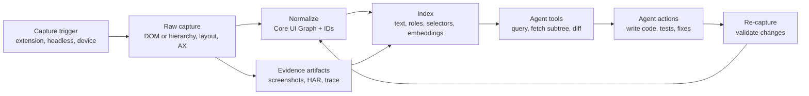
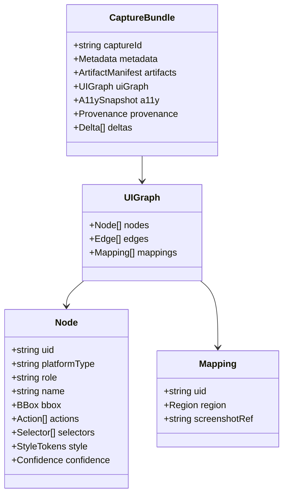

# ViewGraph Format Research

Part 1: Survey of page-layout representation formats for agentic coding agents.
Part 2: SiFR v2 analysis, LLM token efficiency, and ViewGraph v2 design decisions.

## Executive summary

A developer-focused “super assistant” that understands page layouts in full detail cannot rely on any single representation format. The reason is structural: the formats that are best at *visual truth* (screenshots, raster diffs) usually lack *semantic truth* (roles, labels, relationships), while the formats that excel at *semantic truth* (DOM trees, accessibility trees) often omit the *rendered truth* (exact pixels, clipping, transforms, z-order, and cross-platform parity). A robust setup therefore needs a **bundle of complementary artifacts per capture** plus a **unified schema** for cross-referencing everything via stable IDs and coordinate frames. This is consistent with how modern browser automation exposes distinct viewpoints: DOM, layout/box snapshots, and accessibility trees are separate APIs, each optimized for different use cases. cite

For web pages, the most “complete” machine-ingestable foundation today is **(a) DOM structure plus semantics**, **(b) computed layout geometry and paint ordering**, and **(c) accessibility tree naming and role exposure**, all grounded to **one or more screenshots**. Standards and official tooling align with this split: DOM and events are standardized, box generation and stacking contexts define how rendering happens, and the ARIA and accessibility mapping specs describe semantics exposure to assistive technologies. cite

For native mobile screens, parity comes from capturing both **view hierarchy** and **accessibility hierarchy** (they can diverge), plus screenshots. Android’s official documentation explicitly notes that an accessibility tree may not map one-to-one to the view hierarchy, because custom views may expose a virtual accessibility subtree. iOS automation similarly depends heavily on accessibility identifiers, labels, and frames exposed through accessibility APIs and UI testing frameworks. cite

Your current ViewGraph v2 approach already contains several critical ingredients (salience, clusters, selectors, computed styles, bounding boxes). The provided sample capture includes explicit metadata (viewport, devicePixelRatio, user agent), hierarchical nodes grouped by salience, spatial clusters with bounding boxes, inter-element relations, and detailed per-node selectors and attributes such as ARIA and test IDs. fileciteturn0file0 fileciteturn0file1
The biggest step-change to make it “agentic-ready” is to add: **authoritative screenshot grounding**, **accessibility-tree capture and DOM-to-AX mapping**, **incremental diff streams**, and **a security and provenance envelope**.

## Survey of page-layout representation formats

The ecosystem breaks into nine high-value families. Each family tends to be strong in a few dimensions and weak elsewhere, which is why a combined bundle is the practical end state.

### Comparative matrix of major formats

Legend: ✔ strong, ◐ partial/conditional, ✖ weak or not native to format.

| Format family (examples) | Expressiveness (structure, semantics, style, interactions) | Machine-readable | Spatial coords + transforms | Z-order + layers | Text extraction fidelity | Accessibility metadata | Event, action mapping | Versioning + diffs | Tooling ecosystem | Perf + size profile | Licensing, access | Typical use cases |
|---|---|---|---|---|---|---|---|---|---|---|---|---|
| Web source model (HTML, DOM, CSSOM) | Structure ✔, semantics ◐, style ◐, interactions ✔ | ✔ | ◐ (needs computed geometry) | ◐ (stacking contexts via CSS) | ✔ | ◐ (ARIA in-source, but computed names need algorithm) | ✔ (DOM + UI Events) | ◐ (DOM diffs doable, but no standard patch) | ✔ | Medium | Open standards | Auditing, test selectors, code navigation |
| Web rendered snapshot (CDP DOMSnapshot, CSSOM View boxes) | Structure ✔, semantics ◐, style ✔, interactions ◐ | ✔ | ✔ (bounding boxes; viewport relative) | ◐ (needs explicit paint order capture) | ✔ | ◐ (separate API for AX) | ◐ | ✔ (snapshots diff well) | ✔ | Large (can be huge DOMs) | Protocol docs open | Pixel-grounded layout reasoning, visual regression scaffolding |
| Web accessibility tree (AXTree, ARIA, AAM mappings) | Structure ✔, semantics ✔, style ✖, interactions ◐ | ✔ | ◐ (bounds not always guaranteed) | ✖ | ◐ (name/description computed; text order varies) | ✔ | ◐ (actions exposed via accessibility APIs) | ◐ | ✔ | Medium | Open standards + platform APIs | A11y audit, robust element naming, automation anchors |
| Document format (PDF 2.0, tagged PDF, PDF UA) | Structure ◐, semantics ◐ to ✔ (tagged), style ✔ (print fidelity), interactions ◐ | ✔ | ✔ (page coordinates) | ✔ (OCGs/layers) | ◐ (depends on tagging and Unicode mapping) | ◐ to ✔ (PDF/UA) | ◐ (forms, links) | ✔ (incremental updates exist; diffs nontrivial) | ✔ | Medium to Large | ISO based; some paywalled but widely implemented | Document viewing, extraction, accessibility compliance, archiving |
| Vector graphics (SVG) | Structure ✔, semantics ◐, style ✔, interactions ◐ | ✔ | ✔ | ✔ (document order, stacking contexts, optional z-index drafts) | ◐ (text may be text or paths) | ◐ | ◐ | ✔ (XML diffs) | ✔ | Small to Medium | Open standards | Diagrams, icons, overlays, region selectors |
| Design tool exports (Figma, Sketch, Adobe XD) | Structure ✔, semantics ◐, style ✔, interactions ◐ (prototypes) | ✔ | ✔ | ✔ (layer order) | ✔ (explicit text nodes) | ◐ | ◐ | ✔ (revision history varies) | ✔ | Medium to Large | Vendor APIs; access controlled | Design-to-code, component mapping, design audits |
| Declarative app UI schemas (Unity UXML/USS, JSON Forms UISchema, Adaptive Cards) | Structure ✔, semantics ◐, style ◐, interactions ◐ | ✔ | ◐ (layout rules often not baked to absolute coords) | ◐ | ✔ (text is first-class) | ◐ | ◐ | ✔ | ✔ | Small | Mixed (open specs + product ecosystems) | Portable UI definitions, schema-driven UIs |
| Native runtime hierarchies (Android View tree, iOS UIView tree, React Virtual DOM) | Structure ✔, semantics ◐, style ◐, interactions ✔ | ◐ (needs platform APIs) | ◐ to ✔ (frame/bounds available) | ◐ | ✔ | ◐ to ✔ | ✔ | ◐ | ✔ | Medium | Platform governed | Debugging, testing, instrumentation |
| Annotation formats (World Wide Web Consortium Web Annotation, IIIF, COCO, LabelMe) | Structure ◐, semantics ✔, style ✖, interactions ✖ | ✔ | ✔ (regions, selectors, polygons) | ◐ (layering by convention) | ✖ | ✖ | ✖ | ✔ | ✔ | Small to Medium | Mostly open (datasets vary) | Screenshot-to-element mapping, labeled UI datasets, review workflows |

Primary references for the dominant mechanisms above: DOM model and UI event semantics for web interaction, CSS box model and stacking contexts for geometry and paint order, CDP snapshot and accessibility APIs for capture, accessible name and mapping specs for computed semantics, PDF 2.0 and tagged PDF and PDF/UA for structured documents, SVG rendering order for z-axis paint rules, and vendor docs for design exports. cite

### Key format-specific observations that matter for agents

**Web DOM and events are the “source of truth” for structure and interaction hooks, but not for pixels.** The DOM standard defines node trees and the event model, and UI Events extend the DOM event object set for keyboard and mouse interactions. However, answering “where is this on the screen?” requires computed geometry (for example, bounding boxes) and paint order rules. cite

**Computed layout geometry is defined by CSS box generation and formatting rules.** CSS 2.x documents specify that elements generate boxes according to the box model and are laid out under the visual formatting model. Bounding box APIs are standardized in the CSSOM View module, which defines algorithms behind `getBoundingClientRect`. For agents, these are the coordinates that actually ground selectors to pixels. cite

**Z-order and layering for web require stacking-context reasoning.** The CSS 2 spec includes an explicit stacking context description that governs how overlapping content is painted. An agent needs either the derived paint order per element or enough computed properties to reconstruct it reliably. cite

**Accessibility trees are parallel realities, not just “DOM with roles.”** ARIA defines roles, states, and properties for accessible UI semantics, while mapping specs such as Core-AAM and HTML-AAM define how semantics are exposed to platform accessibility APIs. Accessible name computation is specified separately, because a node’s user-facing name is not always its DOM text. This matters because many automation strategies and “human-like” agents rely on accessible names and roles, not brittle selectors. cite

**PDF is visually reliable but semantically conditional.** PDF 2.0 is designed for environment-independent document representation. For structured understanding, tagged PDF defines accessibility mechanisms via structure elements and a structure tree; PDF/UA constrains tagged PDF usage so content is accessible, including requirements around Unicode mapping and logical reading order. When PDFs are scanned, OCR text must be associated and correctly tagged to achieve PDF/UA-quality extraction. cite

**SVG is excellent for geometry and overlays but incomplete for app semantics.** SVG 2 defines rendering order along a z-axis and stacking context behavior, making it strong for region overlays and hit-testing. But it does not natively encode high-level UI semantics or “what this control does” without additional metadata conventions. cite

**Design exports (Figma, Sketch, Adobe XD) are geometry-rich and component-aware.** Sketch documents are a ZIP of JSON files plus assets, making it a strong design-time interchange format. Sketch’s CLI can output a layer hierarchy with dimensions and positions. Adobe XD’s plugin scenegraph represents documents as a hierarchical tree, and node bounds can include all visible pixels via global draw bounds. Within Figma’s plugin model, child order is explicitly back-to-front, providing z-order semantics. cite

**Native “view hierarchies” and “accessibility hierarchies” diverge in practice.** Android’s Layout Inspector exposes a view hierarchy for runtime inspection, but the accessibility API describes a potentially different tree. This is why mobile UI automation often captures both an accessibility-sourced XML hierarchy and a screenshot. On iOS, a UIView has a frame and bounds in coordinate space, but test automation frequently hinges on accessibility identifiers. cite

**Annotation standards are the glue for screenshot grounding.** The Web Annotation Data Model supports selecting segments of resources using selectors, including SVG-based selectors for geometric regions. IIIF’s Presentation API explicitly moved from Open Annotation to the W3C Web Annotation model, which is a strong signal that Web Annotation is the modern interoperable choice for image-region annotations and provenance in this space. COCO and LabelMe provide widely-used conventions for bounding boxes, segmentations, and polygon annotations in computer vision datasets. cite

**How ViewGraph fits in this landscape.** Your ViewGraph v2 output is effectively a hybrid between a DOM-derived layout snapshot and a test-oriented element map: it stores metadata, a salience-filtered node tree, spatial clusters, relations, and detailed selectors plus attributes and computed styles. This is precisely the shape that helps agents conserve context while still having precise selectors and geometry. fileciteturn0file0 fileciteturn0file1

image_group{"layout":"carousel","aspect_ratio":"16:9","query":["Chrome DevTools accessibility tree panel screenshot","Chrome DevTools Elements panel DOM inspector screenshot","Android Studio Layout Inspector view hierarchy screenshot","Xcode view debugger hierarchy screenshot"],"num_per_query":1}

## Agentic coding agents’ input requirements

Agentic coding agents differ from “summarize this JSON” style LLM usage in one brutal way: they must *act*, see consequences, recover from ambiguity, and do so under context and safety constraints. Research and benchmarks on tool-using agents emphasize that coupling reasoning with actions and environment feedback improves reliability, and web-agent benchmarks show that even strong models struggle without better grounding and environment interfaces. cite

### Parsing requirements and preferred internal structures

Agents consistently do better with **typed graphs** than with raw blobs. For UI, that means:

A **tree** for containment plus **edges** for non-tree relations (label-for, described-by, control-to-menu, table row groupings, overlap relationships). This is aligned with how DOM is a tree with separate event flow semantics, and how accessibility APIs define roles, relations, and actions across a tree. cite

A **canonical coordinate frame** plus explicit conversions: CSS pixel coordinates (viewport-relative), scrolling offsets, and device pixel ratio for web; screen coordinates and bounds for mobile. Standard APIs describe bounding boxes relative to the viewport and require clear definition of what “bounding box” means. cite

A **stable identifier strategy**: internal node IDs (for cross-file joins), plus one or more stable selectors (data-testid, accessibilityIdentifier, resource-id). Your current ViewGraph v2 already stores test IDs and ARIA attributes within element details. fileciteturn0file0 cite

### Tokenization, size limits, and incremental updates

In practice, complete UI trees are large enough to blow past real-world context windows, and engineers are already asking for subtree extraction specifically to avoid “time and tokens” waste when dealing with accessibility trees. This is not hypothetical; it appears in real tooling discussions around returning partial accessibility subtrees. cite

Therefore, agent-friendly inputs need:

**Progressive disclosure**: a small summary first (above-the-fold, salient nodes, key clusters), then tool calls to fetch subtrees or details on demand. This aligns with ViewGraph's salience model and clustering strategy. fileciteturn0file1

**Patchable updates**: JSON Patch provides a standardized patch document format for updating JSON documents, and JSON Merge Patch provides a simpler “merge-like” alternative. For streaming binary representations, CBOR sequences are designed to concatenate independent CBOR items for streaming. cite

### Grounding to screenshots and multimodal alignment

A screenshot gives pixel truth, but it is useless to an agent unless you also provide **a mapping from pixels back to actionable elements**. The Web Annotation model’s selectors (including SVG selectors) supply an interoperable way to describe regions of an image resource, and IIIF has standardized around this for image-centric annotation exchange. For datasets and training or evaluation workflows, COCO and LabelMe demonstrate widely-used conventions for boxes and polygons on images. cite

Multimodal web agents explicitly rely on the combination of screenshots and structured environment signals to close the gap with text-only agents. WebVoyager, for example, frames the problem as completing web instructions end-to-end by interacting with real-world websites using multimodal models. cite

### Confidence, uncertainty, and provenance

Agents need to know which facts are authoritative and which are inferred. Provenance standards define how to represent information about entities, activities, and agents involved in producing a piece of data, supporting trust and quality assessment. This maps directly to “was this text extracted from DOM, OCR, or inferred?” and “which tool version captured this layout?” cite

A practical confidence model for UI capture typically tags fields with one of:

* **Measured** (browser or OS API reports, high confidence)
* **Derived** (computed from measured fields, medium-high)
* **Inferred** (ML/OCR or heuristics, variable)
* **User-provided** (test IDs, design-system mapping, high but only if maintained)

The standards and APIs above do not force this labeling, but they provide the foundation for tracking the capture method and semantics exposure mechanisms. cite

### Security and sandboxing requirements

Capturing layouts often implies running automation or instrumentation that can touch sensitive data (tokens in HAR files, PII in screenshots, secrets in DOM attributes). Web security specs such as Content Security Policy and Subresource Integrity exist to constrain resource execution and verify resource integrity, and provenance metadata can explicitly record redaction steps and capture context. For automation system design, a common pattern is to isolate capture processes and treat outputs as potentially sensitive artifacts requiring policy and redaction. cite

As a blunt statement: if you ship only screenshots, your agent is basically coding UI with oven mitts on. Funny once. Painful forever.

## Recommended combined output schema and minimal artifact set

### Design goal

The recommended output is a **capture bundle** that is:

Cross-platform (web, Android, iOS), because your target explicitly spans all three.

Grounded (every actionable node can be tied to pixels).

Diffable (you can stream changes without resending the world).

Auditable (explicit provenance and safety posture).

The most future-proof approach is to define a **platform-neutral Core UI Graph** and attach **platform-specific raw captures** as evidence. This mirrors how platform specs separate concepts: structure trees and event models, visual formatting and stacking rules, and accessibility semantics and mappings. cite

### Proposed combined schema: Unified Layout Capture Bundle

Name it whatever you like. Here is a concrete, implementable conceptual model:

**A. Manifest and provenance envelope**
- Capture metadata: URL or app screen identifier, timestamp, viewport/screen size, devicePixelRatio, locale, and tool versions, similar to what ViewGraph already stores. fileciteturn0file0
- Provenance chain: capture tool, transformation steps, redactions, diff base IDs, consistent with W3C provenance concepts. cite

**B. Evidence artifacts**
- Screenshot(s): viewport screenshot and optional full-page or scroll-stitch for web; device screenshot for mobile.
- Raw structural capture:
 - Web: DOM snapshot plus computed layout info from CDP snapshot APIs. cite
 - Android: UI hierarchy dump XML (bounds, ids, content-desc), plus accessibility tree if captured separately. cite
 - iOS: XCUIElement-derived hierarchy and frames, plus accessibility identifiers and labels. cite
- Accessibility tree:
 - Web: AXTree snapshot via CDP Accessibility domain or Puppeteer snapshot. cite

**C. Core UI Graph (normalized)**
- Nodes: one per meaningful UI element, with:
 - stable `uid`
 - `role` and `name` (prefer accessibility-derived naming where possible)
 - `bbox` in a declared coordinate frame
 - `z` ordering hints
 - selectors/locators and a ranking
 - available actions (click, input, scroll)
 - text content (DOM text and/or OCR fallback)
- Edges:
 - containment
 - label relations
 - table relations
 - overlaps
 - “mappedToScreenshotRegion” bindings

**D. Deltas and diffs**
- Structural diffs: JSON Patch or Merge Patch for JSON payloads. cite
- Visual diffs: pixel diffs for screenshots (pixelmatch) and optional perceptual metrics (SSIM, LPIPS). cite
- Layout stability metrics: CLS-style layout shift signals for web changes. cite

### Minimal viable artifact set per page/screen

This is the smallest set that still supports strong agentic behaviors: robust selection, visual grounding, accessibility auditing, and test generation.

| Artifact | Why the agent needs it | Web capture approach | Android capture approach | iOS capture approach |
|---|---|---|---|---|
| Viewport screenshot PNG | Pixel truth, debugging, visual diffing | CDP screenshot or automation screenshot | device screenshot (instrumentation) | device screenshot (instrumentation) |
| Normalized Core UI Graph JSON | One cross-platform query surface | build from DOM + layout + AX | build from hierarchy XML + a11y | build from XCUIElement + a11y |
| Full DOM or subtree serialization | Precise selectors, attributes, text | DOM snapshot API | N/A | N/A |
| Computed box model and bounding boxes | Screen grounding, hit targets | CSSOM View bounding boxes or DOMSnapshot layout | bounds from hierarchy dump | element frames and accessibilityFrame |
| Accessibility tree snapshot | Roles, names, a11y checks, robust naming | CDP Accessibility domain or Puppeteer snapshot | AccessibilityNodeInfo tree | accessibility hierarchy via test APIs |
| Screenshot-to-element mapping | Multimodal alignment, click planning | bind node IDs to bbox regions | bind nodes to bounds | bind nodes to frames |
| Stable test locators report | Reliable test generation | data-testid, role/name selectors | resource-id, content-desc | accessibilityIdentifier |
| Provenance and redaction report | Trust, privacy, auditability | manifest-level | manifest-level | manifest-level |

Rationale sources: web snapshots and accessibility trees are distinct protocol domains; Android hierarchy dumps include bounds and attributes; iOS testing depends on accessibility identifiers and element geometry; accessible naming is specified; and provenance has a dedicated standard model. cite

### Optional but high-leverage additions for a “super assistant”

These additions are not “nice to have”; they are what turns the system into something developers will pay for because it saves time repeatedly.

- **Network artifact**: HAR capture for request context, plus replay support. HAR is a widely used format for logging browser HTTP interactions, and modern testing tools can record and route from HAR. cite
- **Interaction trace**: action-by-action screenshots plus DOM snapshots (Playwright trace viewer produces DOM snapshots to inspect state across actions). cite
- **Accessibility audit results**: integrate an engine like axe-core which returns JSON accessibility violations. cite
- **Visual regression suite**: pixel diffs plus perceptual diffs and layout-shift alerts. cite
- **Design-system mapping**: link design tokens or components to nodes (Figma components, Sketch symbols, Adobe XD scenegraph nodes) to bridge design-to-code. cite

## Implementation guidance, schemas, and example payloads

### Serialization, compression, and streaming choices

A pragmatic stack that balances developer ergonomics and production performance:

**Human-debuggable canonical storage: JSON (optionally JSON-LD).** JSON-LD is a JSON-based linked-data format intended to integrate into existing JSON systems while enabling interoperable semantics. It pairs well with Web Annotation style selectors and provenance modeling. cite

**Streaming and high-throughput: Protobuf or CBOR (or CBOR sequences).**
- Protobuf is compact and designed for efficient wire encoding; its encoding docs describe the wire format and space concerns. cite
- CBOR is explicitly designed for small message size and extensibility; CBOR sequences support concatenating multiple CBOR items in a stream. cite

**Compression: zstd or Brotli depending on your transport.**
- Brotli is standardized as a compressed data format suitable for web use. cite
- Zstandard is designed for real-time compression scenarios and has an IETF RFC describing its use as a content encoding and media type. cite

**Deltas: JSON Patch, JSON Merge Patch.**
- JSON Patch (RFC 6902) is the most explicit and operation-based. cite
- JSON Merge Patch (RFC 7396) is simpler and “shape-like,” but has limitations with arrays. cite

### API surface and retrieval model

Use a tool-driven interface rather than dumping everything into one prompt. Benchmarks and real tooling discussions show that agents benefit from action-feedback loops and from limiting context to relevant subtrees. cite

A minimal capture API design:

- `capture.create(params)` → returns `captureId`
- `capture.getSummary(captureId)` → returns page/screen summary + cluster map
- `capture.getNodes(captureId, filter)` → returns nodes by role/action/text query
- `capture.getSubtree(captureId, rootUid, depth)` → returns bounded subtree
- `capture.getA11y(captureId, rootUid?)` → returns AX subtree
- `capture.getArtifacts(captureId)` → returns artifact manifest (paths/hashes)
- `capture.diff(a, b, mode)` → returns structural patch + optional visual diff metrics

### Mermaid diagrams





### Sample schema outline

This JSON is intentionally minimal but captures the join points that matter (IDs, coordinate frames, provenance, mapping).

```json
{
 "schema": "ulcb-1.0",
 "captureId": "2026-04-08T06:14:41Z:web:localhost:5173/jobs",
 "metadata": {
 "platform": "web",
 "url": "http://localhost:5173/jobs",
 "timestamp": "2026-04-08T06:14:41.771Z",
 "viewport": { "width": 1696, "height": 799 },
 "devicePixelRatio": 1.1321,
 "tools": [{ "name": "capture-extension", "version": "2.x" }]
 },
 "artifacts": {
 "screenshots": [{ "id": "viewport", "mime": "image/png", "sha256": "..." }],
 "domSnapshot": { "mime": "application/json", "sha256": "..." },
 "a11ySnapshot": { "mime": "application/json", "sha256": "..." },
 "networkHar": null
 },
 "coordinateFrames": [
 { "id": "cssPxViewport", "unit": "css_px", "origin": "viewport_top_left" },
 { "id": "devicePx", "unit": "device_px", "origin": "viewport_top_left" }
 ],
 "uiGraph": {
 "nodes": [
 {
 "uid": "n:btn:talk",
 "platformType": "web.dom",
 "role": "button",
 "name": "Talk",
 "bbox": { "frame": "cssPxViewport", "x": 865, "y": 14, "w": 99, "h": 36 },
 "selectors": [
 { "kind": "css", "value": "button[data-testid='talk']", "rank": 1 }
 ],
 "actions": [{ "kind": "click" }],
 "confidence": { "bbox": 0.99, "name": 0.95, "role": 0.9 },
 "provenance": { "bbox": "computed-layout", "name": "a11y-name-or-text" }
 }
 ],
 "mappings": [
 {
 "uid": "n:btn:talk",
 "screenshotId": "viewport",
 "region": { "kind": "bbox", "x": 865, "y": 14, "w": 99, "h": 36 }
 }
 ]
 }
}
```

### Example payload grounded in your current ViewGraph v2 structure

Your ViewGraph v2 already provides: per-page metadata, salience buckets, clusters, element bounding boxes, selectors, attributes like `data-testid`, and ARIA attributes, plus computed styles. In short: it is an excellent “summary-first” representation. fileciteturn0file0 fileciteturn0file1
To make it a full capture bundle, add artifact references (screenshots, optional HAR, optional AX snapshot) and an explicit node-to-screenshot binding table. The web platform protocols already expose the necessary raw sources: DOMSnapshot for layout and the Accessibility domain for AX trees. cite

### Example payload for a native mobile screen

For Android, a common real-world baseline is “screenshot + hierarchy dump” where the XML contains node attributes including bounds, resource IDs, class names, text, and content descriptions. This is explicitly described in tooling documentation around `uiautomator dump`. cite

```json
{
 "schema": "ulcb-1.0",
 "captureId": "2026-04-08T06:20:10Z:android:com.example.app:Login",
 "metadata": {
 "platform": "android",
 "appId": "com.example.app",
 "screen": "Login",
 "timestamp": "2026-04-08T06:20:10.112Z",
 "device": { "model": "Pixel-like", "os": "Android" }
 },
 "artifacts": {
 "screenshots": [{ "id": "device", "mime": "image/png", "sha256": "..." }],
 "nativeHierarchy": { "mime": "application/xml", "sha256": "..." },
 "a11ySnapshot": { "mime": "application/json", "sha256": "..." }
 },
 "uiGraph": {
 "nodes": [
 {
 "uid": "a:resourceId:com.example.app:id/login_btn",
 "platformType": "android.view",
 "role": "button",
 "name": "Log in",
 "bbox": { "frame": "devicePx", "x": 120, "y": 1650, "w": 840, "h": 140 },
 "selectors": [
 { "kind": "resource-id", "value": "com.example.app:id/login_btn", "rank": 1 },
 { "kind": "text", "value": "Log in", "rank": 2 }
 ],
 "actions": [{ "kind": "click" }],
 "provenance": { "bbox": "uiautomator-bounds", "name": "accessibility-or-text" }
 }
 ]
 }
}
```

For iOS, the equivalent is “screenshot + XCUIElement tree + accessibility identifiers and labels,” where identifiers are intended for automation and labels for user-facing accessibility. cite

## Tooling and libraries to generate and consume artifacts

### Web capture and layout extraction

- **Headless browser automation and capture**: Puppeteer provides high-level automation over Chrome DevTools Protocol and WebDriver BiDi, and exposes APIs for screenshots and accessibility snapshots. cite
- **Protocol-level layout snapshots**: CDP’s DOMSnapshot domain provides document snapshots with DOM, layout, and style information. cite
- **Accessibility capture**: CDP’s Accessibility domain supports retrieving full or partial accessibility trees; enabling it can keep AXNode IDs consistent across calls but may impact performance while enabled. cite
- **WebDriver and WebDriver BiDi for standardized automation**: WebDriver defines a remote control interface for introspection and control of user agents, and BiDi defines a bidirectional protocol for remote control and events. cite
- **Network capture**: HAR is a standard-ish de facto format for HTTP archive logs, and Playwright can record and route from HAR for replay. cite
- **Interaction traces**: Playwright trace viewer records and allows inspection of state over time, including DOM snapshots and other debugging signals. cite

### Mobile capture and hierarchy extraction

- **Android**: Layout Inspector provides runtime view hierarchy inspection; UI Automator tooling can dump a hierarchical XML with bounds and attributes; accessibility APIs expose AccessibilityNodeInfo trees. cite
- **iOS**: UIView geometry is defined via frame and bounds; automation often relies on accessibility identifiers, and UI test frameworks provide XCUIElement abstractions for interaction. cite
- **Cross-platform automation**: Appium’s “Get Page Source” returns HTML in web contexts and application hierarchy XML in native contexts, and the XCUITest driver references accessibility snapshots for page source generation and attribute retrieval. cite

### Design-tool capture and design-to-code mapping

- Sketch file format is a ZIP archive containing JSON encoded data; Sketch CLI inspection can output layer hierarchies with dimensions and positions. cite
- Adobe XD’s plugin scenegraph is a hierarchical tree, and nodes expose global draw bounds in global coordinate space. cite
- Figma’s REST API exposes file and node endpoints; in the plugin scene graph, child order is back-to-front, making z-order explicit. cite

### Visual diffs, OCR, and accessibility audits

- **Pixel diffs**: pixelmatch is a small pixel-level image comparison library created for screenshot diffs. cite
- **OCR**: Tesseract provides an OCR engine and command line tool, with modern LSTM-based recognition. cite
- **Automated accessibility auditing**: axe-core is an accessibility testing engine that returns JSON results of issues. cite

### Integration patterns with agentic coding agents

A robust integration pattern is:

Tool-first: the agent queries summaries and targeted subtrees, rather than receiving full captures.

Grounded selection: the agent chooses elements by role and accessible name (more stable) and only falls back to CSS/XPath when necessary, consistent with accessibility naming and mapping specs. cite

Action-feedback loops: the agent should validate assumptions by acting, recapturing, and diffing, aligning with ReAct-style reasoning plus acting and with findings from web agent benchmarks. cite

Retrieval augmentation: index per-node text, roles, selectors, and cluster summaries; then retrieve relevant nodes for a task such as “generate Playwright tests for all buttons lacking data-testid.” Your ViewGraph MCP Bridge concept already describes MCP tools like listing captures, querying elements by role, and comparing captures. fileciteturn0file1

## Evaluation metrics, trade-offs, and a prioritized roadmap

### Fidelity and usefulness metrics

A “layout understanding” system should be evaluated on both correctness and downstream developer value.

**Structural and semantic fidelity**
- Node coverage: proportion of visible interactive elements in screenshot that are represented in the Core UI Graph.
- Selector stability: test locators remain valid across small UI refactors.
- Accessibility correctness: role/name exposure aligns with ARIA roles, mappings, and name computation expectations. cite

**Geometric and visual fidelity**
- Bounding box alignment: IoU between reported boxes and pixel-derived boxes for key elements.
- Visual similarity: SSIM and LPIPS are widely used similarity metrics; SSIM is classically defined for structural similarity, and LPIPS is designed to correlate with perceptual similarity. cite
- Layout stability: CLS measures unexpected layout shifts over a page lifecycle; for regression systems, CLS-like signals help prioritize meaningful layout changes. cite

**Agent effectiveness**
- Task success rate on representative developer tasks (generate tests, locate a11y issues, implement UI change).
- Intervention rate: how often a human had to correct the agent’s element grounding.
- Time-to-fix: end-to-end time saved relative to baseline.

Web agent benchmarks provide a reality check that success rates can remain low on realistic tasks without better environment interfaces and grounding, making these metrics necessary, not academic. cite

### Core trade-offs for a developer “super assistant”

**Real-time vs batch**
- Real-time capture and streaming deltas enables interactive debugging but increases compute, storage churn, and privacy exposure.
- Batch capture is cheaper and safer but less helpful for “debug now” workflows.

Streaming protocols and patches enable either mode: JSON Patch and Merge Patch for JSON; CBOR sequences for streaming; compression like zstd or Brotli to control bandwidth. cite

**Storage vs compute**
- Keeping full DOM snapshots, AX trees, and high-res screenshots for every step is expensive but enables retroactive debugging.
- A tiered approach helps: store full bundles for key checkpoints, store deltas for intermediate steps, and prune raw artifacts while retaining normalized graphs and summaries.

**Privacy vs usefulness**
- HAR and screenshots are high risk because they can capture tokens, personal data, and internal content.
- Mitigate with strict scoping (allowlists), redaction rules, and explicit provenance records of what was captured and what was scrubbed. Provenance modeling supports auditable capture pipelines, and web security controls like CSP and SRI are relevant reference points for integrity and execution constraints. cite

### Prioritized roadmap

**Phase alpha: Web-first, bundle foundation**
- Implement capture bundle packaging: screenshot + DOMSnapshot + AX snapshot + Core UI Graph.
- Add node mapping: DOM node or internal UID to screenshot regions using bounding boxes and declared coordinate frames.
- Provide tool endpoints for summary, subtree fetch, and “interactive elements missing stable locators.”
- Add diff: JSON Patch between captures and pixelmatch screenshot diffs. cite

**Phase beta: Interaction traces and network context**
- Add Playwright-style traces: action timeline with per-step DOM snapshot and screenshot.
- Add HAR capture and optional replay workflows. cite

**Phase gamma: Mobile parity**
- Android: unify `uiautomator dump` XML, Layout Inspector-derived properties where available, and AccessibilityNodeInfo-based semantics.
- iOS: unify XCUIElement snapshots and accessibility identifiers with screen geometry. cite

**Phase delta: Design-to-code and component mapping**
- Ingest design exports and map components to runtime nodes via geometry + text + token matching.
- Exploit design layer ordering and bounds as priors for UI structure. cite

**Phase production: Safety, governance, and evaluation automation**
- Add redaction policies and provenance audit trails per capture.
- Establish continuous evaluation using task suites and layout stability metrics.
- Add enterprise controls for retention and access.

This roadmap aligns with the core empirical lesson from tool-using agent research: agents become more reliable when their actions are grounded in environment feedback, and when they can retrieve targeted context rather than being forced to ingest massive unstructured dumps. cite
---

# Part 2: SiFR v2 Analysis and ViewGraph Format Design


**Date:** 2026-04-08

**Status:** Complete

**Purpose:** Inform the ViewGraph v2 format specification with evidence-based findings

---

## Credits and Lineage

ViewGraph's capture format is inspired by the **SiFR v2 format** created by
[Element to LLM](https://addons.mozilla.org/en-US/firefox/addon/element-to-llm/)
(v2.8.1), a browser extension by **Insitu** (info@insitu.im). The SiFR format
introduced several ideas we build on: section-marker keys for greppability,
three-tier salience scoring, spatial clustering with grid positions, budget-based
output sizing, and structural pattern detection with exemplar/instance compression.

ViewGraph v2 is a clean-room redesign. We do not reuse any SiFR code (which is
BSL 1.1 licensed). We adopt the conceptual patterns that work, fix the weaknesses
identified below, and add capabilities the original format lacks.

---

## 1. LLM Token Efficiency Findings

### 1.1 JSON overhead is significant for repeated structures

Research on LLM context compression consistently shows JSON is 20-50% more
token-expensive than alternatives when representing arrays of similar objects
(refs 5, 6, 9, 10). The overhead comes from:

- Repeated key names in every object (e.g., `"tag"`, `"parent"`, `"children"`
 repeated per node)
- Structural characters: `{}`, `[]`, `""`, `,` consume tokens with zero
 semantic value
- Deeply nested objects compound the problem multiplicatively

**Benchmarks (ref 5):**

| Format | Token reduction vs JSON | Notes |
|---|---|---|
| YAML | 10-25% | Minimal for small arrays; grows with array size |
| Columnar JSON | 25-50% | Keys appear once; data as arrays. JSON-compatible |
| Markdown tables | 20-40% | Headers once; highly effective for 100+ rows |
| Field filtering | 30-60% | Removing unused fields is the single biggest win |

**Key insight:** Columnar JSON (keys declared once, data as parallel arrays)
saves 35-45% tokens while remaining valid JSON (ref 5). This is exactly what CDP's
`DOMSnapshot.captureSnapshot` uses (ref 28) - a shared string table with integer
indexes into it. The format was designed for wire efficiency, but it's also
LLM-efficient.

### 1.2 Section markers: good for greppability, minor token cost

SiFR's `====METADATA====` style section markers add ~5 tokens each (6 sections
= ~30 tokens). This is negligible compared to the content. The benefit is real:
LLMs can locate sections by pattern matching, and human developers can grep
captures. **Keep them.**

### 1.3 Nested styles are the biggest token sink

In SiFR v2 captures, computed styles are the largest section by far. A single
node's styles can be 500+ tokens when fully expanded across categories (layout,
spacing, positioning, flexbox, grid, typography, visual, animation, interaction).
For a capture with 300 nodes, styles alone can consume 50K+ tokens.

**The fix:** Progressive style disclosure. The NODES section should contain
zero styles. The DETAILS section should contain styles only for high-salience
nodes, and only non-default values. Medium-salience nodes get layout+visual
only. Low-salience nodes get no styles unless explicitly requested via MCP tool.

### 1.4 LLMs lose focus in the middle of large contexts

The "lost-in-the-middle" phenomenon is well-documented (refs 5, 14): LLMs attend more
strongly to the beginning and end of their context window. For captures, this
means:

- METADATA and SUMMARY should come first (orientation)
- NODES should come next (structural understanding)
- DETAILS should come last (reference material, often not fully read)
- RELATIONS can be compact and placed between NODES and DETAILS

This matches SiFR's current ordering and should be preserved.

---

## 2. SiFR v2 Format Weaknesses

Analysis based on reverse-engineering Element to LLM v2.8.1's `utils.min.js`
(64KB minified) and sample capture files (refs 1, 2, 3, 4).

### 2.1 No formal specification

The format has no spec document, no schema, no versioning contract. The only
"specification" is the code that produces it. This makes it impossible to:
- Build conformant producers without reverse-engineering
- Validate captures programmatically
- Evolve the format with backward compatibility guarantees

### 2.2 Tag abbreviations hurt readability

SiFR abbreviates tags: `btn` for button, `spn` for span, `hdr` for header,
`ftr` for footer, `sctn` for section, `artcl` for article, etc. This saves
a few tokens per node but:
- Forces every consumer to maintain an abbreviation lookup table
- Makes captures harder to read for humans debugging issues
- LLMs already tokenize "button" efficiently (1 token in most tokenizers)
- The savings are ~2 tokens per node × 300 nodes = ~600 tokens - negligible
 compared to the 50K+ tokens in styles

**Recommendation:** Use full HTML tag names. The readability gain far outweighs
the marginal token cost.

### 2.3 Node IDs are opaque and unstable

SiFR generates IDs like `btn001`, `div003`, `a002` - a tag abbreviation plus a
sequential counter. These IDs are:
- Unstable across captures (same element gets different IDs if capture order changes)
- Opaque (no semantic meaning beyond tag type)
- Collision-prone if multiple captures are compared

**Recommendation:** Use human-readable IDs that incorporate semantic hints:
`button:submit-form`, `nav:main-menu`, `input:email-field`. Fall back to
`tag:n001` only when no semantic identifier is available. Include the element's
`data-testid` or `id` attribute in the node ID when present.

### 2.4 No coordinate frame declaration

SiFR bounding boxes are `{x, y, width, height}` with no declaration of what
coordinate system they use. Are they viewport-relative? Document-relative?
CSS pixels? Device pixels? The answer (viewport-relative CSS pixels) must be
inferred from context.

**Recommendation:** Declare the coordinate frame explicitly in METADATA:
```json
"coordinateFrame": {
 "unit": "css-px",
 "origin": "viewport-top-left",
 "scrollOffset": { "x": 0, "y": 150 }
}
```

### 2.5 No provenance or confidence metadata

Every field in a SiFR capture is treated as equally trustworthy. But:
- Bounding boxes from `getBoundingClientRect()` are measured (high confidence)
- Accessible names may be computed from heuristics (variable confidence)
- Salience scores are derived from a custom algorithm (medium confidence)
- Text content from `textContent` is measured, but OCR text would be inferred

**Recommendation:** Add optional provenance tags at the section level, not per
field (too expensive). E.g., METADATA declares: `"provenance": "browser-api"`
for the whole capture, with overrides only where needed.

### 2.6 Structural patterns are complex to parse

SiFR's structural pattern detection (fingerprinting repeated DOM structures,
selecting exemplars, marking instances) is powerful but the output format is
hard to consume:
- Patterns are embedded in SUMMARY with cross-references to NODES and DETAILS
- Exemplar/instance relationships require joining across three sections
- An LLM must understand the compression scheme to interpret the data

**Recommendation:** Make structural patterns self-contained in SUMMARY. Each
pattern should include inline exemplar data (not just IDs), so the LLM can
understand the pattern without cross-referencing.

### 2.7 Relations section is over-engineered for spatial proximity

SiFR computes `above`, `leftOf`, `overlaps` relations with pixel distances
and line-of-sight checks. This is computationally expensive and produces
hundreds of relations that LLMs rarely use. The semantic relations (`labelFor`,
`describedBy`, `controls`) are far more valuable.

**Recommendation:** Split relations into:
- **Semantic relations** (always included): labelFor, describedBy, controls,
 owns - derived from ARIA attributes
- **Spatial relations** (optional, on-demand via MCP tool): above, leftOf,
 overlaps - computed only when requested

### 2.8 No accessibility tree data

SiFR captures ARIA attributes from the DOM but does not capture the browser's
computed accessibility tree. The accessibility tree provides:
- Computed accessible names (which differ from DOM text)
- Computed roles (which differ from explicit `role` attributes)
- States (expanded, selected, checked, disabled)
- The tree structure assistive technologies actually see

Research from the FillApp browser agent paper (ref 14) confirms that accessibility
tree snapshots are the primary context for production browser agents, not raw
DOM. Agents using AX trees achieve ~85% task success vs ~50% for DOM-only.
The Chrome accessibility tree (refs 30, 31) provides computed names and roles that
differ from raw DOM attributes (refs 34, 35).

**Recommendation:** Add an optional `====ACCESSIBILITY====` section containing
the computed AX tree, or integrate AX data into NODES (role, name, state per
node).

---

## 3. Standard Format Export Layer

ViewGraph's native format is optimized for LLM consumption. But users and tools
may need standard formats for interoperability. Rather than changing our core
format, we expose standard-format exports as optional MCP tools.

### 3.1 CDP DOMSnapshot export

**What:** Chrome DevTools Protocol's `DOMSnapshot.captureSnapshot` format (ref 28).
Columnar arrays with a shared string table. Flattened node tree with parallel
layout and style arrays indexed by node position.

**Why:** The most token-efficient DOM representation available. Used by
Playwright MCP, Chrome DevTools MCP, and browser automation tools. Developers
building on CDP tooling can consume this directly.

**MCP tool:** `export_cdp_snapshot({ filename })` - converts a ViewGraph
capture to CDP DOMSnapshot format.

### 3.2 Accessibility tree export

**What:** A simplified accessibility tree matching the format used by Playwright
MCP and the CDP Accessibility domain. Each node has: role, name, description,
value, focused, expanded, selected, checked, disabled, and children.

**Why:** Browser agents (FillApp (ref 14), Browser Use, Playwright MCP (ref 37)) primarily
consume AX tree snapshots. Exporting in this format makes ViewGraph captures
directly usable by any AX-tree-consuming agent.

**MCP tool:** `export_ax_tree({ filename })` - extracts accessibility-relevant
data from a ViewGraph capture and formats it as an AX tree snapshot.

### 3.3 W3C Web Annotation export

**What:** The W3C Web Annotation Data Model (JSON-LD) (refs 32, 33) for the
ANNOTATIONS section. Each annotation becomes a Web Annotation with a
`TextualBody` (the comment) and a `FragmentSelector` or `CssSelector`
targeting the annotated elements.

**Why:** Interoperability with annotation tools, IIIF viewers, and any system
that consumes W3C Web Annotations. Makes our review-mode annotations portable.

**MCP tool:** `export_annotations_w3c({ filename })` - converts ViewGraph
annotations to W3C Web Annotation JSON-LD.

### 3.4 Extension UI for export format selection

The extension popup's settings panel will include an "Export Formats" section:

```
☑ ViewGraph v2 (always on)
☐ CDP DOMSnapshot
☐ Accessibility Tree
☐ W3C Web Annotations (review mode only)
```

When additional formats are checked, the extension produces multiple output
files per capture (e.g., `capture.viewgraph.json`, `capture.cdp.json`,
`capture.axtree.json`). The MCP server indexes all variants and exposes them
through the export tools.

---

## 4. Improvement Proposals for ViewGraph v2

Based on the research above plus external format review, these are the
concrete changes from SiFR v2. Proposals 1-8 were in the initial analysis.
Proposals 9-20 were added after expert review of the draft spec.

| # | Change | Rationale | Status |
|---|---|---|---|
| 1 | Full tag names, no abbreviations | Readability > marginal token savings | In spec v2.0 |
| 2 | Semantic node IDs incorporating testid/id/role | Stable, human-readable, debuggable | Evolved to three-layer IDs in v2.1 |
| 3 | Explicit coordinate frame in METADATA | Eliminates ambiguity for multimodal agents | In spec v2.0, canonical=document in v2.1 |
| 4 | Progressive style disclosure (none in NODES, tiered in DETAILS) | 30-50% token reduction | In spec v2.0 |
| 5 | Split relations: semantic (always) vs spatial (on-demand) | Reduces default capture size | In spec v2.0 |
| 6 | Self-contained structural patterns in SUMMARY | LLM can understand without cross-referencing | In spec v2.0 |
| 7 | Optional ACCESSIBILITY section | Aligns with browser agent best practices | In spec v2.0, inline AX added in v2.1 |
| 8 | Section-level provenance declaration | Trust signals without per-field overhead | Upgraded to per-section map in v2.1 |
| 9 | JSON Schema 2020-12 metaschema | Machine-validated contract, typed SDK generation | In spec v2.1 |
| 10 | Three-layer node IDs (nid/alias/backendNodeId) | Stable join keys + human readability + CDP round-trip | In spec v2.1 |
| 11 | Inline AX on high/med nodes | Reduces cross-section joins for agent workflows | In spec v2.1 |
| 12 | Multi-strategy locators with ranking | Agents pick most stable locator, not just CSS | In spec v2.1 |
| 13 | Document-canonical coordinates | Scroll-independent diffing and regression | In spec v2.1 |
| 14 | Coverage/omission manifest | Agents distinguish "not on page" from "dropped for budget" | In spec v2.1 |
| 15 | Text channels (visibleText, domText, formValue, accessibleName) | Disambiguate what user sees vs DOM vs AT | In spec v2.1 |
| 16 | Frame/shadow boundary preservation | Agents know when selectors cross execution contexts | In spec v2.1 |
| 17 | W3C-aligned annotation model (motivation, body, target, selectors) | Lossless export to W3C Web Annotation | In spec v2.1 |
| 18 | Compact serialization profile (columnar + string table) | Token optimization for MCP transport | In spec v2.1 |
| 19 | Hint threshold fields | Self-documenting anomaly detection rules | In spec v2.1 |
| 20 | childrenText defined in coverage section | Explicit schema field, not undocumented side-effect | In spec v2.1 |
| 9 | Formal versioning with semver in METADATA | Backward compatibility contract |
| 10 | Optional standard-format exports via MCP tools | Interoperability without format compromise |
| 11 | Columnar encoding option for NODES | CDP-style efficiency for large captures |
| 12 | Bbox as `[x, y, w, h]` array not object | ~40% fewer tokens per bbox (4 keys eliminated) |

---

## 5. Competitive Landscape

| Tool | Approach | Format | AI Integration |
|---|---|---|---|
| Element to LLM (Insitu) | Browser ext, DOM capture | SiFR v2 (proprietary) | Clipboard paste to LLM |
| Agentation | Browser ext, UI annotation | Custom JSON | Paste to Claude Code/Codex |
| Playwright MCP | Headless browser, AX tree | CDP AX snapshots | MCP tools |
| Chrome DevTools MCP | Browser automation | CDP protocol | MCP tools |
| **ViewGraph** | Browser ext + MCP server | ViewGraph v2 (open spec) | Bidirectional MCP |

ViewGraph's differentiators: open format spec, bidirectional MCP integration
(not just clipboard), annotation/review mode, screenshot capture, and optional
standard-format exports.

---

## References

### Primary subject: Element to LLM / SiFR format

- [1] Element to LLM v2.8.1, Firefox extension by Insitu (BSL 1.1 license).
 Reverse-engineered from published extension: `lib/utils.min.js` (64KB),
 `content/content.min.js`, `background/background.js`, `popup/popup.js`,
 `manifest.json`, and associated source maps.
 https://addons.mozilla.org/en-US/firefox/addon/element-to-llm/
- [2] Element to LLM, Chrome Web Store listing: "DOM Capture for AI."
 Store description states: "Raw HTML is bloated. Screenshots burn tokens.
 Accessibility trees miss visual context."
 https://chromewebstore.google.com/detail/element-to-llm/oofdfeinchhgnhlikkfdfcldbpcjcgnj
- [3] Element to LLM, Firefox Add-ons version history (v2.6.0-v2.8.1 changelogs).
 Documents bug fixes for child prioritization, content script injection,
 and telemetry.
 https://addons.mozilla.org/en-US/firefox/addon/element-to-llm/versions/
- [4] "Show HN: Element to LLM - Extension That Turns Runtime DOM into JSON
 for LLMs." Hacker News discussion (4 comments). Author (Alechko/Insitu)
 describes use case: "the runtime state the browser is actually rendering."
 https://news.ycombinator.com/item?id=45041345

### LLM token efficiency and context compression

- [5] Zhu, X. "Compressing LLM Context Windows: Efficient Data Formats and
 Context Management." Reinforcement Coding, 2026. Key finding: JSON is
 20-50% more token-expensive than alternatives for repeated structures.
 Columnar JSON saves 35-45%. Markdown tables save 20-40% for large arrays.
 https://www.reinforcementcoding.com/blog/context-compression-efficient-data-formats
- [6] Gilbertson, D. "LLM Output Formats: Why JSON Costs More Than TSV."
 Medium, 2024. Compares token usage across JSON, YAML, TSV, and custom
 formats. JSON uses ~2x tokens vs TSV for equivalent data.
 https://david-gilbertson.medium.com/llm-output-formats-why-json-costs-more-than-tsv-ebaf590bd541
- [7] "Token efficiency with structured output from language models."
 Microsoft Data Science, Medium, 2024. Analysis of token optimization
 methods for JSON and YAML generation.
 https://medium.com/data-science-at-microsoft/token-efficiency-with-structured-output-from-language-models-be2e51d3d9d5
- [8] "Comparing Structured Data Formats for LLMs." nathom.dev, 2025.
 Compares JSON, YAML, TOML, and custom formats for LLM consumption.
 https://nathom.dev/blog/llms_and_structured_data/
- [9] "Why JSON Is Inefficient for LLMs vs TOON and YAML." Scalevise, 2025.
 "JSON is optimized for interoperability and strict validation. LLMs are
 optimized for probabilistic reasoning over dense semantic input."
 https://scalevise.com/resources/json-vs-toon-yaml-llm-context-efficiency/
- [10] "The #1 Mistake Developers Make With LLM APIs (It's Still Using JSON)."
 Orendra, 2025. Discusses token cost of JSON structural overhead.
 https://orendra.com/blog/the-1-mistake-developers-make-with-llm-apis-its-still-using-json/
- [11] "Benchmarking Complex Nested JSON Data Mining for Large Language Models."
 arXiv, 2025. Evaluates LLM performance on nested JSON structures.
 https://arxiv.org/html/2509.25922
- [12] "JSON Response Formatting with Large Language Models." arXiv, 2024.
 Evaluates LLM ability to generate structured JSON outputs.
 https://arxiv.org/html/2408.11061v1
- [13] Boundary ML documentation on token optimization across serialization
 formats. Notes optimal format depends on specific use case and LLM.
 https://docs.boundaryml.com/examples/prompt-engineering/token-optimization

### Browser agents, DOM representation, and web automation

- [14] Vardanyan, A. "Building Browser Agents: Architecture, Security, and
 Practical Solutions." arXiv:2511.19477, 2025. Production browser agent
 achieving ~85% on WebGames benchmark. Key findings: accessibility tree
 snapshots are primary context (not raw DOM), hybrid vision+AX is best,
 agents need progressive disclosure, element references need versioning.
 Grid-based coordinate mapping abandoned in favor of AX-tree-based refs.
 https://arxiv.org/html/2511.19477
- [15] "Show HN: Convert HTML DOM to semantic markdown for use in LLMs."
 Hacker News discussion, 2024. Community feedback on LLM challenges with
 complex markdown tables and column correlation.
 https://news.ycombinator.com/item?id=41043771
- [16] "An Illusion of Progress? Assessing the Current State of Web Agents."
 arXiv, 2025. LLM-as-a-Judge evaluation achieving ~85% agreement with
 human judgment on web agent tasks.
 https://arxiv.org/html/2504.01382v4
- [17] "Scaling Training Environments for Visual Web Agents with Realistic
 Tasks." arXiv, 2026. Notes some agents use accessibility trees while
 visual agents observe screenshots.
 https://arxiv.org/html/2601.02439v1
- [18] "Learning and Leveraging Environment Dynamics in Web Navigation."
 arXiv, 2024. LLM-based web agents in long-horizon tasks.
 https://arxiv.org/html/2410.13232v1
- [19] "Robustifying Multimodal Web Agents Against Cross-Modal Attacks."
 arXiv, 2026. Safety of LLM-based web agents.
 https://arxiv.org/html/2603.04364v1
- [20] "Web Agent Reliability Evaluation on Existing Benchmarks." arXiv, 2025.
 Browser-based LLM agents in controlled vs real environments.
 https://arxiv.org/html/2510.03285v1
- [21] "Evaluating LLM Agents on Real-World Web Navigation Tasks." arXiv, 2025.
 https://arxiv.org/html/2510.02418v1
- [22] "Contents" (web test automation locator stability). arXiv, 2026.
 CSS selectors and XPath are inherently brittle across DOM updates.
 https://arxiv.org/html/2603.20358v1

### Agentic coding assistants and context management

- [23] "Claude.md Becomes Critical Configuration Standard for Agentic
 Workflows." The Next Gen Tech Insider, 2026. Context window saturation
 and instruction drift in agentic coding.
 https://www.thenextgentechinsider.com/pulse/claudemd-becomes-critical-configuration-standard-for-agentic-workflows
- [24] "Why AI Agents Keep Asking the Same Questions." Augment Code, 2026.
 Model weights are frozen, context windows rebuild from scratch.
 https://www.augmentcode.com/guides/why-ai-agents-repeat-questions
- [25] "Developers Report Critical Token Spikes in Claude Code Sessions."
 The Next Gen Tech Insider, 2026. High overhead of system prompts and
 context window loading.
 https://www.thenextgentechinsider.com/pulse/developers-report-critical-token-spikes-in-claude-code-sessions
- [26] "12 Agentic Harness Patterns from Claude Code." Generative Programmer,
 2026. Durable project-level configuration files for agent sessions.
 https://generativeprogrammer.com/p/12-agentic-harness-patterns-from
- [27] "Navigating the Navigation Paradox in Agentic Code Intelligence."
 Own Your AI, 2026. Context windows expanding toward millions of tokens
 does not dissolve retrieval bottlenecks.
 https://ownyourai.com/codecompass-navigating-the-navigation-paradox-in-agentic-code-intelligence/

### Standard formats and protocols

- [28] Chrome DevTools Protocol, DOMSnapshot domain. `captureSnapshot` returns
 flattened arrays with shared string table - columnar format for wire and
 token efficiency. Includes layout bounds, computed styles, paint order.
 https://chromedevtools.github.io/devtools-protocol/tot/DOMSnapshot
- [29] Chrome DevTools Protocol, Accessibility domain. Full AX tree snapshots
 via CDP. Computed roles, names, states.
 https://chromedevtools.github.io/devtools-protocol/tot/Accessibility
- [30] "Full accessibility tree in Chrome DevTools." Chrome blog, 2021.
 "The accessibility tree is a derivative of the DOM tree... simplified to
 remove nodes with no semantic content."
 https://developer.chrome.com/blog/full-accessibility-tree/
- [31] "How to use Chrome's accessibility tree." Pope Tech, 2023. Practical
 guide to AX tree interpretation. "Assistive technology uses the
 accessibility tree to interpret the content on the page."
 https://blog.pope.tech/2023/11/27/how-to-use-chromes-accessibility-tree/
- [32] W3C, "Web Annotation Data Model." W3C Recommendation, 2017. Structured
 model for annotations with JSON-LD serialization, selector types
 (CSS, XPath, Fragment, SVG), and motivation vocabulary.
 https://www.w3.org/TR/annotation-model/
- [33] W3C, "Web Annotation Vocabulary." W3C Recommendation, 2017.
 https://www.w3.org/TR/annotation-vocab/
- [34] "Aligning LLMs for Accessible Web UI Code Generation." arXiv, 2025.
 LLMs struggle with complex ARIA attributes in generated code.
 https://arxiv.org/html/2510.13914v1
- [35] "Human or LLM? A Comparative Study on Accessible Code Generation
 Capability." arXiv, 2025. LLMs produce more accessible code for basic
 features but struggle with complex ARIA.
 https://arxiv.org/html/2503.15885v1

### Competitive landscape

- [36] Agentation. "The visual feedback tool for AI agents." Product Hunt,
 2026. "Click any element, add a note, and paste the output into Claude
 Code, Codex, or any AI tool."
 https://www.producthunt.com/products/agentation
- [37] Playwright MCP. Microsoft's headless browser MCP server using
 accessibility tree snapshots. Referenced in [14].
- [38] Chrome DevTools MCP. Access to CDP including performance traces and
 full accessibility trees. Referenced in [14].

### Additional context from project docs

- [39] `docs/architecture/technical-design.md` - ViewGraph project technical design
 document (internal). Full architecture spec for extension + MCP server.
- [40] `docs/architecture/viewgraph-format-research.md` - Output formats for full fidelity page layout understanding
 by-agentic-coding-agents.md` - Research survey of representation formats
 for agentic coding agents (internal). Covers DOM, AX trees, CDP snapshots,
 PDF, SVG, design exports, native mobile, annotation standards. Proposes
 Unified Layout Capture Bundle (ULCB) schema.

### Standards referenced in v2.1 spec update

- [41] JSON Schema 2020-12. Structure definition, canonical identification,
 reusable definitions, and tooling-friendly comments.
 https://json-schema.org/draft/2020-12
- [42] JSON Pointer (RFC 6901). IETF standard for identifying a specific
 value in a JSON document.
 https://datatracker.ietf.org/doc/html/rfc6901
- [43] JSONPath (RFC 9535). IETF standard for selecting and extracting
 JSON values from a document.
 https://datatracker.ietf.org/doc/html/rfc9535
- [44] CDP Accessibility domain. `queryAXTree` computes name and role for
 nodes including ignored ones. `getFullAXTree` returns complete AX tree.
 https://chromedevtools.github.io/devtools-protocol/tot/Accessibility
