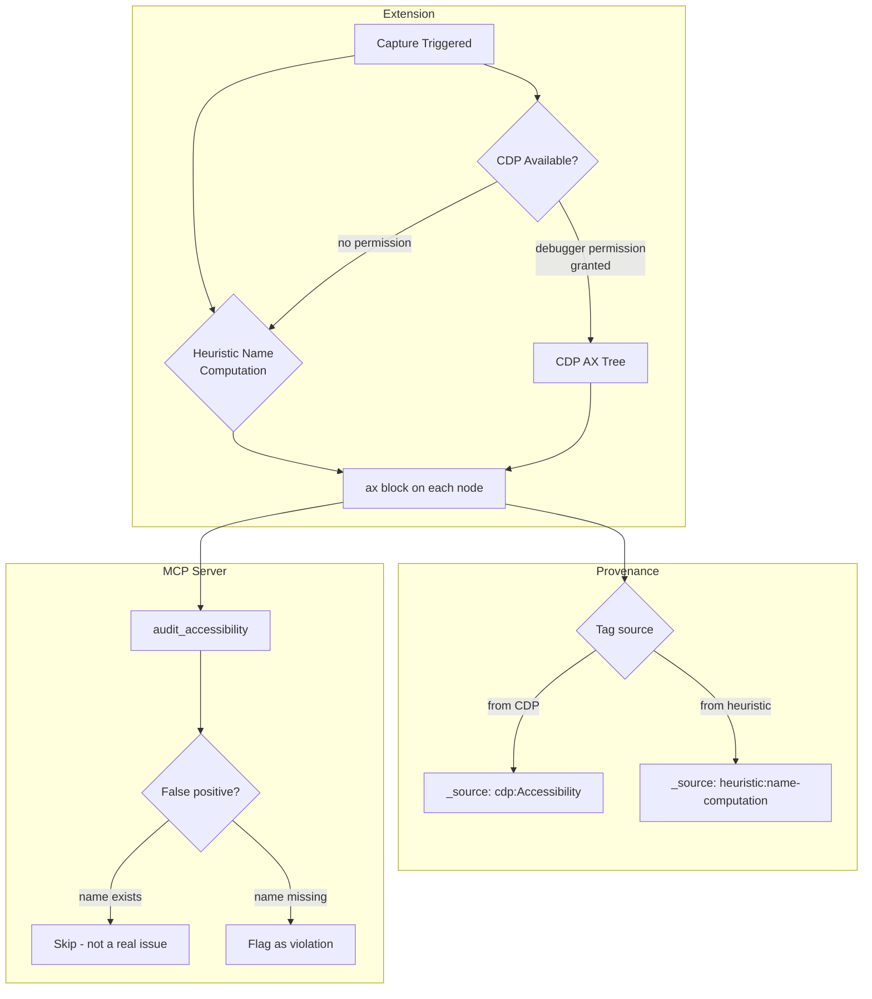
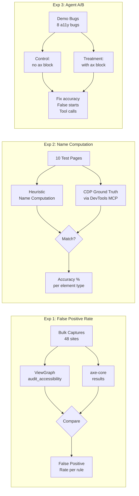

# Idea: CDP Accessibility Tree Capture

**Created:** 2026-04-28
**Status:** Evaluate
**Category:** Capture Accuracy

## Problem Statement

ViewGraph currently infers accessibility information by reading DOM attributes: `aria-label`, `aria-role`, `alt`, `for`, `tabindex`. This is a **syntactic** approach - it checks what the developer wrote, not what the browser computed.

The browser's accessibility tree is the **semantic** ground truth. It resolves:
- Implicit roles (a `<nav>` has role `navigation` without any ARIA attribute)
- Name computation (a button's accessible name can come from text content, `aria-label`, `aria-labelledby`, `title`, or `alt` on a child image - in that priority order)
- State resolution (`aria-expanded` on a parent affects children)
- Presentation role (`role="presentation"` removes semantics from the tree)
- Hidden elements (`aria-hidden="true"` removes from a11y tree but not DOM)

### What ViewGraph gets wrong today

```
┌─────────────────────────────────────────────────────────────────┐
│              Current A11y Inference (Syntactic)                   │
│                                                                   │
│  DOM ──► Check aria-label? ──► Check alt? ──► Check role?        │
│                │                    │              │               │
│                ▼                    ▼              ▼               │
│          Present/absent      Present/absent  Present/absent       │
│                                                                   │
│  ❌ Does NOT resolve:                                             │
│     - Implicit roles (<nav> = navigation)                         │
│     - Name from text content (<button>Sign in</button>)           │
│     - Label association (<label for="email">)                     │
│     - Presentation role (role="presentation")                     │
│     - aria-labelledby references                                  │
└─────────────────────────────────────────────────────────────────┘

┌─────────────────────────────────────────────────────────────────┐
│              Browser A11y Tree (Semantic - Ground Truth)          │
│                                                                   │
│  DOM ──► Browser Engine ──► Name Computation Algorithm ──► Tree   │
│                                      │                            │
│                                      ▼                            │
│                              Resolved for each node:              │
│                              - Computed role                      │
│                              - Computed name + source             │
│                              - States (focusable, expanded...)    │
│                              - Parent/child in a11y tree          │
│                                                                   │
│  ✅ Handles ALL edge cases the browser handles                    │
└─────────────────────────────────────────────────────────────────┘
```

| Scenario | ViewGraph says | Browser says | Impact |
|---|---|---|---|
| `<button>Sign in</button>` | "button has no accessible name" (no `aria-label`) | Name: "Sign in" (from text content) | **False positive** - flags a non-issue |
| `<button aria-label="">Sign in</button>` | "button has empty aria-label" | Name: "" (empty label overrides text) | **Correct** - but for the wrong reason |
| `` inside `<button>` | "image missing alt" | Decorative (presentation role) | **False positive** - intentionally decorative |
| `<div role="button" tabindex="0">Click</div>` | Might miss it (not a `<button>` tag) | Role: button, Name: "Click" | **False negative** - misses custom elements |
| `<label for="email">Email</label><input id="email">` | "input has no aria-label" | Name: "Email" (from associated label) | **False positive** - label association works |

### Axe-core partially solves this

ViewGraph already integrates axe-core (R2), which runs 100+ WCAG rules and catches most of these cases. But axe-core is a **rule checker**, not a **tree provider**. It tells you what's wrong, not what the browser actually computed. The agent can't ask "what is this element's computed accessible name?" - it can only ask "does this element violate WCAG rule X?"

## Proposed Approach

### Option A: Chrome DevTools Protocol (CDP) Accessibility Domain

Chrome exposes the computed accessibility tree via `Accessibility.getFullAXTree()`. This returns every node with:
- Computed role (resolved from tag + ARIA + implicit semantics)
- Computed name (resolved via W3C name computation algorithm)
- Computed description
- States (focusable, focused, expanded, selected, disabled, etc.)
- Properties (level, valuemin, valuemax, etc.)
- Parent/child relationships in the a11y tree (different from DOM tree)

**How to access from extension:**
- `chrome.debugger.attach()` + `chrome.debugger.sendCommand('Accessibility.getFullAXTree')` - requires `debugger` permission
- Or: `chrome.devtools.inspectedWindow.eval()` from a DevTools panel - only works when DevTools is open

**Permission implications:**
- `debugger` permission triggers a scary Chrome warning: "This extension can debug other extensions"
- Users may reject the permission
- Firefox has no equivalent API

### Option B: `window.getComputedAccessibleNode()` (Experimental)

Chrome has an experimental API for computed accessibility. Not standardized, not available in Firefox, may be removed.

**Verdict:** Too unstable to depend on.

### Option C: Heuristic Name Computation (No CDP)

Implement the W3C Accessible Name Computation algorithm in JavaScript:
1. Check `aria-labelledby` (resolve referenced elements)
2. Check `aria-label`
3. Check native label association (`<label for>`)
4. Check `alt` (for ``)
5. Check `title`
6. Fall back to text content (for buttons, links)

This is what axe-core does internally. We could extract or reimplement the name computation without CDP.

**Advantages:** No new permissions, works in Firefox, no CDP dependency
**Disadvantages:** Won't catch every edge case (CSS `content`, shadow DOM label forwarding, SVG `<title>`)

### Option D: Hybrid - Heuristic Default + CDP When Available

Use Option C as the baseline. When the user has DevTools open (or grants debugger permission), upgrade to CDP for ground truth. Tag the provenance accordingly:

```json
"ax": {
  "role": "button",
  "name": "Sign in",
  "_source": "cdp:Accessibility"
}
```

vs.

```json
"ax": {
  "role": "button",
  "name": "Sign in",
  "_source": "heuristic:name-computation"
}
```

## Recommendation

**Option D (Hybrid)** with Option C as the immediate implementation. CDP integration is a future enhancement gated on user research about permission acceptance.

### Architecture: Hybrid Approach



### Option Comparison Matrix

### Option Comparison Matrix

```
┌──────────────┬────────────┬───────────┬──────────┬──────────────┐
│ Option       │ Accuracy   │ Permissions│ Firefox  │ Complexity   │
├──────────────┼────────────┼───────────┼──────────┼──────────────┤
│ A: CDP only  │ ★★★★★      │ debugger  │ ✗ None   │ Medium       │
│ B: Exp. API  │ ★★★★       │ None      │ ✗ None   │ Low          │
│ C: Heuristic │ ★★★★       │ None      │ ✓ Works  │ Medium       │
│ D: Hybrid    │ ★★★★★      │ Optional  │ ✓ Falls  │ High         │
│   (recommended)           │           │   back   │              │
└──────────────┴────────────┴───────────┴──────────┴──────────────┘
```

## Before/After Example

### Before (current - attribute-only)

```json
{
  "nodes": {
    "high": {
      "button": {
        "17": {
          "alias": "button:sign-in",
          "actions": ["clickable"],
          "isRendered": true
        }
      }
    }
  },
  "details": {
    "high": {
      "button": {
        "17": {
          "attributes": { "aria-label": "" },
          "visibleText": "Sign in"
        }
      }
    }
  }
}
```

`audit_accessibility` flags: "Button has no accessible name (no text content or aria-label)"
- This is **wrong** - the button has text content "Sign in". The audit checks for `aria-label` but doesn't run name computation.

### After (with computed a11y)

```json
{
  "nodes": {
    "high": {
      "button": {
        "17": {
          "alias": "button:sign-in",
          "actions": ["clickable"],
          "isRendered": true,
          "ax": {
            "role": "button",
            "name": "Sign in",
            "nameSource": "contents",
            "states": ["focusable"],
            "_source": "heuristic:name-computation"
          }
        }
      }
    }
  }
}
```

`audit_accessibility` now knows: the button HAS an accessible name ("Sign in" from contents). The empty `aria-label=""` is still a problem (it overrides the text content in some browsers), but the audit can report it accurately: "Button has empty aria-label which may override text content name."

### Token Impact

Per node, the `ax` block adds ~80-120 bytes:
```json
"ax": { "role": "button", "name": "Sign in", "nameSource": "contents", "states": ["focusable"] }
```

For the demo page (27 nodes): ~2,700 bytes (+5.7%)
For the Shanti dashboard (208 nodes): ~20,800 bytes (+7%)

**But:** This replaces the current `audit_accessibility` false positives, which waste agent tokens on investigating non-issues. Net token efficiency may improve if false positive rate drops significantly.

## Experiment Design

### Experiment Pipeline



### Experiment 1: False Positive Rate Measurement

**Goal:** Quantify how many current `audit_accessibility` findings are false positives.

**Method:**
1. Run `audit_accessibility` on the bulk capture corpus (Set A: 48 sites)
2. For each finding, manually classify: true positive, false positive, or uncertain
3. Categorize false positives by type: name computation error, implicit role missed, label association missed, presentation role missed

**Shortcut:** Use axe-core results (already in captures) as ground truth. Compare ViewGraph's `audit_accessibility` findings against axe-core violations. Findings that ViewGraph flags but axe-core doesn't are likely false positives.

**Script:** `scripts/experiments/a11y-false-positives/run.js`
- Input: bulk capture results with axe-core data
- Output: per-rule false positive rate, aggregate FP rate

**Success criteria:** If FP rate is >20%, the heuristic name computation is justified. If <5%, the current approach is good enough.

### Experiment 2: Name Computation Accuracy

**Goal:** How accurate is a JavaScript name computation vs CDP ground truth?

**Method:**
1. Build the heuristic name computation (Option C)
2. On 10 diverse test pages, compare:
   - Heuristic computed name vs CDP computed name (via Chrome DevTools MCP)
   - For each element: match, partial match, or mismatch
3. Report: accuracy rate, common failure patterns

**Execution:** Use Chrome DevTools MCP's `evaluate_script` to call `chrome.devtools` APIs or use the a11y snapshot from `take_snapshot` (which already shows computed names) as ground truth.

**Success criteria:** Heuristic matches CDP >90% of the time. Mismatches are in edge cases (CSS content, shadow DOM).

### Experiment 3: Agent Fix Quality (A/B)

**Goal:** Does computed a11y data improve agent fix quality for accessibility bugs?

**Method:**
1. Use the 8 a11y-related demo bugs (bugs 1, 3, 6, 7 from login + bugs 9, 10, 12 from dashboard + bugs 15-19 from settings)
2. Control: agent receives current captures (attribute-only a11y)
3. Treatment: agent receives captures with computed `ax` block
4. Measure: fix accuracy, false starts (agent investigates a non-issue), tool call count

**Success criteria:** Treatment arm has fewer false starts (agent doesn't waste time on elements that actually have accessible names).

### Experiment 4: Token Efficiency Net Impact

**Goal:** Does the `ax` block's token cost pay for itself by reducing false positive investigation?

**Method:**
1. Measure: tokens added by `ax` block across corpus
2. Measure: tokens saved by eliminating false positive audit findings (fewer `find_source` calls, fewer fix attempts on non-issues)
3. Net: `tokens_saved - tokens_added`

**Success criteria:** Net positive (saves more tokens than it costs).

## Implementation Plan (if experiments pass)

### Phase 1: Heuristic Name Computation (no new permissions)
1. Implement W3C name computation in `extension/lib/collectors/name-computation.js`
2. Run during capture, populate `ax.name` and `ax.nameSource` on each node
3. Update `audit_accessibility` to use computed names instead of attribute checks
4. Reduce false positive rate

### Phase 2: CDP Integration (optional, permission-gated)
1. Add optional `debugger` permission (not required by default)
2. When granted, use `Accessibility.getFullAXTree()` for ground truth
3. Tag provenance: `_source: "cdp:Accessibility"` vs `"heuristic:name-computation"`
4. Fall back to heuristic when CDP unavailable

## Risks

- **Permission rejection** - users may refuse `debugger` permission, limiting CDP to a small fraction of installs
- **Firefox gap** - no CDP equivalent in Firefox; heuristic-only path must be robust
- **Name computation complexity** - the W3C algorithm has many edge cases (CSS content, shadow DOM, SVG). Partial implementation may introduce new false positives
- **Token cost** - the `ax` block adds 5-7% to capture size. If agents don't use it, it's wasted
- **Axe-core overlap** - axe-core already catches most real a11y issues. The marginal value of computed names may be small
