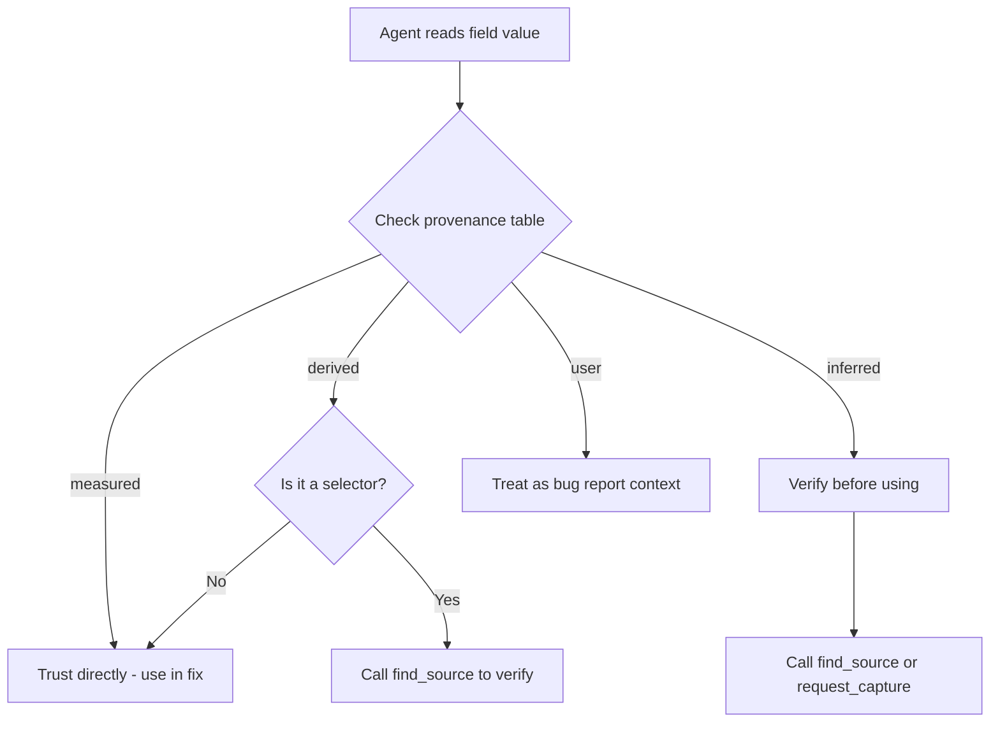

# Idea: Provenance Metadata - Field-Level Source Tagging

**Created:** 2026-04-28
**Status:** Evaluate
**Category:** Capture Format

## Problem Statement

ViewGraph captures mix data from fundamentally different sources - DOM API measurements, heuristic computations, and user annotations - but presents them all identically. An agent reading `"font-size": "56px"` can't tell if that's a hard measurement from `getComputedStyle()` or an inference. An agent reading `"selector": "div > h1"` can't tell if that's a stable `data-testid` locator or a fragile positional heuristic.

This matters because:
1. **Confidence calibration** - agents should trust measured values more than inferred ones
2. **Fix strategy selection** - a heuristic selector should trigger `find_source` for verification; a testid selector can be used directly
3. **Debugging provenance** - when a value is wrong, knowing its source tells you where to look
4. **Quality scoring** - captures with more measured data are more reliable than captures with more heuristics

## Current State

The format spec (v2.2.0) defines a `metadata.provenance` map at the section level:

```
┌─────────────────────────────────────────────────────────────┐
│                    Current Capture Flow                      │
│                                                              │
│  DOM API ──┐                                                 │
│            ├──► Traverser ──► Serializer ──► JSON Capture    │
│  Heuristics┘         │                          │            │
│                      │                          ▼            │
│              No provenance              All fields look      │
│              tags emitted               identical to agent   │
│                                                              │
│  Agent reads: "font-size": "56px"                            │
│  Agent reads: "selector": "div > h1"                         │
│  Agent reads: "cluster": "header"                            │
│                                                              │
│  ❓ Which is measured? Which is guessed? No way to tell.     │
└─────────────────────────────────────────────────────────────┘
```

```json
"provenance": {
  "geometry": "getBoundingClientRect",
  "accessibility": "dom-aria-attributes",
  "styles": "computed-style",
  "selectors": "heuristic",
  "salience": "heuristic",
  "annotations": "user"
}
```

**Problem:** This is section-level, not field-level. It says "selectors come from heuristics" but doesn't distinguish between a testid-based selector (high confidence) and a positional CSS selector (low confidence). In practice, this field isn't even populated in real captures today.

## Proposed Design

### Data Flow with Provenance

```
┌──────────────────────────────────────────────────────────────────┐
│                   Proposed Capture Flow                           │
│                                                                   │
│  getBoundingClientRect() ──► bbox ──────────► "measured"          │
│  getComputedStyle()      ──► styles ────────► "measured"          │
│  element.textContent     ──► visibleText ───► "measured"          │
│                                                                   │
│  CSS selector generator  ──► locators ──────► "derived"           │
│  Salience scorer         ──► salience ──────► "derived"           │
│  isRendered walk         ──► isRendered ────► "derived"           │
│                                                                   │
│  Fiber walk / heuristic  ──► component ─────► "inferred"          │
│  Cluster assignment      ──► cluster ───────► "inferred"          │
│                                                                   │
│  User annotation         ──► comment ───────► "user"              │
│                                                                   │
│         ┌─────────────────────────────────────────┐               │
│         │         Provenance Table                 │               │
│         │  bboxDocument: measured                  │               │
│         │  styles.*: measured                      │               │
│         │  locators[css]: derived                  │               │
│         │  locators[testId]: measured              │               │
│         │  cluster: inferred                       │               │
│         └─────────────────────────────────────────┘               │
│                          │                                        │
│                          ▼                                        │
│              Agent reads table ONCE,                              │
│              knows confidence level                               │
│              for every field type                                 │
└──────────────────────────────────────────────────────────────────┘
```

### Decision Tree: How Agent Uses Provenance



### Option A: Inline Tags

Add a `_p` suffix field next to each value:

```json
{
  "locators": [
    { "strategy": "testId", "value": "password-input", "rank": 1, "_p": "measured" },
    { "strategy": "css", "value": "form > button", "rank": 2, "_p": "derived" }
  ],
  "visibleText": "Sign in",
  "visibleText_p": "measured",
  "layout": {
    "bboxDocument": [666, 527, 338, 42],
    "bboxDocument_p": "measured"
  },
  "styles": {
    "typography": {
      "font-size": "56px",
      "font-size_p": "measured"
    }
  }
}
```

**Provenance values:**
| Tag | Meaning | Example |
|---|---|---|
| `measured` | Direct DOM/CSSOM API call | `getComputedStyle()`, `getBoundingClientRect()`, `element.textContent` |
| `derived` | Computed from measured values | CSS selector generated from DOM position, salience score |
| `inferred` | Heuristic guess | Component name from fiber walk, cluster role assignment |
| `user` | Human-provided | Annotation comments, severity ratings |

**Token cost analysis (demo page capture, 27 nodes):**

Current capture: 47,740 bytes (~12,000 tokens at 4 chars/token)

Field count per node (from real data):
- `locators`: 1-3 entries, each gets `_p` = +3-9 `_p` fields
- `visibleText`: 1 field = +1
- `bboxDocument`: 1 field = +1
- `styles`: ~15 properties per node = +15

Per node overhead: ~20 `_p` fields x ~15 bytes each = ~300 bytes
27 nodes x 300 bytes = **~8,100 bytes (+17%)**

For the 208-node Shanti dashboard: 208 x 300 = **~62,400 bytes (+21%)**

### Option B: Provenance Lookup Table (Compact)

Instead of inline tags, use a separate provenance section with a compact encoding:

```json
{
  "provenance": {
    "fields": {
      "locators[strategy=testId]": "measured",
      "locators[strategy=css]": "derived",
      "locators[strategy=id]": "measured",
      "visibleText": "measured",
      "bboxDocument": "measured",
      "styles.*": "measured",
      "salience": "derived",
      "isRendered": "derived",
      "cluster": "inferred",
      "alias": "derived",
      "ax.role": "measured",
      "ax.name": "measured"
    }
  }
}
```

**Token cost:** ~200 bytes total, regardless of node count. **<1% overhead.**

**Tradeoff:** Less granular - can't tag individual nodes differently. But in practice, the provenance of a field type is consistent across all nodes (all `bboxDocument` values come from the same API).

### Option C: Hybrid - Table Default + Per-Node Overrides

Use Option B as the default, with per-node overrides only when a field's provenance differs from the table:

```json
{
  "provenance": {
    "defaults": {
      "bboxDocument": "measured",
      "visibleText": "measured",
      "styles.*": "measured",
      "locators[strategy=testId]": "measured",
      "locators[strategy=css]": "derived",
      "salience": "derived",
      "isRendered": "derived",
      "cluster": "inferred"
    }
  },
  "details": {
    "high": {
      "button": {
        "17": {
          "visibleText": "Sign in",
          "visibleText_p": "inferred"
        }
      }
    }
  }
}
```

**Token cost:** ~200 bytes base + ~15 bytes per override. Overrides are rare (<5% of fields), so total cost is ~200-500 bytes. **<2% overhead.**

## Recommendation

**Option C (Hybrid)** - best of both worlds. Near-zero token cost for the common case, with escape hatch for exceptions.

## Before/After Example

### Before (current format)

```json
{
  "details": {
    "high": {
      "button": {
        "17": {
          "locators": [
            { "strategy": "css", "value": "form > button", "rank": 1 }
          ],
          "attributes": { "aria-label": "" },
          "visibleText": "Sign in",
          "layout": { "bboxDocument": [666, 527, 338, 42] },
          "styles": {
            "typography": { "font-size": "15px", "font-weight": "600" }
          }
        }
      }
    }
  }
}
```

Agent sees: `"strategy": "css", "value": "form > button"` - is this reliable? Should I use it in a test? No way to know.

### After (with provenance)

```json
{
  "provenance": {
    "defaults": {
      "bboxDocument": "measured",
      "visibleText": "measured",
      "styles.*": "measured",
      "locators[strategy=testId]": "measured",
      "locators[strategy=css]": "derived",
      "isRendered": "derived",
      "cluster": "inferred"
    }
  },
  "details": {
    "high": {
      "button": {
        "17": {
          "locators": [
            { "strategy": "css", "value": "form > button", "rank": 1 }
          ],
          "attributes": { "aria-label": "" },
          "visibleText": "Sign in",
          "layout": { "bboxDocument": [666, 527, 338, 42] },
          "styles": {
            "typography": { "font-size": "15px", "font-weight": "600" }
          }
        }
      }
    }
  }
}
```

Agent sees: the provenance table says `locators[strategy=css]` is `"derived"` - this is a heuristic selector. The agent should call `find_source` to verify, or prefer a testid locator if available.

## Experiment Design

### Experiment Pipeline

```
┌─────────────┐    ┌──────────────┐    ┌──────────────┐    ┌────────────┐
│  Existing    │    │  Generate    │    │  Measure     │    │  Compare   │
│  Captures    │───►│  Variants    │───►│  Token Cost  │───►│  Results   │
│  (7 files)   │    │  A / B / C   │    │  (tiktoken)  │    │  (CSV)     │
└─────────────┘    └──────────────┘    └──────────────┘    └────────────┘
                                                                 │
                   ┌──────────────┐    ┌──────────────┐          │
                   │  Demo Bugs   │    │  Agent A/B   │          │
                   │  (23 bugs)   │───►│  Fix Test    │──────────┘
                   │              │    │  +/- prov.   │
                   └──────────────┘    └──────────────┘
```

### Experiment 1: Token Cost Measurement

**Goal:** Measure the exact token overhead of each provenance option across real captures.

**Method:**
1. Take the 7 existing captures (27-208 nodes, 47KB-311KB)
2. For each, generate 3 variants: Option A (inline), Option B (table), Option C (hybrid)
3. Measure: byte size, token count (tiktoken cl100k_base), field count
4. Report: overhead percentage per option, per capture size tier

**Script:** `scripts/experiments/provenance-token-cost/run.js`
- Input: `.viewgraph/captures/*.json`
- Output: CSV with columns: `filename, nodes, original_bytes, original_tokens, optionA_bytes, optionA_tokens, optionB_bytes, optionB_tokens, optionC_bytes, optionC_tokens`

**Success criteria:** Option C adds <2% token overhead on captures with >100 nodes.

### Experiment 2: Agent Fix Accuracy (A/B)

**Goal:** Does provenance metadata improve agent fix accuracy on known bugs?

**Method:**
1. Use the 23 planted demo bugs as the test corpus
2. Control arm: agent receives current captures (no provenance)
3. Treatment arm: agent receives captures with Option C provenance
4. For each bug, measure:
   - Did the agent fix it correctly? (binary)
   - How many tool calls did it make? (efficiency)
   - Did it use `find_source` when the selector was `derived`? (provenance-aware behavior)
   - Did it trust `measured` values without verification? (confidence calibration)

**Execution:** Run each arm 3 times (LLM variance), report mean accuracy and tool call count.

**Success criteria:** Treatment arm shows either:
- Higher fix accuracy (>5% improvement), OR
- Fewer tool calls for same accuracy (>10% reduction), OR
- Measurably different behavior on `derived` vs `measured` fields

### Experiment 3: Provenance Distribution Audit

**Goal:** Understand what fraction of fields in real captures are measured vs derived vs inferred.

**Method:**
1. Instrument the capture pipeline to tag each field's source
2. Run against the bulk capture experiment sites (Set A: 48 sites)
3. Report distribution: what % of fields are measured, derived, inferred?

**Why this matters:** If 95% of fields are `measured`, provenance adds little value. If 30% are `derived` or `inferred`, it's highly valuable.

**Script:** `scripts/experiments/provenance-distribution/run.js`
- Extends bulk-capture experiment
- Output: per-site and aggregate provenance distribution

**Success criteria:** At least 15% of fields across the corpus are non-measured (derived or inferred).

## Implementation Plan (if experiments pass)

1. Add `provenance.defaults` to capture format (backward compatible - new optional section)
2. Instrument the traverser to track field sources during capture
3. Emit the provenance table in the serializer
4. Update MCP tools to surface provenance in responses (e.g., `find_missing_testids` could flag derived selectors)
5. Update agent steering docs to teach provenance-aware behavior
6. Bump format version to 2.3.0

## Risks

- **Token cost exceeds benefit** - if the overhead is >5%, the information density drops and agents may perform worse
- **Agents ignore provenance** - if the model doesn't change behavior based on provenance tags, the feature is wasted bytes
- **Maintenance burden** - every new collector must tag its fields, adding development overhead
- **False confidence** - agents might over-trust `measured` values that are actually wrong (e.g., `getBoundingClientRect` during animation)
