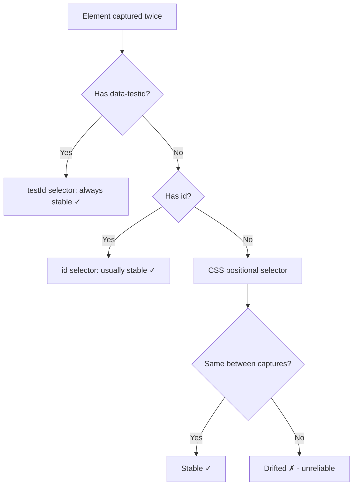

# Idea: Token Efficiency Experiments - Capture Format Optimization

**Created:** 2026-04-28
**Status:** Experimenting
**Category:** Token Efficiency

## Context

ViewGraph captures range from 47KB (27 nodes) to 1.2MB (1050 nodes). At ~4 chars/token, a large capture consumes 75,000+ tokens - a significant fraction of an agent's context window. Every byte that doesn't help the agent fix a bug is waste.

This doc defines 4 experiments to identify the largest sources of token waste in the current format, measured across 175 real captures from 4 projects + 80 bulk experiment sites.

```
┌─────────────────────────────────────────────────────────────────┐
│                  Token Budget Breakdown (typical)                 │
│                                                                   │
│  ████████████████████████████████████████  Styles (40-50%)        │
│  ████████████████                          Nodes + Relations (20%)│
│  ████████████                              Locators (15%)         │
│  ██████                                    Enrichment (8%)        │
│  ████                                      Metadata (5%)         │
│  ██                                        Summary (2%)          │
│                                                                   │
│  Styles dominate. That's where optimization has the most impact.  │
└─────────────────────────────────────────────────────────────────┘
```

## Experiment 1: Style Deduplication Rate

### Hypothesis

Many nodes on a page share identical computed styles (same font, color, spacing). A design-system page might have 50 buttons all with the same styles. Currently each node gets its own copy of all style properties. A shared style table (like CSS classes) could eliminate this redundancy.

### What We Measure

```
┌──────────────────────────────────────────────────────────┐
│  For each capture:                                        │
│                                                           │
│  1. Extract all style objects from details section         │
│  2. Hash each style object (JSON.stringify → hash)        │
│  3. Count unique hashes vs total nodes                    │
│                                                           │
│  dedup_rate = 1 - (unique_styles / total_nodes)           │
│                                                           │
│  If dedup_rate = 60%, a style table saves 60% of style    │
│  bytes by referencing shared styles instead of repeating.  │
└──────────────────────────────────────────────────────────┘
```

### Before/After Format

Before (current - 3 buttons, identical styles repeated):
```json
{
  "details": {
    "high": {
      "button": {
        "1": { "styles": { "typography": { "font-size": "14px", "font-weight": "600" }, "visual": { "color": "#fff", "background": "#6366f1" } } },
        "2": { "styles": { "typography": { "font-size": "14px", "font-weight": "600" }, "visual": { "color": "#fff", "background": "#6366f1" } } },
        "3": { "styles": { "typography": { "font-size": "14px", "font-weight": "600" }, "visual": { "color": "#fff", "background": "#6366f1" } } }
      }
    }
  }
}
```

After (style table - define once, reference by ID):
```json
{
  "styleTable": {
    "s1": { "typography": { "font-size": "14px", "font-weight": "600" }, "visual": { "color": "#fff", "background": "#6366f1" } }
  },
  "details": {
    "high": {
      "button": {
        "1": { "styleRef": "s1" },
        "2": { "styleRef": "s1" },
        "3": { "styleRef": "s1" }
      }
    }
  }
}
```

**Token savings:** 3 copies × ~80 tokens = 240 tokens → 1 copy + 3 refs = ~90 tokens. **62% reduction** for this example.

### Success Criteria

Dedup rate >30% across the corpus. Below that, the style table overhead (the table itself + ref lookups) may not pay for itself.

## Experiment 2: Default Value Waste

### Hypothesis

`getComputedStyle()` returns ALL computed properties, including browser defaults. Properties like `position: static`, `overflow: visible`, `opacity: 1`, `display: block` (on block elements) carry zero information - they're what the browser does when you specify nothing. Omitting them saves tokens without losing any signal.

### What We Measure

```
┌──────────────────────────────────────────────────────────┐
│  For each style property across all nodes:                │
│                                                           │
│  1. Check if value matches the CSS default for that       │
│     property (e.g., position: static, opacity: 1)         │
│  2. Count default vs non-default values                   │
│                                                           │
│  waste_rate = default_values / total_values                │
│                                                           │
│  If waste_rate = 40%, omitting defaults saves 40% of      │
│  style tokens with zero information loss.                  │
└──────────────────────────────────────────────────────────┘
```

### Default Value Reference

| Property | Default | Notes |
|---|---|---|
| `position` | `static` | Only non-static is interesting |
| `display` | varies by tag | `block` for div/p/h1, `inline` for span/a |
| `visibility` | `visible` | Only `hidden`/`collapse` is interesting |
| `overflow` | `visible` | Only non-visible is interesting |
| `opacity` | `1` | Only <1 is interesting |
| `flex-direction` | `row` | Only non-row is interesting |
| `text-align` | `start` | Only non-start is interesting |
| `font-weight` | `400` | Only non-400 is interesting |
| `background-color` | `rgba(0, 0, 0, 0)` | Transparent = default |
| `border` | `0px none ...` | No border = default |
| `margin` | `0px` | No margin = default |
| `padding` | `0px` | No padding = default |

### Success Criteria

Default value rate >25% of all style values. Below that, the filtering logic isn't worth the complexity.

## Experiment 3: Enrichment Section Emptiness

### Hypothesis

ViewGraph runs 17 enrichment collectors on every capture. Some produce empty results on most pages (e.g., `stacking` issues are rare, `components` requires a framework). Empty sections waste tokens on structure (`"stacking": { "issues": [] }`) without providing value.

### What We Measure

```
┌──────────────────────────────────────────────────────────┐
│  For each enrichment section across all captures:         │
│                                                           │
│  1. Check if section exists in capture                    │
│  2. Check if section has meaningful data (non-empty)      │
│  3. Measure bytes consumed by empty sections              │
│                                                           │
│  Sections that are empty >80% of the time should be       │
│  opt-in rather than always-on.                            │
└──────────────────────────────────────────────────────────┘
```

### Sections to Audit

| Section | Collector | Expected emptiness |
|---|---|---|
| `network` | Performance API | Low (most pages have requests) |
| `console` | Console interceptor | Medium (many pages have no errors) |
| `breakpoints` | CSS media queries | Low (most pages have breakpoints) |
| `stacking` | Z-index walk | High (most pages have no stacking issues) |
| `focus` | Tab order computation | Medium |
| `scroll` | Scroll container detection | Medium |
| `landmarks` | ARIA landmark extraction | Low |
| `components` | Framework detection | High (only React/Vue/Svelte pages) |
| `axe` | axe-core audit | Low (most pages have some violations) |

### Success Criteria

At least 3 sections are empty >70% of the time. Those become opt-in collectors.

## Experiment 4: Selector Stability

### Hypothesis

ViewGraph generates CSS selectors for each element. If these selectors change between captures of the same page (without DOM changes), they're unreliable for test generation and element matching. Unstable selectors waste agent effort - the agent writes a test with a selector that breaks on the next capture.

### What We Measure

```
┌──────────────────────────────────────────────────────────┐
│  For each pair of same-URL captures:                      │
│                                                           │
│  1. Match elements by data-testid or alias                │
│  2. Compare their CSS selectors between captures          │
│  3. Count: stable (identical), drifted (changed),         │
│     missing (element gone)                                │
│                                                           │
│  stability_rate = stable / (stable + drifted)             │
│                                                           │
│  If stability < 90%, selector generation needs work.      │
│  If stability > 95%, selectors are reliable for tests.    │
└──────────────────────────────────────────────────────────┘
```

### Selector Types to Compare



### Success Criteria

- testId selectors: 100% stable (by definition)
- id selectors: >99% stable
- CSS positional selectors: measure actual stability rate
- If CSS selectors are <90% stable, we should flag them as `derived` in provenance and warn agents not to use them in tests

## Cross-Cutting: Implementation Impact

```
┌─────────────────────────────────────────────────────────────────┐
│              Potential Token Savings (Cumulative)                 │
│                                                                   │
│  Current capture (median 665KB, ~166K tokens):                   │
│                                                                   │
│  Style dedup (est. 30-50% of styles)  ──► -20 to -33% tokens    │
│  Default omission (est. 25-40%)       ──► -10 to -16% tokens    │
│  Empty section removal                ──► -2 to -5% tokens      │
│  Combined                             ──► -30 to -50% tokens    │
│                                                                   │
│  665KB capture → 330-465KB capture                               │
│  166K tokens → 83-116K tokens                                    │
│                                                                   │
│  That's 50-83K tokens saved per capture.                         │
│  At $3/M tokens (Claude), that's $0.15-0.25 per capture.        │
│  At 10 captures/session, that's $1.50-2.50/session saved.       │
└─────────────────────────────────────────────────────────────────┘
```

## Dataset

All experiments run on the same corpus:
- 95 real project captures (planiq: 79, home-management: 5, viewgraph: 10, shared-libs: 1)
- 80 bulk experiment captures (48 diverse websites)
- Total: 175 captures, 27-1050 nodes, 47KB-1.2MB
