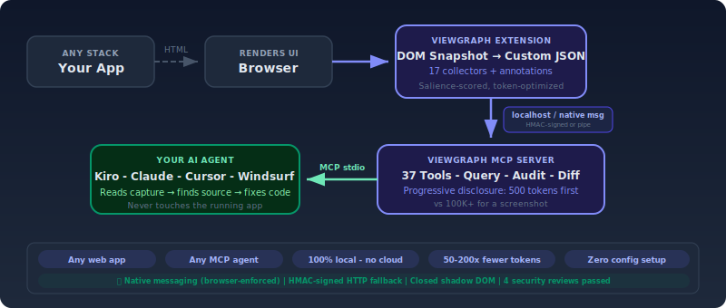

# The UI Context Layer for AI Coding Agents

<figure></figure>

> *Built with Kiro, for Kiro - and every MCP-compatible agent.*

See a bug. Click it. Describe it. Your agent fixes it.


[](https://chromewebstore.google.com/detail/viewgraph-capture/dmgbneoidgmkdcfnlegmfijkedijjnjj) &nbsp; [](https://addons.mozilla.org/en-US/firefox/addon/viewgraph-capture/)

[](https://www.npmjs.com/package/@viewgraph/core) &nbsp; [](https://github.com/sourjya/viewgraph)

---

## The Problem


**AI coding agents can read your source code. They cannot see your rendered UI.**


- The agent **guesses** CSS fixes instead of seeing the actual layout
- Bug reports land as **vague screenshots** instead of structured evidence
- Accessibility audits find violations but **no path to the source file**
- Visual regressions **slip through** because tests check behavior, not structure
- QA handoffs require **back-and-forth** to clarify what's actually broken

These problems cost teams hours per bug. ViewGraph solves [23 of them](why-viewgraph.md).

---

## How It Works

You click the broken element. You describe what's wrong. You send it to your agent.

The agent receives the element's exact CSS selector, computed styles, accessibility state, bounding box, network errors, console warnings - and your comment. It finds the source file and fixes the code.

No screenshots with arrows. No copy-pasting from DevTools. No "the button is somewhere on the settings page."



Works with any web app regardless of backend. Python, Ruby, Java, Go, PHP - if it renders HTML, ViewGraph captures it.

---

## Get Started in 2 Minutes

**Step 1.** Install the browser extension (Chrome or Firefox links above)

**Step 2.** Add to your AI agent's MCP config:

```json
{
  "mcpServers": {
    "viewgraph": { "command": "npx", "args": ["-y", "@viewgraph/core"] }
  }
}
```

**That's it.** The server runs automatically and learns your project from the first capture.


**Need version pinning?** `npm install -g @viewgraph/core && viewgraph-init`. See [Installation](getting-started/installation.md) for all options.


For the full walkthrough with screenshots, see the [Quick Start Guide](getting-started/quick-start.md).

---

## Who It's For

| | |
|---|---|
| **Developers with AI agents** | See bug → click → describe → agent fixes. Works with Kiro, Claude Code, Cursor, Windsurf, Cline, Aider. |
| **Testers and QA** | Same workflow, no agent needed. Export as Markdown (Jira/GitHub) or ZIP report with screenshots. |
| **Non-technical stakeholders** | Click what looks wrong, describe it in plain language. ViewGraph captures the technical details. |
| **Test automation teams** | Capture DOM during Playwright tests. Generate test files from browser captures. [`@viewgraph/playwright`](https://www.npmjs.com/package/@viewgraph/playwright) |

See [Who Benefits?](who-benefits.md) for the full breakdown.

---

## What Makes It Different

| | ViewGraph | Screenshots + chat | Browser DevTools |
|---|---|---|---|
| Agent gets structured DOM context | ✅ | ❌ | ❌ |
| Works with any MCP agent | ✅ | ❌ | ❌ |
| Non-technical users can report bugs | ✅ | ✅ | ❌ |
| Accessibility audit built in | ✅ | ❌ | Partial |
| Captures network + console errors | ✅ | ❌ | ✅ (manual) |
| Export to Jira/GitHub markdown | ✅ | ❌ | ❌ |
| 92.1% capture accuracy (measured) | ✅ | N/A | N/A |

[Full comparison](comparison/overview.md) | [Capture accuracy details](comparison/accuracy.md) | [41 MCP tools](features/mcp-tools.md)

---

## Your Agent Is Wasting Tokens


Research shows AI agents spend **60-80% of their token budget** on finding information, not fixing problems. One study found an agent reading 25 files to answer a question that needed 3.


<figure></figure>

Most browser tools send your agent the entire page on every interaction. That's 100,000+ tokens per step - and your agent pays for every one.

ViewGraph v3 sends only what your agent actually needs:

```
Tokens per 10-step browser task:

Chrome DevTools MCP  ████████████████████████████████████  132,000+
Playwright MCP       ██████████████████████████████        114,000
ViewGraph v2 (full)  ████████████████████████████          100,000
ViewGraph v3 (smart) ██                                      7,000
```

**That's $3.00 per task down to $0.10.** At 50 tasks a day, that's $4,350 saved per month.

How? ViewGraph pre-indexes interactive elements into a flat manifest. Your agent reads 20 lines instead of scanning 600. Style dedup removes duplicate CSS. Default omission strips browser defaults that carry zero information. Container merging removes empty wrapper divs. The result: same fixes, 97% fewer tokens.

[See the full token efficiency breakdown](comparison/capture-format-v3.md)

---

## Open Source

AGPL-3.0 licensed. Full source on [GitHub](https://github.com/sourjya/viewgraph).

| Component | Description |
|---|---|
| [server/](https://github.com/sourjya/viewgraph/tree/main/server) | MCP server - 41 tools, WebSocket collab, baselines |
| [extension/](https://github.com/sourjya/viewgraph/tree/main/extension) | Chrome/Firefox extension - capture, annotate, 21 enrichment collectors |
| [packages/playwright/](https://github.com/sourjya/viewgraph/tree/main/packages/playwright) | Playwright fixture for E2E test captures |
| [power/](https://github.com/sourjya/viewgraph/tree/main/power) | Kiro Power assets - hooks, prompts, steering docs |


**GitHub Releases = latest version, always.** Chrome and Firefox stores can lag behind by days or weeks. [GitHub Releases](https://github.com/sourjya/viewgraph/releases/latest) always has the newest extension ZIPs, npm package, and changelog.



**GitHub:** [github.com/sourjya/viewgraph](https://github.com/sourjya/viewgraph) - star the repo, report issues, contribute

**npm packages:**
- [@viewgraph/core](https://www.npmjs.com/package/@viewgraph/core) - MCP server + CLI tools
- [@viewgraph/playwright](https://www.npmjs.com/package/@viewgraph/playwright) - Playwright test fixture

**Docs:** [chaoslabz.gitbook.io/viewgraph](https://chaoslabz.gitbook.io/viewgraph)


---

## Acknowledgments

ViewGraph's capture format was inspired by [Element to LLM](https://addons.mozilla.org/en-US/firefox/addon/element-to-llm/) (E2LLM) by [insitu.im](https://insitu.im/) - the first browser extension to frame DOM capture as a structured perception layer for AI agents. The core insight that agents need a purpose-built intermediate representation, not raw HTML, came from E2LLM. ViewGraph extended these foundations through [format research](https://github.com/sourjya/viewgraph/blob/main/docs/references/viewgraph-format-research.md) that produced 20 improvement proposals across token efficiency, accessibility, enrichment, and MCP integration. [Full comparison](comparison/capture-format.md#acknowledgments).

ViewGraph's [security assessment](reference/threat-model.md) was conducted using the [AWS Labs Threat Modeling MCP Server](https://github.com/awslabs/threat-modeling-mcp-server) by [Aidin Ferdowsi](https://github.com/aidinferdowsi) (AWS). The tool's structured STRIDE analysis and Threat Composer integration produced the 9-threat, 9-mitigation model that drove ViewGraph's HMAC auth implementation, prompt injection defenses, and seven rounds of security reviews. [Full threat model](reference/threat-model.md).
