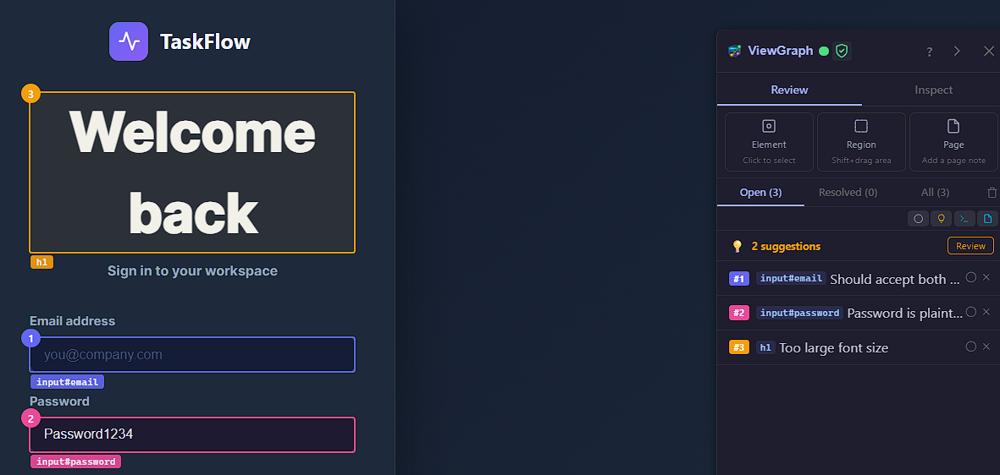

# What is ViewGraph?

<figure></figure>

> *Built with Kiro, for Kiro - and every MCP-compatible agent.*

ViewGraph is the UI context layer for AI coding agents. A browser extension captures structured DOM snapshots from any web page - elements, styles, selectors, accessibility state, network errors - and a local MCP server exposes them to your AI assistant through the [Model Context Protocol](https://modelcontextprotocol.io/). The agent sees what you see in the browser, and can fix what you point at. Think of it as giving your coding agent a pair of eyes.

<!-- VIDEO: Add YouTube embed via GitBook editor - do not edit this section from GitHub -->

[](https://chromewebstore.google.com/detail/viewgraph-capture/dmgbneoidgmkdcfnlegmfijkedijjnjj) [](https://addons.mozilla.org/en-US/firefox/addon/viewgraph-capture/) [](https://www.npmjs.com/package/@viewgraph/core) [](https://github.com/sourjya/viewgraph)

## The Problem

AI coding agents can read your source code. They cannot see your rendered UI. This gap means:

- The agent **guesses** CSS fixes instead of seeing the actual layout
- Bug reports land as **vague screenshots** instead of structured evidence
- Accessibility audits produce violations but **no path to the source file**
- Visual regressions **slip through** because tests check behavior, not structure
- QA handoffs require **back-and-forth** to clarify what's actually broken

These problems cost teams hours per bug across development, testing, QA, and release. ViewGraph solves [23 of them](why-viewgraph.md#common-problems).

## How ViewGraph Solves This

You click the broken element. You describe what's wrong. You send it to your agent.

The agent receives the element's exact CSS selector, computed styles, accessibility state, bounding box, parent layout, network errors, console warnings - and your comment explaining what to fix. It finds the source file and implements the fix.

No screenshots with arrows. No copy-pasting selectors from DevTools. No "the button is somewhere on the settings page."

For the full list of 23 problems ViewGraph solves across development, testing, QA, and release workflows, see [Why ViewGraph?](why-viewgraph.md).



## How It Works

```
Your app (any language) --> serves HTML --> Browser renders it --> Extension captures DOM
                                                                        |
                                                                        v
Kiro / Claude / Cursor  <-- MCP protocol <-- ViewGraph server <-- .viewgraph.json files
```

The extension captures the DOM from Chrome or Firefox. The server reads those capture files and exposes them to your AI agent via MCP. Your agent uses this context to modify your source code - it never injects into or manipulates the running application directly.

ViewGraph works with any web app regardless of backend technology. Python, Ruby, Java, Go, PHP - doesn't matter. If it renders HTML in a browser, ViewGraph can capture it.

## Get Started in 2 Minutes

**1. Install the browser extension:**

[](https://chromewebstore.google.com/detail/viewgraph-capture/dmgbneoidgmkdcfnlegmfijkedijjnjj)  [](https://addons.mozilla.org/en-US/firefox/addon/viewgraph-capture/)

**2. Add to your AI agent's MCP config:**

```json
{
  "mcpServers": {
    "viewgraph": { "command": "npx", "args": ["-y", "@viewgraph/core"] }
  }
}
```

**That's it.** The server runs automatically, creates `.viewgraph/captures/`, and learns your project's URL pattern from the first capture. No install commands, no config files.

> **Need version pinning?** Use `npm install -g @viewgraph/core && viewgraph-init` instead. See [Installation](getting-started/installation.md) for details.

For the full walkthrough with screenshots, see the [Quick Start Guide](getting-started/quick-start.md).

## Who It's For

### Developers with AI agents

See a bug, click it, describe it, send to agent, agent fixes it. The core loop takes 30 seconds from spotting a bug to the agent having full context.

Works with **Kiro**, **Claude Code**, **Cursor**, **Windsurf**, **Cline**, **Aider**, and any MCP-compatible agent.

See [Why ViewGraph?](why-viewgraph.md) for the full list of development, testing, and release problems it solves.

### Testers and QA reviewers

Same annotation workflow, no AI agent needed. Click elements, add comments, export as:
- **Markdown** - paste into Jira, Linear, or GitHub Issues
- **ZIP report** - markdown + cropped screenshots + network.json + console.json

### Non-technical stakeholders and new developers

You don't need to speak DOM. PMs, designers, junior devs, bootcamp grads, and career switchers can click what looks wrong, describe it in plain language, and ViewGraph captures the technical details automatically. See [Who Benefits?](who-benefits.md) for the full list.

### Test automation teams

Capture DOM snapshots during Playwright E2E tests. Generate tests from browser captures. The `@viewgraph/playwright` package bridges testing and review.

## What It Captures

Every capture includes:

| Data | What agents do with it |
|---|---|
| Every visible element with CSS selectors | `find_source` locates the source file |
| Computed styles (colors, fonts, spacing, layout) | Agents fix CSS issues precisely |
| Bounding boxes (position, size) | `audit_layout` detects overlaps and overflows |
| Accessibility attributes (role, aria-label) | `audit_accessibility` finds WCAG violations |
| data-testid attributes | `find_missing_testids` improves test coverage |
| Network requests (failed, slow) | Agents correlate UI bugs with API failures |
| Console errors and warnings | Agents fix JS errors causing UI issues |
| Component names (React, Vue, Svelte) | Agents jump from DOM element to component file |

## Capture Accuracy

Measured automatically against 48 diverse real-world websites:

| Dimension | Median |
|---|---|
| **Composite** | **92.1%** |
| Selector accuracy | 99.7% |
| Testid recall | 100.0% |
| Interactive recall | 97.9% |
| Bbox accuracy | 100.0% |
| Semantic recall | 88.2% |

Full methodology and per-site breakdowns: [bulk capture experiment](https://github.com/sourjya/viewgraph/tree/main/scripts/experiments/bulk-capture)

## [36 MCP Tools](features/mcp-tools.md)

Your agent discovers these automatically via the MCP protocol:

- **Core:** list captures, get capture, page summary
- **Analysis:** accessibility audit, layout audit, missing testids, interactive elements
- **Annotations:** resolve, track, diff, detect patterns, generate specs
- **Comparison:** structural diff, baseline regression, screenshot pixel diff, cross-page consistency, CSS style diff
- **Coverage:** component testid coverage report
- **Sessions:** journey recording, flow visualization, capture stats
- **Source:** find source file, component detection
- **Bidirectional:** request capture from agent, verify fixes

## Open Source

ViewGraph is AGPL-3.0 licensed. Full source, issues, and contributions on [GitHub](https://github.com/sourjya/viewgraph).

| Component | Description |
|---|---|
| [server/](https://github.com/sourjya/viewgraph/tree/main/server) | MCP server - 36 tools, WebSocket collab, baselines |
| [extension/](https://github.com/sourjya/viewgraph/tree/main/extension) | Chrome/Firefox extension - capture, annotate, export |
| [packages/playwright/](https://github.com/sourjya/viewgraph/tree/main/packages/playwright) | Playwright fixture for E2E test captures |
| [power/](https://github.com/sourjya/viewgraph/tree/main/power) | Kiro Power assets - hooks, prompts, steering docs |

[](https://addons.mozilla.org/en-US/firefox/addon/viewgraph-capture/)


**GitHub:** [github.com/sourjya/viewgraph](https://github.com/sourjya/viewgraph) - star the repo, report issues, contribute

**npm:** [@viewgraph/core](https://www.npmjs.com/package/@viewgraph/core) - `npm install @viewgraph/core`

**Playwright:** [@viewgraph/playwright](https://www.npmjs.com/package/@viewgraph/playwright) - `npm install @viewgraph/playwright`

**Docs:** [chaoslabz.gitbook.io/viewgraph](https://chaoslabz.gitbook.io/viewgraph)

