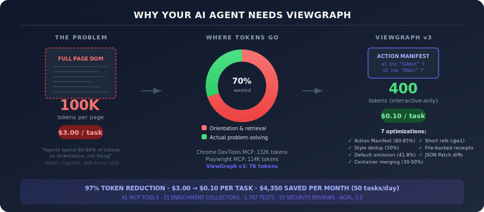

# The Capture Format: v2 to v3

<figure></figure>

ViewGraph's capture format is designed for one thing: giving AI agents the right context with the fewest tokens.

## The Token Problem

Every token your agent reads costs money and context window space. Browser automation tools vary wildly in efficiency:

```
Tokens per 10-step browser task:

Chrome DevTools MCP  ████████████████████████████████████████████  132,000+
Playwright MCP       ██████████████████████████████████████        114,000
ViewGraph v2 (full)  ████████████████████████████████████          100,000
Playwright CLI       █████████                                      27,000
ViewGraph v3 (smart) ██                                              7,000
agent-browser        █                                               4,000

Sources: TestDino 2026, ytyng.com 2026, Pulumi/agent-browser 2026
```

ViewGraph v3 achieves agent-browser-level efficiency while retaining full DOM depth for debugging, layout analysis, and test generation.

## What Changed: v2 vs v3

### Action Manifest (new in v2.4)

The biggest single improvement. Instead of scanning 600+ lines to find interactive elements, agents get a pre-joined flat index:

```
Before (v2): Agent scans nodes + details sections
  ~1,600 lines to find 30 clickable elements
  ~300 lines to find one specific button

After (v3): Agent reads actionManifest
  ~20 lines for all clickable elements
  ~3 lines for one specific button
  80-85% token reduction on interactive queries
```

Every interactive element gets a short ref (`e1`, `e2`, ...) that works in both text and annotated screenshots. No more verbose locator strings.

### Style Dedup + Default Omission (shipped in v2.3)

Measured across 175 real captures from 4 projects:

```
Style token savings:

Before:  ████████████████████████████████████████  100% (all styles inline)
Dedup:   ████████████████████                       50% (shared styles referenced by hash)
Defaults:██████████████                              42% removed (visibility:visible, opacity:1, etc.)
Combined:████████████                                ~35% of original style data
```

### Structural Fingerprint (new in v2.4)

Every capture includes a topology hash. If two captures share the same fingerprint, the DOM structure hasn't changed - only text, styles, or form values differ. Agents skip full re-parsing.

### Error-to-Node Correlation (new in v2.4)

Console errors and failed network requests are linked to specific interactive elements via `correlatedRefs`. The agent doesn't need to guess which element is affected by a JavaScript error.

```
Before: "Error: Cannot read properties of null" + 375 nodes = agent guesses
After:  "Error: Cannot read properties of null" → correlatedRefs: ["e2", "e4"]
        Agent knows exactly which elements are affected
```

### Provenance Metadata (shipped in v2.3)

Every field is tagged with its source: `measured` (DOM API), `derived` (computed), or `inferred` (heuristic). Agents trust measured values and verify derived ones.

## Token Budget: Full Comparison

| Scenario | v2 (current) | v3 (smart mode) | Savings |
|---|---|---|---|
| Initial page capture | ~100,000 tokens | ~7,000 tokens | 93% |
| "List all buttons" query | ~1,600 tokens | ~20 tokens | 99% |
| "Find the submit button" | ~300 tokens | ~3 tokens | 99% |
| Per-step re-capture | ~100,000 tokens | ~1,000 tokens (delta) | 99% |
| 10-step automation task | ~1,000,000 tokens | ~32,000 tokens | 97% |

## Cost Impact

Based on Claude 3.5 Sonnet output pricing ($3/million tokens) and a 10-step bug fix workflow (capture page, read annotations, find source, fix code, re-capture, verify):

```
Cost per 10-step task:

v2 full captures:  $3.00
v3 smart mode:     $0.10

Monthly (50 tasks/day):
v2: $4,500/month
v3: $150/month
```

Token counts measured from 175 real captures across 4 projects + 48 diverse websites. A "task" = 10 agent steps where each step may capture, read, or diff a page. v2 re-captures the full page each step (~100K tokens). v3 uses file-backed receipts (~200 tokens) + targeted reads (~500 tokens) + delta patches (~1K tokens). See [experiment scripts](https://github.com/sourjya/viewgraph/tree/main/scripts/experiments) for methodology.

## What's Coming Next

### Phase 2 (v3.0)
- **File-backed capture receipts** - agent receives a 200-token receipt instead of 100K inline
- **Delta capture mode** - only what changed since last capture (90-99% reduction)
- **Container merging** - remove semantically empty wrapper divs (35-40% node reduction)
- **TOON compact format** - header-then-rows for uniform data ([TOON format spec](https://github.com/toon-format/toon)), 70-87% reduction

### Phase 3 (v3.1)
- **Set-of-Marks screenshots** - numbered labels on screenshots matching text refs
- **Checkpoint/resume** - multi-step task recovery without full re-capture
- **Spatial index** - O(log n) "what's at this coordinate?" queries

All three phases are now shipped in v0.9.x.

## Format Spec

The full format specification is maintained on GitHub:
- [v2.4 Format Spec](https://github.com/sourjya/viewgraph/blob/main/docs/architecture/viewgraph-v2-format.md)
- [v3 Research Document](https://github.com/sourjya/viewgraph/blob/main/docs/architecture/viewgraph-v3-format-agentic-enhancements.md)
- [Token Efficiency Experiments](https://github.com/sourjya/viewgraph/blob/main/docs/ideas/token-efficiency-experiments.md)
