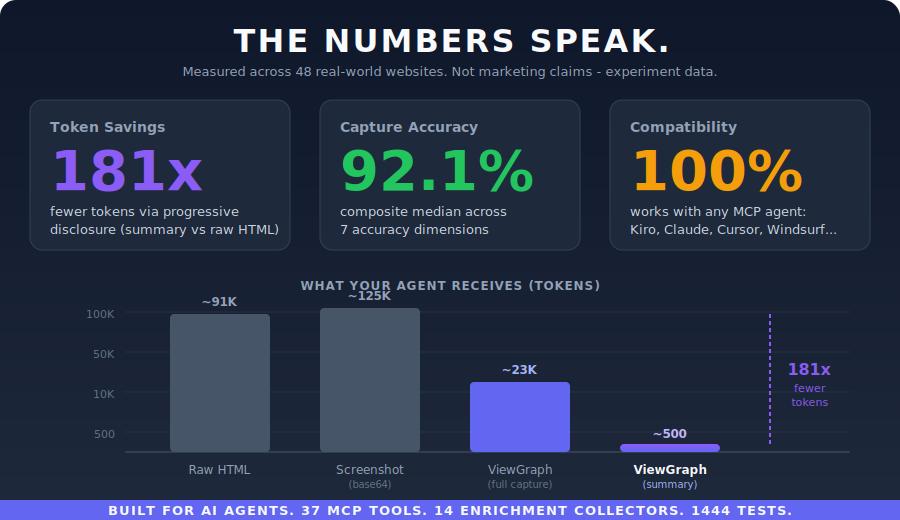

# The Capture Format



ViewGraph uses a custom structured JSON format designed specifically for AI agent consumption. It's not raw HTML, not an accessibility tree, not a screenshot - it's a purpose-built representation that gives agents the most actionable context per token.

## Why Not Just Use Raw HTML?

Raw HTML is what the browser receives. It's not what the browser renders. The gap is enormous:

| What raw HTML tells you | What the browser actually computes |
|---|---|
| `class="btn-primary"` | `background: linear-gradient(135deg, #6366f1, #8b5cf6)` |
| `<div style="position: relative">` | Bounding box at [120, 340, 200, 48] |
| `<input type="text">` | Missing `aria-label`, no associated `<label>` |
| `<nav>` exists in source | Nav is hidden by `display: none` on a parent |
| CSS file says `z-index: 10` | Element is behind a sibling due to stacking context |

ViewGraph captures the **rendered truth** - what the browser actually computed and displayed - not just the source code.

## Format Structure

Every capture is a JSON file with these sections:

```
metadata        What: URL, title, viewport, timestamp, element counts
summary         Quick orientation: key elements, styles, page structure
nodes           Element tree grouped by salience tier (high/med/low)
relations       Semantic relationships (label-for, aria-controls, etc.)
details         Full element data: locators, attributes, styles, layout
enrichment      16 collectors: network, console, a11y, stacking, focus, etc.
annotations     Human comments with severity, category, element references
```

## The Salience Model

Not all elements are equally important. A page with 500 elements might have 30 that matter for any given task. ViewGraph scores every element and classifies it into three tiers:

**High salience** (score >= 50): interactive elements, elements with data-testid, ARIA-labeled elements, semantic landmarks. These get full style data, all attributes, and ranked locators.

**Medium salience** (score 20-49): visible elements with text content, elements in the viewport, substantial-sized elements. These get layout and visual styles only.

**Low salience** (score < 20): decorative elements, wrappers, spacers. These get structural data only - no styles.

Scoring factors:
- Interactive element (button, link, input): +30
- Has data-testid: +20
- Has ARIA role or label: +15
- Semantic tag (nav, main, header): +10
- Has visible text: +10
- In viewport: +10
- Substantial size (>100px wide, >50px tall): +5

This means an agent asking "what buttons are on this page?" gets rich data for the buttons (high salience) without wading through 400 wrapper divs (low salience).

## Ranked Locators

Every element gets multiple locator strategies, ranked by stability:

```json
"locators": [
  { "strategy": "testId", "value": "login-btn", "rank": 1 },
  { "strategy": "role", "value": "button", "name": "Sign in", "rank": 2 },
  { "strategy": "css", "value": "form > button.btn-primary", "rank": 3 }
]
```

The agent picks the most stable locator available. `data-testid` survives refactors. Role + name survives CSS changes. CSS selector is the fallback.

## Progressive Disclosure

Agents don't receive the full capture upfront. The MCP tools serve data on demand:

1. `get_page_summary` (~500 tokens) - page title, element counts, key interactive elements
2. `get_interactive_elements` (~2,000 tokens) - just buttons, links, inputs with locators
3. `get_elements_by_role` (~1,000 tokens) - filtered by role (e.g., just headings)
4. `get_capture` (~20,000+ tokens) - full capture when needed

An agent solving a button bug calls `get_interactive_elements` (2K tokens) instead of `get_capture` (20K+ tokens). 90% token savings for the same result.

## 14 Enrichment Collectors

Every capture automatically includes data from these collectors, providing context beyond the DOM:

| Collector | What it adds | Why it matters |
|---|---|---|
| Network | Failed requests, slow responses | UI bug might be caused by a 404 API call |
| Console | JS errors and warnings | Runtime error might explain the broken UI |
| Breakpoints | Active CSS breakpoint, viewport width | Responsive bugs need breakpoint context |
| Media queries | All @media rules and match state | Which responsive rules are active |
| Stacking | Z-index conflicts between siblings | "Dropdown behind modal" bugs |
| Focus | Tab order, unreachable elements, traps | Keyboard accessibility issues |
| Scroll | Nested scroll containers, overflow | "Wrong thing scrolls" bugs |
| Landmarks | Semantic elements (nav, main, header) | Page structure for a11y |
| Components | React/Vue/Svelte component names | Maps DOM elements to framework components |
| axe-core | 100+ WCAG accessibility rules | Industry-standard a11y violations |
| Event listeners | Click handlers, keyboard handlers | Which elements are actually interactive |
| Performance | Navigation timing, resource timing | Page load performance context |
| Animations | Running CSS/JS animations | Animation-related layout issues |
| Intersection | Element visibility relative to viewport | Above/below fold, lazy loading state |
| Client storage | localStorage, sessionStorage, cookies | App state, auth tokens (sensitive values redacted) |
| CSS custom properties | CSS variables on :root and body | Design system tokens, theme state |

## Token Efficiency

The format is designed to minimize LLM token consumption:

- **Salience filtering** eliminates 60-80% of style tokens
- **Progressive disclosure** serves 500 tokens instead of 20K+ for most queries
- **Text truncation** caps `visibleText` at 200 characters per element
- **Field filtering** omits default CSS values (`display: block` on a `<div>` is not stored)
- **Columnar structure** avoids repeating key names per element

A typical 500-element page produces a 20-40KB capture. A raw HTML dump of the same page would be 200-400KB. A base64 screenshot would be 500KB+.

## Acknowledgments

ViewGraph's capture format was inspired by [Element to LLM](https://addons.mozilla.org/en-US/firefox/addon/element-to-llm/) (E2LLM) by [insitu.im](https://insitu.im/) - the first browser extension to frame DOM capture as a structured perception layer for AI agents. E2LLM's SiFR format introduced key ideas: salience scoring, action tagging (`[clickable]`, `[fillable]`), and spatial relationship mapping - proving that a purpose-built intermediate representation beats both raw HTML and screenshots for agent consumption.

ViewGraph extended these foundations through [deep format research](https://github.com/sourjya/viewgraph/blob/main/docs/architecture/viewgraph-format-research.md) that identified 8 weaknesses in SiFR v2 and produced 20 improvement proposals. The core insight - that AI agents need a structured perception layer, not raw HTML - came from E2LLM. ViewGraph's format builds on that insight with significant structural changes:

| Dimension | SiFR v2 (E2LLM) | ViewGraph v2 |
|---|---|---|
| **Token delivery** | Full capture to clipboard (~50K+ tokens for styles alone) | Progressive disclosure via MCP - summary is ~500 tokens, full capture on demand (181x savings) |
| **Style handling** | All computed styles on all nodes (biggest token sink) | Tiered: full styles on high-salience only, layout-only on medium, none on low (30-50% token reduction) |
| **Tag names** | Abbreviated (`btn`, `spn`, `hdr`) - saves ~600 tokens but requires lookup table | Full HTML tag names - readability over marginal savings |
| **Node IDs** | Opaque sequential (`btn001`, `div003`) - unstable across captures | Three-layer IDs (nid/alias/backendNodeId) incorporating testid, id, or role |
| **Locators** | None - consumer must derive selectors | Ranked multi-strategy locators (testId > role > css) per element |
| **Coordinate frame** | Undeclared (must infer viewport-relative CSS pixels) | Explicit declaration in metadata (unit, origin, scroll offset) |
| **Accessibility** | ARIA attributes from DOM only | Inline computed AX tree data (role, name, state) + axe-core audit results |
| **Enrichment** | DOM structure only | 16 collectors: network, console, stacking, focus, scroll, landmarks, components, performance, animations, etc. |
| **Annotations** | Not supported | W3C-aligned annotation model with severity, category, element references |
| **Relations** | All spatial relations computed upfront (hundreds of entries) | Semantic relations always included; spatial relations on-demand via MCP tool |
| **Specification** | No spec - format defined only by source code | Formal JSON Schema 2020-12 spec with semver versioning |
| **AI integration** | Clipboard paste to any LLM | Bidirectional MCP protocol - agent queries, requests captures, resolves annotations |
| **License** | BSL 1.1 (proprietary) | AGPL-3.0 (open source) |

Full analysis: [Format Research - SiFR v2 Analysis](https://github.com/sourjya/viewgraph/blob/main/docs/architecture/viewgraph-format-research.md)

## Format Specification

The full format specification (v2.2.0) with field definitions, coordinate frame conventions, and serialization rules is available at:

- [ViewGraph v2 Format Spec](https://github.com/sourjya/viewgraph/blob/main/docs/architecture/viewgraph-v2-format.md)
- [Format Research](https://github.com/sourjya/viewgraph/blob/main/docs/architecture/viewgraph-format-research.md) - design rationale, token efficiency benchmarks, competitive format analysis
