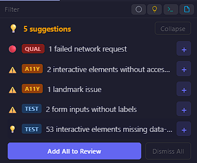
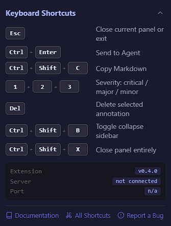

# Browser Extension

Click bugs. Describe them. Send to your agent - or export to Jira.

  


Also works in Edge, Brave, and Opera (Chromium-based). Store version outdated? [Download latest from GitHub](https://github.com/sourjya/viewgraph/releases/latest).


---

## 1. Hover and Select

Click the ViewGraph toolbar icon. Elements highlight as you hover, with a tooltip showing the CSS selector, testid, role, and dimensions.

- **Click** any element to annotate it
- **Shift+drag** to select a rectangular region
- **Scroll wheel** while hovering to navigate up/down the DOM tree

---

## 2. Annotate

Describe what's wrong. Set severity and category. ViewGraph captures the technical details automatically.

- **Severity:** Critical / Major / Minor
- **Category:** Visual, Functional, Content, A11y, Perf, Idea
- **Smart suggestions:** Clickable chips for detected issues (missing aria-label, no testid, low contrast)
- **Idea mode:** Toggle the lightbulb to switch from bug reporting to feature ideation. Send ideas to your agent with `@vg-ideate` to generate structured specs.

---

## 3. Inspect

The Inspect tab surfaces browser diagnostics without opening DevTools.

- Failed network requests with URL, type, and duration
- Console errors and warnings from page scripts
- Accessibility issues (missing labels, low contrast, keyboard traps)
- Layout problems (overflow, z-index conflicts, focus chain)
- Viewport breakpoint indicator

Each section has **Copy** (clipboard) and **Add as Note** (+) buttons. One click turns a network failure or console error into an annotation - no DevTools, no copy-pasting.

### Smart Suggestions

After capture, ViewGraph scans for issues and shows clickable suggestions. Click `+` to add any suggestion to your review list.

### Help Card

Click `?` in the header for keyboard shortcuts, version info, and quick links.

---

## 4. Export



Pushes annotations + full DOM capture + 17 enrichment collectors to the MCP server. Your agent receives everything needed to fix the code.

**Requires:** MCP server running. **Trust gate:** Blocked on untrusted URLs with override option.



Copies a structured bug report to clipboard. Paste into Jira, Linear, or GitHub Issues.

Includes: page metadata, viewport, breakpoint, failed requests, console errors, and each annotation with element details.

**Works offline** - no server needed.



Downloads a ZIP archive with:
- `report.md` - full markdown report
- `screenshots/` - cropped screenshots per annotation
- `network.json` - network request data
- `console.json` - console errors and warnings

**Works offline** - no server needed.



---

## 16 Enrichment Collectors

Every capture automatically includes data from these collectors:



| Collector | What it captures |
|---|---|
| Network | HTTP requests, failed requests, response sizes |
| Console | Errors, warnings from page scripts |
| Performance | Navigation timing, resource timing, memory |
| Event listeners | Click handlers, keyboard handlers |
| Animations | Running CSS/JS animations |



| Collector | What it captures |
|---|---|
| Breakpoints | Active CSS breakpoint, viewport width |
| Media queries | All `@media` rules and their match state |
| Stacking contexts | Z-index conflicts between siblings |
| Focus chain | Tab order, unreachable elements, focus traps |
| Scroll containers | Nested scroll areas, overflow state |
| Landmarks | Semantic elements (nav, main, header, footer) |
| axe-core | 100+ WCAG accessibility rules |
| Intersection | Element visibility relative to viewport |



| Collector | What it captures |
|---|---|
| Components | React/Vue/Svelte component names on DOM nodes |
| Client storage | localStorage, sessionStorage, cookies (sensitive values redacted) |
| CSS custom properties | CSS variables defined on `:root` and `body` |
| Transient state | Toasts, flash content, animation jank, render thrashing (30s buffer) |



---

## More Features

| Feature | Description |
|---|---|
| **Auto-audit** | Automatically runs a11y, layout, and testid audits after each capture |
| **Baselines** | Set a capture as baseline, compare subsequent captures for structural regressions |
| **Session recording** | Record multi-step user journeys as annotated sessions |
| **HTML snapshots** | Save full page HTML alongside captures (toggle in Settings) |
| **Screenshots** | Save viewport PNG alongside captures (toggle in Settings) |
| **Keyboard shortcuts** | Ctrl+Enter (send), Ctrl+Shift+C (copy), 1/2/3 (severity), Esc (close). [Full list](../reference/keyboard-shortcuts.md) |
| **URL trust indicator** | Shield icon shows trusted (green), configured (blue), or untrusted (amber) pages |
| **Multi-project** | Up to 4 simultaneous projects with automatic URL routing. [Setup guide](../getting-started/multi-project.md) |
