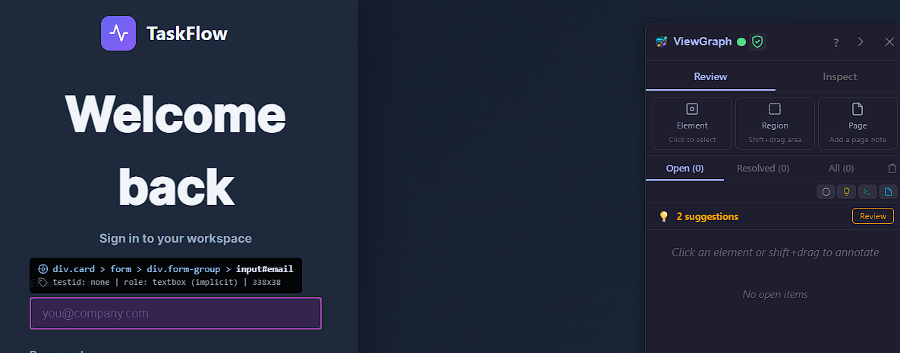
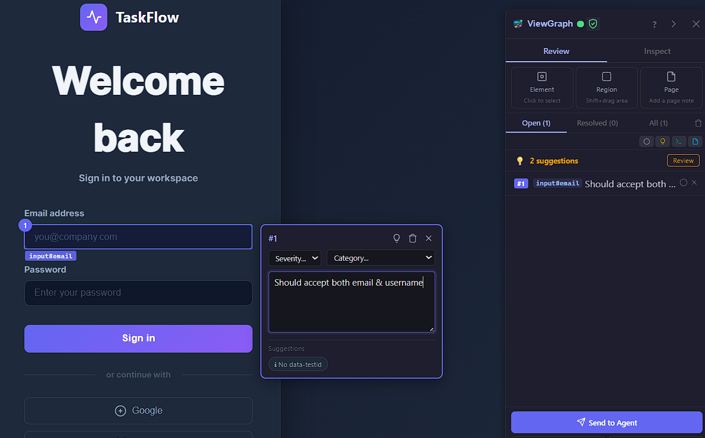
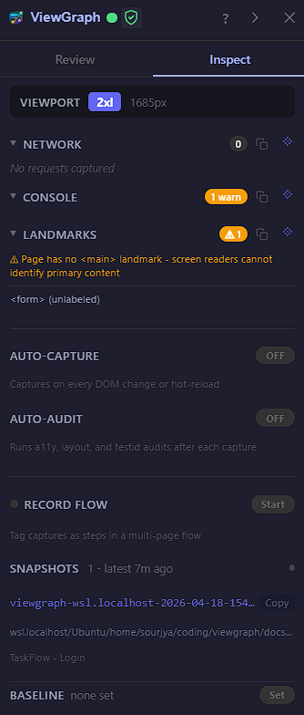
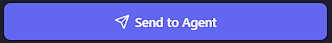
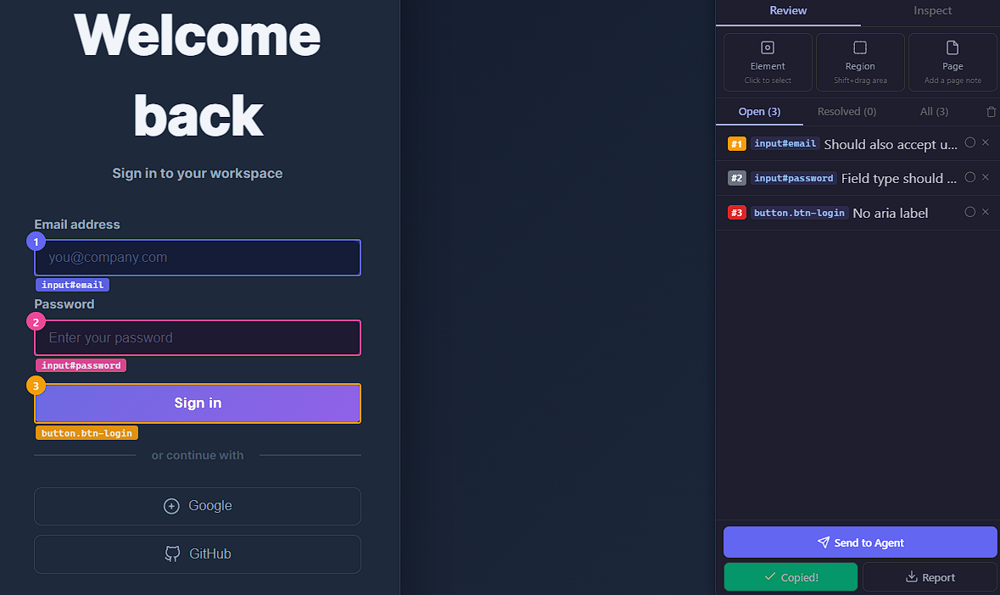
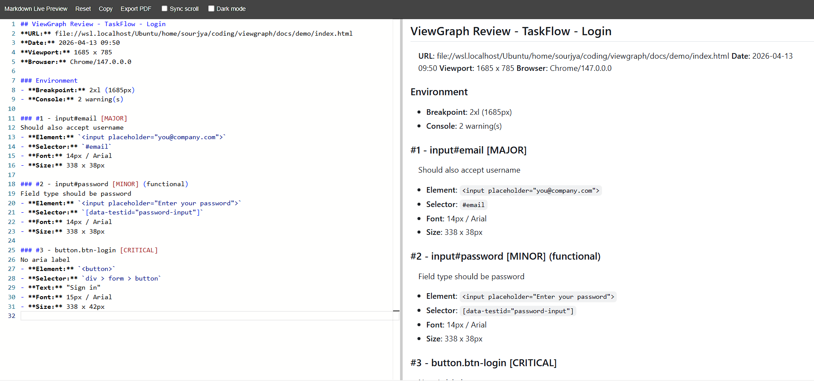

# Browser Extension

The ViewGraph extension runs in Chrome and Firefox. Other Chromium-based browsers (Edge, Brave, Opera) can load the extension but are not officially tested.

## Annotate Mode

Click the ViewGraph toolbar icon to enter annotate mode. The sidebar opens and elements highlight as you hover.



### Element Selection

- **Click** any element to select it and add a comment
- **Shift+drag** to select a rectangular region
- **Scroll wheel** while hovering to navigate up/down the DOM tree

### Hover Tooltip

A 2-line tooltip follows your cursor showing:
```
body > main > form > input.form-control
testid: email-input | role: textbox | 330x38
```

### Annotation Panel

When you click an element, a floating panel appears with:
- **Comment** text area - describe what's wrong
- **Severity** - Critical (red), Major (yellow), Minor (gray)
- **Category** - Visual, Functional, Content, A11y, Perf, Idea
- **Smart suggestions** - clickable chips based on detected issues (missing aria-label, no testid, low contrast)



## Two-Tab Sidebar

### Review Tab

For annotating and exporting:
- Mode bar: Element, Region, Page selection modes
- Agent request cards (when your agent asks for a capture)
- Annotation list with severity badges
- Filter: Open / Resolved / All
- Export: Send to Agent, Copy MD, Download Report


### Inspect Tab

For understanding page state:


- Viewport breakpoint indicator
- Network requests (failed requests highlighted in red)
- Console errors and warnings
- Visibility warnings (elements hidden by ancestor)
- Stacking, focus, scroll, and landmark diagnostics

## Export Options

### Send to Agent

Pushes annotations + full DOM capture + all enrichment data to the MCP server. Your agent receives everything needed to implement fixes.



### Copy Markdown

Copies a structured bug report to clipboard:
- Page metadata (URL, date, viewport, browser)
- Environment (breakpoint, failed requests, console errors)
- Each annotation with element details and severity





### Download Report (ZIP)

Downloads a ZIP archive:
- `report.md` - full markdown report
- `screenshots/` - cropped screenshots per annotation
- `network.json` - network request data
- `console.json` - console errors and warnings

## 14 Enrichment Collectors

Every capture automatically includes data from these collectors:

| Collector | What it captures |
|---|---|
| Network | HTTP requests, failed requests, response sizes |
| Console | Errors, warnings from page scripts |
| Breakpoints | Active CSS breakpoint, viewport width |
| Media queries | All `@media` rules and their match state |
| Stacking contexts | Z-index conflicts between siblings |
| Focus chain | Tab order, unreachable elements, focus traps |
| Scroll containers | Nested scroll areas, overflow state |
| Landmarks | Semantic elements (nav, main, header, footer) |
| Components | React/Vue/Svelte component names on DOM nodes |
| axe-core | 100+ WCAG accessibility rules |
| Event listeners | Click handlers, keyboard handlers |
| Performance | Navigation timing, resource timing, memory |
| Animations | Running CSS/JS animations |
| Intersection | Element visibility relative to viewport |

Every diagnostic section has two action buttons:

- **Copy** (clipboard icon) - copies the section data as text. Paste into a chat, Jira ticket, or Slack message.
- **Note** (document icon) - creates an annotation pre-populated with the diagnostic data. It appears in your Review tab and gets sent with your next "Send to Agent."

This turns error reporting into a one-click action. See a red "2 failed" badge on Network? Click the note icon - the failed URLs, request types, and durations are packaged into an annotation automatically. No DevTools, no copy-pasting error messages, no writing technical descriptions. The sidebar surfaces what matters and lets you report it instantly.

## Keyboard Shortcuts

Click the `?` button in the sidebar header for the shortcut cheat sheet. See [Keyboard Shortcuts](../reference/keyboard-shortcuts.md) for the full list.

| Shortcut | Action |
|---|---|
| `Esc` | Close current panel or exit |
| `Ctrl+Enter` | Send to Agent |
| `Ctrl+Shift+C` | Copy Markdown |
| `1` / `2` / `3` | Set severity |
| `Delete` | Delete annotation |

## Auto-Audit

Toggle "Auto-Audit" in the Inspect tab. When enabled, the server automatically runs accessibility, layout, and testid audits after each capture and shows a summary badge in the sidebar.

## Baselines

In the Inspect tab, set the latest capture as your baseline. On subsequent captures, click "Compare" to see a structural diff: elements added, removed, moved, or with changed testids.
