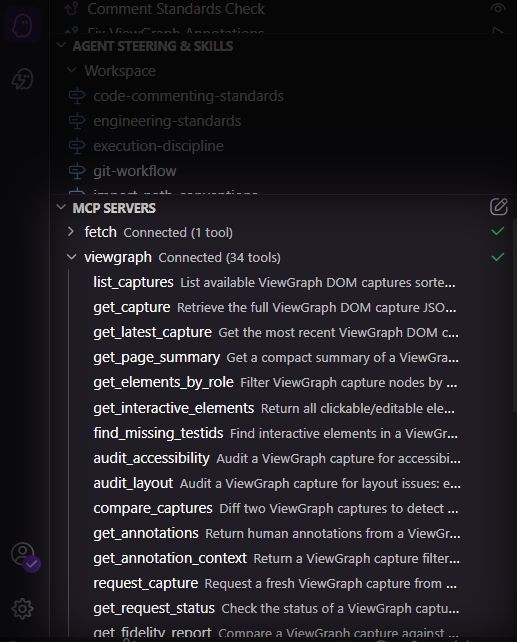

# 38 MCP Tools

Your agent discovers these automatically. You don't call them - you describe what you want and the agent picks the right tool.

> "Fix the annotations from my last review" → agent calls `get_unresolved`, `get_annotation_context`, `find_source`, then `resolve_annotation` for each fix.

---





**Core (5)**

| Tool | What the agent does with it |
|---|---|
| `list_captures` | Find captures by URL, date, or count |
| `get_capture` | Read full DOM structure of a page |
| `get_latest_capture` | Quick access to the most recent capture |
| `get_page_summary` | Lightweight overview before loading full capture |
| `get_session_status` | Check what data is available before choosing tools |

**Analysis (8)**

| Tool | What the agent does with it |
|---|---|
| `get_elements_by_role` | Find all buttons, links, inputs, headings, etc. |
| `get_interactive_elements` | List every clickable/editable element with selectors |
| `find_missing_testids` | Identify elements that need data-testid for testing |
| `audit_accessibility` | Run 100+ WCAG rules via axe-core |
| `audit_layout` | Detect overflow, overlap, and viewport issues |
| `compare_captures` | Diff two captures for structural changes |
| `get_annotations` | Read human feedback from review sessions |
| `get_annotation_context` | Get full DOM context around annotated elements |

**Bidirectional (3)**

| Tool | What the agent does with it |
|---|---|
| `request_capture` | Ask the user to capture a specific page |
| `get_request_status` | Check if the user accepted the capture request |
| `get_fidelity_report` | Verify capture accuracy against HTML snapshot |

**Baseline & Regression (3)**

| Tool | What the agent does with it |
|---|---|
| `set_baseline` | Save a capture as the golden reference |
| `compare_baseline` | Detect regressions against the baseline |
| `list_baselines` | See all stored baselines |

**Annotation Intelligence (7)**

| Tool | What the agent does with it |
|---|---|
| `resolve_annotation` | Mark issues as fixed, wontfix, duplicate, or invalid |
| `get_unresolved` | Find all open issues across captures |
| `check_annotation_status` | Check if old issues are still present in new captures |
| `diff_annotations` | Track which issues persist across deploys |
| `detect_recurring_issues` | Find elements that keep getting flagged |
| `analyze_patterns` | Generate recommendations from resolved issues |
| `generate_spec` | Turn annotations into Kiro specs (requirements + tasks) |

**Session & Journey (5)**

| Tool | What the agent does with it |
|---|---|
| `list_sessions` | Find recorded user journeys |
| `get_session` | Replay a multi-step flow |
| `analyze_journey` | Check for issues across journey steps |
| `visualize_flow` | Generate Mermaid state diagram from a session |
| `get_capture_stats` | Aggregate stats across all captures |

**Source & Quality (6)**

| Tool | What the agent does with it |
|---|---|
| `find_source` | Map a DOM element to its source file and line number |
| `check_consistency` | Detect style drift across pages |
| `compare_screenshots` | Pixel-by-pixel visual regression check |
| `compare_styles` | Diff computed CSS of an element between captures |
| `get_component_coverage` | Report testid coverage per framework component |
| `validate_capture` | Check capture quality (empty pages, missing data) |




| Tool | What the agent does with it |
|---|---|
| `list_captures` | Find captures by URL, date, or count |
| `get_capture` | Read full DOM structure of a page |
| `get_latest_capture` | Quick access to the most recent capture |
| `get_page_summary` | Lightweight overview before loading full capture |
| `get_session_status` | Check what data is available before choosing tools |



| Tool | What the agent does with it |
|---|---|
| `get_elements_by_role` | Find all buttons, links, inputs, headings, etc. |
| `get_interactive_elements` | List every clickable/editable element with selectors |
| `find_missing_testids` | Identify elements that need data-testid for testing |
| `audit_accessibility` | Run 100+ WCAG rules via axe-core |
| `audit_layout` | Detect overflow, overlap, and viewport issues |
| `compare_captures` | Diff two captures for structural changes |
| `get_annotations` | Read human feedback from review sessions |
| `get_annotation_context` | Get full DOM context around annotated elements |



| Tool | What the agent does with it |
|---|---|
| `resolve_annotation` | Mark issues as fixed, wontfix, duplicate, or invalid |
| `get_unresolved` | Find all open issues across captures |
| `check_annotation_status` | Check if old issues are still present in new captures |
| `diff_annotations` | Track which issues persist across deploys |
| `detect_recurring_issues` | Find elements that keep getting flagged |
| `analyze_patterns` | Generate recommendations from resolved issues |
| `generate_spec` | Turn annotations into Kiro specs (requirements + tasks) |



| Tool | What the agent does with it |
|---|---|
| `set_baseline` | Save a capture as the golden reference |
| `compare_baseline` | Detect regressions against the baseline |
| `list_baselines` | See all stored baselines |
| `request_capture` | Ask the user to capture a specific page |
| `get_request_status` | Check if the user accepted the capture request |
| `get_fidelity_report` | Verify capture accuracy against HTML snapshot |



| Tool | What the agent does with it |
|---|---|
| `find_source` | Map a DOM element to its source file and line number |
| `check_consistency` | Detect style drift across pages |
| `compare_screenshots` | Pixel-by-pixel visual regression check |
| `compare_styles` | Diff computed CSS of an element between captures |
| `get_component_coverage` | Report testid coverage per framework component |
| `validate_capture` | Check capture quality (empty pages, missing data) |



| Tool | What the agent does with it |
|---|---|
| `list_sessions` | Find recorded user journeys |
| `get_session` | Replay a multi-step flow |
| `analyze_journey` | Check for issues across journey steps |
| `visualize_flow` | Generate Mermaid state diagram from a session |
| `get_capture_stats` | Aggregate stats across all captures |



