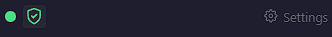

# Installation

[](https://chromewebstore.google.com/) [](https://addons.mozilla.org/en-US/firefox/addon/viewgraph-capture/) [](https://www.npmjs.com/package/@viewgraph/core)

Two ways to set up ViewGraph depending on your goal.

## For Users: Add ViewGraph to Your Project

This is the path for developers who want to use ViewGraph with their AI agent. You install it in **your project**, not in a separate folder.

### Step 1: Install the browser extension

<!-- TODO: Replace with actual CWS link when published -->
Install [ViewGraph Capture](https://chrome.google.com/webstore) from the Chrome Web Store. Works in Chrome, Edge, Brave, and Opera.

[](https://addons.mozilla.org/en-US/firefox/addon/viewgraph-capture/)

Or [build from source](#for-developers-build-from-source) if you prefer.

### Step 2: Install the npm package

**Option A: Global install** (simpler - install once, use in any project)

```bash
npm install -g @viewgraph/core
```

Then in any project, just run `viewgraph-init` (no `npx` needed). One install covers all your projects.

**Option B: Per-project install**

```bash
cd ~/my-project
npm install @viewgraph/core
```

Then use `npx viewgraph-init` in that project. Use this approach when different projects need different ViewGraph versions, or when your team pins dependencies in `package.json` for reproducible builds.

Package: [@viewgraph/core on npm](https://www.npmjs.com/package/@viewgraph/core)

### Step 3: Initialize

```bash
npx viewgraph-init
```

This creates `.viewgraph/captures/` in your project, detects your AI agent, writes the MCP config, and starts the server.

**Using a dev server?** Add `--url` so captures route correctly:

```bash
npx viewgraph-init --url localhost:3000
```

### Step 4: Verify

1. Click the ViewGraph icon on any page
2. The sidebar should show a **green dot** with "Connected"
3. Hover over elements - blue highlight should follow your cursor



If the dot is red, the server isn't running. Run `npx viewgraph-init` again from your project folder.

### Requirements

| Requirement | Minimum Version |
|---|---|
| [Node.js](https://nodejs.org/) | 22.0.0+ (LTS) |
| npm | 9.0.0+ |
| Chrome | 116+ (or Firefox 109+) |

### Agent detection

The init script detects your agent by looking for config directories:

| Agent | Detected by | Config written to |
|---|---|---|
| Kiro | `.kiro/` directory exists | `.kiro/settings/mcp.json` |
| Claude Code | `.claude/` directory exists | `.claude/mcp.json` |
| Cursor | `.cursor/` directory exists | `.cursor/mcp.json` |
| Generic | No agent detected | `.viewgraph/mcp.json` |

For Kiro, the init script also installs Power assets: 3 hooks, 8 prompt shortcuts, and 3 steering docs.

Here's how the init output differs - a Kiro project (right) gets hooks, prompts, and steering docs automatically, while a non-Kiro project (left) gets just the MCP config:


---

## For Developers: Build from Source

This is the path for contributors or anyone who wants to build the browser extension themselves.

### Step 1: Clone the repo

```bash
git clone https://github.com/sourjya/viewgraph.git
cd viewgraph
npm install
```

### Step 2: Build the extension

```bash
npm run build                        # Chrome + Firefox + Playwright bundle
npm run build:ext:chrome             # Chrome only
npm run build:ext:firefox            # Firefox only
```

### Step 3: Load in browser

**Chrome:**
1. Open `chrome://extensions/`
2. Enable **Developer mode** (top-right toggle)
3. Click **Load unpacked**
4. Select `extension/.output/chrome-mv3`

**Firefox:**
1. Open `about:debugging#/runtime/this-firefox`
2. Click **Load Temporary Add-on**
3. Select any file inside `extension/.output/firefox-mv3`

### Step 4: Run the server

```bash
npm run dev:server
```

### Step 5: Initialize in a test project

Open a separate terminal in any project folder:

```bash
cd ~/some-project
npx viewgraph-init
```

This points to the server you started in step 4.

---

## Starting the server in later sessions

The init script starts the server automatically on first run. For subsequent sessions, either:

- Re-run `npx viewgraph-init` from your project (restarts cleanly)
- Or run `npm run dev:server` from the ViewGraph repo (if building from source)


## Updating ViewGraph

ViewGraph has multiple components that update independently:

| Component | How it updates | What you do |
|---|---|---|
| **Chrome extension** | Auto-updates from Chrome Web Store | Nothing - Chrome handles it automatically (checks every few hours) |
| **Firefox extension** | Auto-updates from Firefox Add-ons | Nothing - Firefox handles it automatically (checks every 24 hours) |
| **@viewgraph/core** (MCP server) | npm package | Run `npm update @viewgraph/core` in your project |
| **@viewgraph/playwright** | npm package | Run `npm update @viewgraph/playwright` in your project |
| **Power assets** (prompts, hooks, steering) | Re-run init script | Run `npx viewgraph-init` - it automatically updates files that are older than the source |
| **MCP server process** | Restarts on init | Re-running `npx viewgraph-init` kills the old server and starts the updated one |

### Updating the npm packages

```bash
cd ~/my-project
npm update @viewgraph/core
npx viewgraph-init
```

The `npm update` pulls the latest server code. The `npx viewgraph-init` restarts the server and updates any power assets (prompts, hooks, steering docs) that have changed since your last init.

### Checking for updates

```bash
npm outdated @viewgraph/core @viewgraph/playwright
```

This shows your installed version vs the latest available version.

### What triggers a version bump

| Change type | Version bump | Example |
|---|---|---|
| Bug fixes | Patch (0.1.1 → 0.1.2) | Fix routing bug, fix prompt scope |
| New features | Minor (0.1.2 → 0.2.0) | New MCP tool, sidebar redesign |
| Breaking changes | Major (0.x → 1.0) | Capture format change, API change |

Release notes are published on [GitHub Releases](https://github.com/sourjya/viewgraph/releases) and the [Roadmap](../reference/roadmap.md) page.

## Troubleshooting

| Problem | Solution |
|---|---|
| Extension icon doesn't appear | Check `chrome://extensions/` - is it enabled? |
| Sidebar shows red dot | Server isn't running. Run `npx viewgraph-init` from your project. |
| "Send to Agent" does nothing | Check sidebar connection status. Server must be running. Re-run `npx viewgraph-init` from your project. |
| Captures not appearing in agent | Verify `.viewgraph/captures/` exists. Run `npx viewgraph-status` for a health check. |
| Wrong project shown in sidebar | Add `--url` pattern. See [Multi-Project Setup](multi-project.md). |

## Agent and IDE Compatibility

ViewGraph works with any MCP-compatible agent. The init script auto-detects your agent and writes the correct config file.

| Agent | MCP Config Location | Power Assets |
|---|---|---|
| Kiro | `.kiro/settings/mcp.json` | Hooks, prompts, steering docs |
| Claude Code | `~/.claude/mcp.json` | MCP tools only |
| Cursor | `.cursor/mcp.json` | MCP tools only |
| Windsurf | `.windsurf/mcp.json` | MCP tools only |
| Cline | `.cline/mcp.json` | MCP tools only |
| Other MCP agents | `.viewgraph/mcp.json` | MCP tools only |

### Cloud IDEs

The extension runs in your local browser. The MCP server runs wherever your code is. For cloud IDEs (GitHub Codespaces, Gitpod, AWS Cloud9), you need port forwarding so the extension can reach the server.

| Environment | MCP Server | Extension | Port Forwarding |
|---|---|---|---|
| Local IDE | localhost | localhost | Not needed |
| Codespaces | Remote | Local browser | Automatic for most ports |
| Gitpod | Remote | Local browser | Automatic for most ports |
| SSH remote | Remote | Local browser | `ssh -L 9876:localhost:9876` |

The standalone export modes (Copy MD, Download Report) work without any server connection. The `@viewgraph/playwright` package runs entirely server-side.
