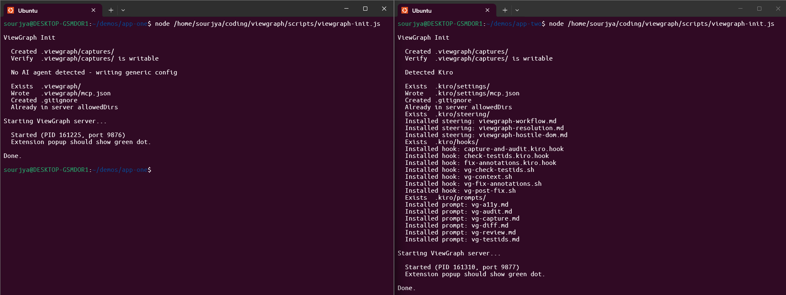

# Multi-Project Setup

ViewGraph can run multiple projects simultaneously, each with its own server, captures directory, and URL routing.

> **Single project?** You don't need this page. The [Quick Setup](installation.md#quick-setup-recommended) handles everything automatically. This guide is for running 2+ projects at the same time with separate capture directories.

## How Port Allocation Works

Each project gets its own MCP server on a unique port. The init script handles this automatically:

1. **Port scanning:** `viewgraph-init` scans ports 9876, 9877, 9878, 9879 in order
2. **First available:** It picks the first port that isn't already in use by another ViewGraph server
3. **Server starts:** The MCP server binds to `127.0.0.1:<port>` (localhost only - not accessible from the network)
4. **Port recorded:** The port is saved in the MCP config file so your AI agent knows where to connect

If all 4 ports are in use, the init script reports an error.

**Current limit: 4 simultaneous projects.** The port range 9876-9879 supports up to 4 projects running at the same time. This is a deliberate choice to keep the extension's port scanning fast (4 checks vs scanning hundreds). If you need more than 4 simultaneous projects, stop a server you're not actively using (`pkill -f "server/index.js"`) to free a port. Most developers work on 1-2 projects at a time; the 4-port limit is rarely hit. Expanding the range is on the roadmap if demand warrants it.

### How the extension finds your server

When you click the ViewGraph icon, the extension needs to figure out which server handles the current page:

1. **Port scan:** The extension checks all 4 ports (9876-9879) for running ViewGraph servers
2. **Server info:** For each running server, it calls `GET /info` to get the project root and URL patterns
3. **URL matching:** It compares the current page URL against each server's URL patterns
4. **Best match:** The server whose patterns match the current page receives the capture

This happens in milliseconds. The green dot in the sidebar header confirms a server was found. A red dot means no server matched.

### Example with two projects

```
Project A: ~/projects/frontend  → port 9876, patterns: [localhost:3000]
Project B: ~/projects/admin     → port 9877, patterns: [localhost:4000]
```

- Open `localhost:3000/dashboard` → extension routes to port 9876 (Project A)
- Open `localhost:4000/users` → extension routes to port 9877 (Project B)
- Open a `file://` URL inside `~/projects/frontend/` → routes to port 9876 by path match

No manual port configuration needed. The init script and extension handle everything.

## How URL Routing Works

When you capture a page, the extension matches the page URL against each running server to find the right project:

| Mode | URL example | How it matches | Setup needed |
|---|---|---|---|
| **File** | `file:///home/user/myapp/index.html` | Compares file path against server's project root | None - automatic |
| **Localhost** | `http://localhost:3000/dashboard` | Matches URL patterns in `.viewgraph/config.json` | `--url localhost:3000` |
| **Remote** | `https://staging.myapp.com/login` | Matches URL patterns in `.viewgraph/config.json` | `--url staging.myapp.com` |

The extension normalizes URLs automatically:
- `127.0.0.1`, `0.0.0.0`, and `[::1]` are treated as `localhost`
- Custom hostnames like `myapp.local:3000` match by port number
- WSL file paths (`file://wsl.localhost/Ubuntu/...`) are handled on Windows

## Setting Up URL Patterns


These commands require `npm install -g @viewgraph/core` first. If you're using the zero-config setup (MCP JSON only), URL patterns are learned automatically from your first capture.


### During init

```bash
viewgraph-init --url localhost:3000
```

Multiple patterns:

```bash
viewgraph-init --url localhost:3000 --url staging.myapp.com
```

### Adding patterns later

Re-run init with the new `--url` flag. It appends without duplicating:

```bash
viewgraph-init --url staging.myapp.com
# config.json now has: ["localhost:3000", "staging.myapp.com"]
```

### Editing directly

Open `.viewgraph/config.json`:

```json
{
  "urlPatterns": [
    "localhost:3000",
    "staging.myapp.com"
  ]
}
```

Changes take effect within 15 seconds (the extension's registry refresh interval).

## Example: Two Projects

```bash
# Terminal 1
cd ~/projects/frontend
viewgraph-init --url localhost:3000
#   Started (PID 12345, port 9876)

# Terminal 2
cd ~/projects/admin
viewgraph-init --url localhost:3001
#   Started (PID 12346, port 9877)
```

Now in Chrome:
- `http://localhost:3000/login` - captures go to `frontend/.viewgraph/captures/`
- `http://localhost:3001/users` - captures go to `admin/.viewgraph/captures/`
- `file:///home/user/projects/frontend/index.html` - matches by file path automatically



## Verifying

Check which servers are running:

```bash
curl http://127.0.0.1:9876/info | jq
```

```json
{
  "capturesDir": "/home/user/projects/frontend/.viewgraph/captures",
  "projectRoot": "/home/user/projects/frontend",
  "urlPatterns": ["localhost:3000"],
  "agent": "Kiro"
}
```

The sidebar's green dot tooltip shows which server the current page is connected to.

## Troubleshooting

| Problem | Cause | Fix |
|---|---|---|
| Wrong project in sidebar | URL pattern missing | Add `--url` pattern or edit `.viewgraph/config.json` |
| No server detected | Server not running | Run `viewgraph-init` in the project folder |
| 127.0.0.1 vs localhost | Handled automatically | Extension normalizes both to `localhost` |
| Custom hostname not matching | Port fallback handles this | `--url localhost:3000` matches any hostname on port 3000 |
| Config changes not visible | 15-second cache | Close and reopen the sidebar to force refresh |
