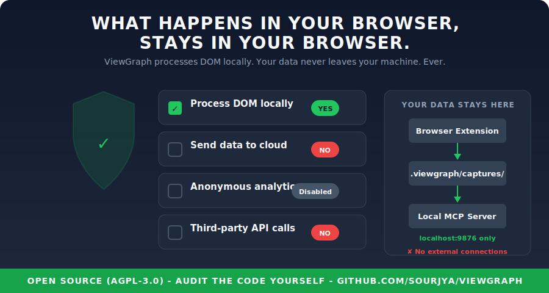

# Security



ViewGraph is designed to be safe for developers, testers, and teams working on production applications. Here's how it handles common security concerns.

## No Data Leaves Your Machine

ViewGraph operates entirely on localhost. The architecture:

```
Browser extension --> localhost:9876 --> .viewgraph/captures/ on your disk
```

- The extension communicates **only** with a server running on `127.0.0.1`
- No cloud services, no external APIs, no telemetry, no analytics
- Captures are plain JSON files stored in your project directory
- You control what gets captured and where it goes

## Read-Only Observer

The extension **never modifies** the pages you visit:

- No form submissions
- No network requests on behalf of the site
- No cookie access or manipulation
- No DOM modifications (the sidebar runs in an isolated Shadow DOM)
- No script injection into the page's execution context

It reads the DOM structure, computed styles, and element attributes. That's it.

## Minimal Permissions

The extension requests only what it needs:

| Permission | Why | What it can't do |
|---|---|---|
| `activeTab` | Access the current tab's DOM when you click the icon | Can't access other tabs, can't run in background |
| `storage` | Save your preferences locally | Data stays in browser, not synced externally |
| `scripting` | Inject the capture script on your click | Only runs when you explicitly activate it |

No `<all_urls>` host permission for background access. No `webRequest` for intercepting traffic. No `cookies` permission.

## What Gets Captured

Every capture includes only what's visible in the rendered DOM:

| Captured | NOT captured |
|---|---|
| Element tags, attributes, selectors | Passwords or input values |
| Computed CSS styles | Cookies or session tokens |
| Bounding boxes and layout | Request/response bodies |
| ARIA roles and labels | localStorage or IndexedDB |
| Console errors (messages only) | Source code or server-side data |
| Network request status (pass/fail) | Authentication headers |
| Component names (React/Vue/Svelte) | Environment variables |

## Open Source

The entire codebase is open source under AGPL-3.0. You can inspect every line:

- [Extension source](https://github.com/sourjya/viewgraph/tree/main/extension)
- [Server source](https://github.com/sourjya/viewgraph/tree/main/server)
- [STRIDE Threat Model](https://github.com/sourjya/viewgraph/blob/main/docs/architecture/threat-model-stride.md) - 9 threats, 9 mitigations, 4 threat actors
- [Security assessment](https://github.com/sourjya/viewgraph/blob/main/docs/architecture/security-assessment.md)
- [SRR-001 Security Review](https://github.com/sourjya/viewgraph/blob/main/docs/security/SRR-001-2026-04-18.md)
- [SRR-002 Security Review](https://github.com/sourjya/viewgraph/blob/main/docs/security/SRR-002-2026-04-19-T2.md)
- [SRR-004 Security Review](https://github.com/sourjya/viewgraph/blob/main/docs/security/SRR-004-2026-04-21-T3.md)
- [SRR-005 Security Review](https://github.com/sourjya/viewgraph/blob/main/docs/security/SRR-005-2026-04-24-T2.md)
- [Codebase Review](https://github.com/sourjya/viewgraph/blob/main/docs/architecture/codebase-review-2026-04-18.md)

## Security Audits Performed

The project undergoes periodic security reviews using a 3-tier model:

- **Tier 1 (every commit):** Secrets, unsafe execution, auth bypass - automated pre-commit check
- **Tier 2 (feature complete):** Full OWASP S1-S17 audit of changed files
- **Tier 3 (sprint end):** Full codebase + supply chain + AI-generation artifacts

**[SRR-005 - Tier 2 Review (April 24, 2026)](https://github.com/sourjya/viewgraph/blob/main/docs/security/SRR-005-2026-04-24-T2.md):**
- 1 HIGH (fixed: timing-safe handshake verify), 2 MEDIUM (1 fixed, 1 accepted), 1 LOW (fixed)
- HMAC key in handshake accepted risk (native messaging is the fix)
- F22: Native messaging auto-configured by viewgraph-init (Linux, macOS, Windows - not WSL)

**[SRR-004 - Tier 3 Sprint End Review (April 21, 2026)](https://github.com/sourjya/viewgraph/blob/main/docs/security/SRR-004-2026-04-21-T3.md):**
- 0 CRITICAL, 2 HIGH (1 fixed: config whitelist bypass, 1 roadmap: F19 wrapping), 5 MEDIUM, 4 LOW
- Native messaging config whitelist enforced (shared ALLOWED_CONFIG_KEYS constant)
- All previous remediations from SRR-001/002/003 verified intact

**[SRR-002 - Tier 2 Review (April 19, 2026)](https://github.com/sourjya/viewgraph/blob/main/docs/security/SRR-002-2026-04-19-T2.md):**
- 1 HIGH (fixed: auto-learn config merge), 3 MEDIUM (2 fixed, 2 deferred), 2 LOW (1 fixed)
- URL hostname matching replaces String.includes() trust gate bypass
- All SRR-001 remediations verified in place

**[SRR-001 - Full Codebase Review (April 18, 2026)](https://github.com/sourjya/viewgraph/blob/main/docs/security/SRR-001-2026-04-18.md):**
- 2 HIGH (both accepted risks pending native messaging), 5 MEDIUM (all fixed), 4 LOW (all fixed)
- Config schema validation, auto-learn localhost-only, shadow DOM closed mode
- Security headers, WebSocket limits, error sanitization, F19 wrapping gaps closed

**[Security Assessment (April 2026)](https://github.com/sourjya/viewgraph/blob/main/docs/architecture/security-assessment.md):**
- HTTP server endpoint review (16 endpoints)
- Input validation on all POST endpoints
- Path traversal prevention on file writes
- Payload size limits (5MB captures, 10MB snapshots)
- XSS prevention in extension UI (closed Shadow DOM)
- WebSocket connection handling

## Localhost Server Security

The MCP server binds to `127.0.0.1` only - it is not accessible from the network. Additional protections:

- **Capture format validation** - rejects malformed JSON before writing
- **Filename sanitization** - strips `..`, path traversal characters, and non-alphanumeric chars
- **Directory scoping** - only writes to configured `.viewgraph/captures/` directories
- **Payload limits** - 5MB max for captures, 10MB for snapshots
- **Config schema validation** - PUT /config only accepts whitelisted keys, preventing config poisoning
- **Auto-learn localhost-only** - URL patterns are only auto-learned from localhost/file:// URLs
- **Security headers** - all responses include `X-Content-Type-Options: nosniff` and `Cache-Control: no-store`
- **WebSocket limits** - 1MB max payload, 10 concurrent connections max
- **Error sanitization** - error responses never leak filesystem paths

Auth tokens were evaluated and removed for beta (see [ADR-010](https://github.com/sourjya/viewgraph/blob/main/docs/decisions/ADR-010-remove-http-auth-beta.md)). The transport abstraction layer (F11) is built - extension modules communicate through `transport.js` which will use native messaging when the host is installed, falling back to localhost HTTP. See [ADR-013](https://github.com/sourjya/viewgraph/blob/main/docs/decisions/ADR-013-native-messaging-transport.md) for the layered transport strategy.

## Prompt Injection Defense (F19)

ViewGraph captures DOM content from web pages and sends it to AI agents. A malicious page could embed instructions in DOM text that the agent might follow. ViewGraph uses 5 layers of defense:

| Layer | What it does | What it stops |
|---|---|---|
| **1. Capture sanitization** | Strips HTML comments, caps data-* attributes at 100 chars, clears hidden element text | Comment injection, hidden text injection, oversized payloads |
| **2. Transport wrapping** | Wraps page text in `[CAPTURED_TEXT]` delimiters, comments in `[USER_COMMENT]` delimiters | LLM confusing data with instructions |
| **3. Suspicious detection** | Flags patterns like "ignore previous instructions", "system:", "act as" with `_warning` field | Common injection patterns |
| **4. Prompt hardening** | SERVER_INSTRUCTIONS, steering docs, and all prompts include injection defense guidance | Casual injection attempts |
| **5. Trust gate (F17)** | Blocks send-to-agent for untrusted URLs entirely | ALL injection from untrusted sites |

No single layer is bulletproof, but combined they significantly reduce the attack surface. See [ADR-012](https://github.com/sourjya/viewgraph/blob/main/docs/decisions/ADR-012-prompt-injection-defense.md) for the full design rationale.

## Shadow DOM Isolation

The sidebar runs in a **closed Shadow DOM** (`mode: 'closed'`). The host page's JavaScript cannot:
- Read annotation comments or sidebar content
- Modify the sidebar UI or inject fake elements
- Access the MCP server URL or connection status
- Intercept extension message passing or storage

## Install Method Security Comparison

All current install methods run entirely on your machine. No data leaves localhost.

| | Zero-config (npx) | npm install | Build from source |
|---|---|---|---|
| **Server runs on** | localhost only | localhost only | localhost only |
| **Network exposure** | None | None | None |
| **Data leaves machine** | No | No | No |
| **Package source** | npm registry | npm registry | GitHub (you audit) |
| **Version control** | Always latest from npm | Pinned to installed version | Pinned to your clone |
| **Supply chain risk** | Low - fetches latest on each run | Lower - pinned version | Lowest - you review the code |
| **Auto-updates** | Yes (npx fetches latest) | No (manual `npm update`) | No (manual `git pull`) |
| **Offline capable** | Only if npm-cached | Yes | Yes |
| **Setup effort** | 5 lines of JSON | 2 commands | Clone + build |
| **Best for** | Quick start, single project | Production teams, version pinning | Contributors, auditors |

**Recommendation:** Use zero-config (npx) to get started. Switch to `npm install` if you need version pinning or offline use. Build from source if your security policy requires code review before execution.

> **Note on npx:** The `npx -y @viewgraph/core` command downloads the package from the npm registry on first run and caches it locally. Subsequent runs use the cache unless a newer version is available. This is the same mechanism used by `npx create-react-app`, `npx eslint`, and other standard Node.js tools. The downloaded code runs with the same permissions as any npm package - no elevated access.

## Safe for Production Sites

You can safely use ViewGraph on production, staging, or any environment:

- It only reads the DOM - never writes, submits, or navigates
- It doesn't interfere with the site's JavaScript execution
- It doesn't modify network requests or responses
- The capture happens in a single pass - no persistent monitoring
- Closing the sidebar stops all ViewGraph activity on the page

**Connection-aware export behavior:**

| Scenario | Send to Agent | Copy MD | Download Report |
|---|---|---|---|
| MCP server connected, localhost URL | Enabled | Enabled | Enabled |
| MCP server connected, trusted URL | Enabled | Enabled | Enabled |
| MCP server connected, untrusted URL | Blocked (override available) | Enabled | Enabled |
| No MCP server connected | Hidden | Enabled (promoted) | Enabled |

When no server is connected, a status banner appears above the export buttons explaining that Copy MD and Report are available. When an untrusted URL is detected, Send to Agent requires the user to explicitly add the URL to their trusted list or use a one-time override. See [Threat Model](threat-model.md) for the security rationale.

## Common Concerns

**"Will it slow down my site?"**
No. The DOM traversal runs once when you click Send. It takes 50-200ms depending on page size. No continuous monitoring.

**"Can it access my other tabs?"**
No. The `activeTab` permission only grants access to the tab you explicitly click the ViewGraph icon on.

**"Does it phone home?"**
No. Zero network requests to external servers. Verify by checking the extension's network activity in DevTools.

**"Is it safe to install on my work machine?"**
Yes. It's a read-only DOM inspector with no external dependencies. The extension is submitted to Chrome Web Store and Firefox Add-ons with full source disclosure.
