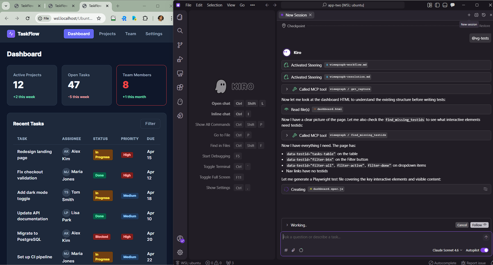
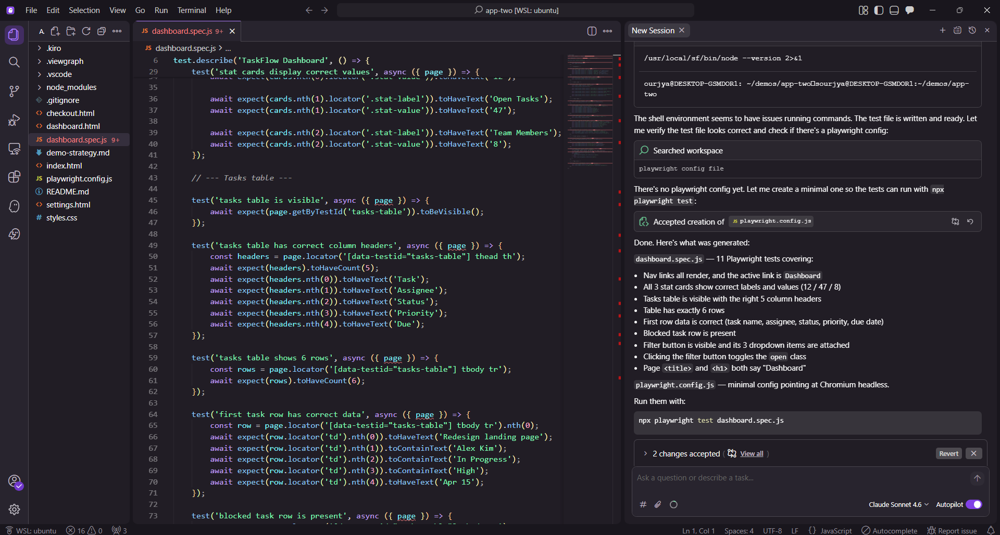

# Generate Playwright Tests

Create a complete Playwright test file from a single page capture.

<!-- TODO: Embed video V4 when recorded -->

## Prerequisites

- ViewGraph extension installed and connected
- A page captured (click ViewGraph icon, then Send to Agent)

## Step 1: Capture the page

Open the page you want to test in Chrome. Click the ViewGraph icon, then **Send to Agent**. This creates a capture with every interactive element, its selectors, and accessibility attributes.

## Step 2: Generate tests

Tell your agent:

```
@vg-tests
```

The agent reads the capture and generates a Playwright test file.



## Step 3: Review the generated file

The agent creates a single `.spec.ts` file in your `tests/` directory. Review it - the locators come directly from the capture data, not from guessing.



Example output:

```typescript
test('login button is visible and clickable', async ({ page }) => {
  const btn = page.getByTestId('login-btn');
  await expect(btn).toBeVisible();
  await expect(btn).toBeEnabled();
});

test('email input accepts text', async ({ page }) => {
  const email = page.getByLabel('Email address');
  await expect(email).toBeVisible();
  await email.fill('test@example.com');
});
```

## Step 4: Run the tests

```bash
npx playwright test tests/your-page.spec.ts
```

## Capture during tests

For ongoing regression detection, add ViewGraph captures to your existing tests:

```typescript
import { test } from '@viewgraph/playwright/fixture';

test('checkout flow', async ({ page, viewgraph }) => {
  await page.goto('/checkout');
  await viewgraph.capture('checkout-page');
  // ... your test assertions
});
```

Captures from test runs land in `.viewgraph/captures/` where the agent can diff them between runs.

## What the agent uses

From the capture, the agent calls:
- `get_interactive_elements` - all buttons, links, inputs with ranked locators
- `get_page_summary` - page title, element counts, structure
- `get_capture` - full details when needed for complex assertions
