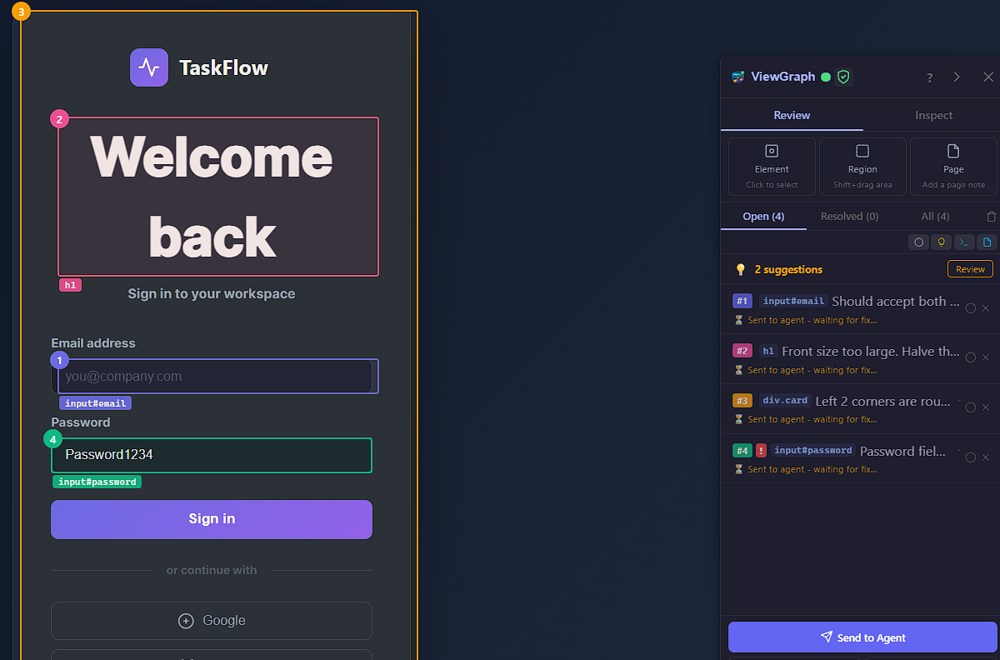
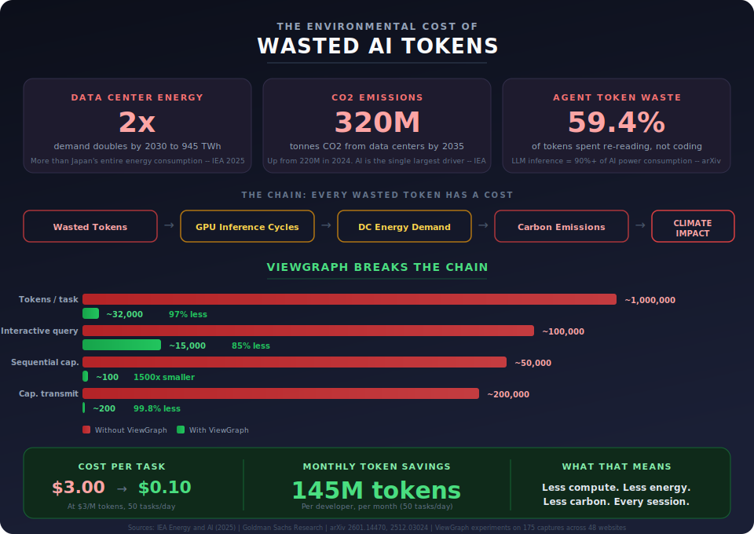

# Why ViewGraph?

## See It. Click It. Fixed.

After annotating and sending to the agent:

Three bugs found, annotated, and fixed - without opening DevTools.

---

## Why Not Just Paste a Screenshot?

The most common workaround for "the agent can't see my UI" is pasting a screenshot. Here's why that falls short - for your workflow and for the planet:

| | Screenshot in IDE | ViewGraph capture |
|---|---|---|
| **Token cost** | 100,000+ (base64 PNG) | 500-2,000 (structured summary) |
| **Energy impact** | ~50-200x more compute per query | Minimal inference cost |
| **CSS selectors** | None - agent guesses | Exact selector for every element |
| **Computed styles** | Pixels, not values | `font-size: 56px`, `border-radius: 0` |
| **Accessibility** | Invisible | ARIA roles, labels, violations flagged |
| **Source file** | Impossible to find | `find_source` maps element to file:line |
| **Agent action** | "I see a big heading" | "h1 at `index.html:38`, font-size 56px" |
| **Cross-page** | One screenshot per page | Structural diff, baseline, consistency check |

A screenshot costs 50-200x more tokens and gives the agent almost nothing actionable. That's 50-200x more compute, more energy, and more carbon - for a worse result.

<figure></figure>

---

## You Don't Need to Speak DOM

ViewGraph separates the human skill (seeing what's wrong) from the technical skill (knowing the DOM).

Click what looks broken. Describe it in plain language. ViewGraph captures the selectors, styles, accessibility state, and source locations automatically.

Junior developers, PMs, designers, QA testers, bootcamp graduates, career switchers, backend engineers doing frontend work - anyone who can see a problem can report it with enough precision for an AI agent to fix it.

See [Who Benefits?](who-benefits.md) for the full breakdown.

---

## 23 Problems It Solves {#common-problems}




**Common**

| # | Problem | How ViewGraph helps |
|---|---|---|
| 1 | **Agent can't see the UI** | Captures rendered DOM, styles, layout, a11y state, console, network - agent works from browser reality |
| 2 | **Can't explain the bug precisely** | Packages exact element context and runtime signals into structured evidence |
| 3 | **Bug reports stop at symptoms** | Links visible symptoms to browser-level causes (overflow, z-index, failed requests) |
| 4 | **Responsive bugs are hard to reproduce** | Records breakpoint-specific DOM, bounding boxes, and layout at the exact viewport |
| 5 | **Localization breaks layouts** | Captures actual rendered structure to detect text expansion, clipping, broken grids |
| 6 | **Visual diffs show change, not meaning** | Structural comparison with element-level context, not just pixel noise |
| 7 | **Cross-page consistency drifts** | Compare shared components across pages to detect spacing, style, and interaction drift |

**Development**

| # | Problem | How ViewGraph helps |
|---|---|---|
| 8 | **Don't know which file renders this** | Maps elements to source files via selectors, testids, and component hints |
| 9 | **Can't debug z-index/focus/scroll from code** | Captures computed geometry, stacking, focus chains, overflow - invisible in source |
| 10 | **AI agents struggle with frontend** | Gives agents rendered context to reason about UI failures instead of guessing |
| 11 | **Source mapping without DevTools** | Attaches machine-usable metadata to reduce manual browser-to-source tracing |
| 12 | **Agent-driven self-healing** | Agent inspects failing UI, infers source file, proposes fix, resolves annotation |
| 13 | **Frontend onboarding is slow** | Externalizes browser-to-component knowledge that usually lives in senior engineers' heads |

**Testing & QA**

| # | Problem | How ViewGraph helps |
|---|---|---|
| 14 | **QA handoffs are vague** | Capture element-level evidence, export as markdown or ZIP with screenshots |
| 15 | **A11y audits disconnected from fixes** | Connects violations to DOM context and source locations for faster remediation |
| 16 | **Visual regressions slip through** | Structural comparison and baseline checking catch missing elements and drift |
| 17 | **Test passed but page is broken** | Complements functional tests with layout audits and rendered-state inspection |
| 18 | **Playwright triage lacks context** | Captures DOM, console, network during test runs for richer failure artifacts |
| 19 | **No regression baselines** | Baseline and diff workflows for critical journeys (auth, checkout, onboarding) |

**Review & Release**

| # | Problem | How ViewGraph helps |
|---|---|---|
| 20 | **Design QA happens too late** | Earlier capture and review of rendered UI, closer to PR stage |
| 21 | **PR review without rendered evidence** | Enriches code review with structural diffs and layout context |
| 22 | **Design-system drift** | Compare component behavior across surfaces to detect consistency leaks |
| 23 | **Support escalation without context** | Capture production-state evidence with UI structure and runtime diagnostics |




| # | Problem | How ViewGraph helps |
|---|---|---|
| 1 | **Agent can't see the UI** | Captures rendered DOM, styles, layout, a11y state, console, network - agent works from browser reality |
| 2 | **Can't explain the bug precisely** | Packages exact element context and runtime signals into structured evidence |
| 3 | **Bug reports stop at symptoms** | Links visible symptoms to browser-level causes (overflow, z-index, failed requests) |
| 4 | **Responsive bugs are hard to reproduce** | Records breakpoint-specific DOM, bounding boxes, and layout at the exact viewport |
| 5 | **Localization breaks layouts** | Captures actual rendered structure to detect text expansion, clipping, broken grids |
| 6 | **Visual diffs show change, not meaning** | Structural comparison with element-level context, not just pixel noise |
| 7 | **Cross-page consistency drifts** | Compare shared components across pages to detect spacing, style, and interaction drift |



| # | Problem | How ViewGraph helps |
|---|---|---|
| 8 | **Don't know which file renders this** | Maps elements to source files via selectors, testids, and component hints |
| 9 | **Can't debug z-index/focus/scroll from code** | Captures computed geometry, stacking, focus chains, overflow - invisible in source |
| 10 | **AI agents struggle with frontend** | Gives agents rendered context to reason about UI failures instead of guessing |
| 11 | **Source mapping without DevTools** | Attaches machine-usable metadata to reduce manual browser-to-source tracing |
| 12 | **Agent-driven self-healing** | Agent inspects failing UI, infers source file, proposes fix, resolves annotation |
| 13 | **Frontend onboarding is slow** | Externalizes browser-to-component knowledge that usually lives in senior engineers' heads |



| # | Problem | How ViewGraph helps |
|---|---|---|
| 14 | **QA handoffs are vague** | Capture element-level evidence, export as markdown or ZIP with screenshots |
| 15 | **A11y audits disconnected from fixes** | Connects violations to DOM context and source locations for faster remediation |
| 16 | **Visual regressions slip through** | Structural comparison and baseline checking catch missing elements and drift |
| 17 | **Test passed but page is broken** | Complements functional tests with layout audits and rendered-state inspection |
| 18 | **Playwright triage lacks context** | Captures DOM, console, network during test runs for richer failure artifacts |
| 19 | **No regression baselines** | Baseline and diff workflows for critical journeys (auth, checkout, onboarding) |



| # | Problem | How ViewGraph helps |
|---|---|---|
| 20 | **Design QA happens too late** | Earlier capture and review of rendered UI, closer to PR stage |
| 21 | **PR review without rendered evidence** | Enriches code review with structural diffs and layout context |
| 22 | **Design-system drift** | Compare component behavior across surfaces to detect consistency leaks |
| 23 | **Support escalation without context** | Capture production-state evidence with UI structure and runtime diagnostics |


