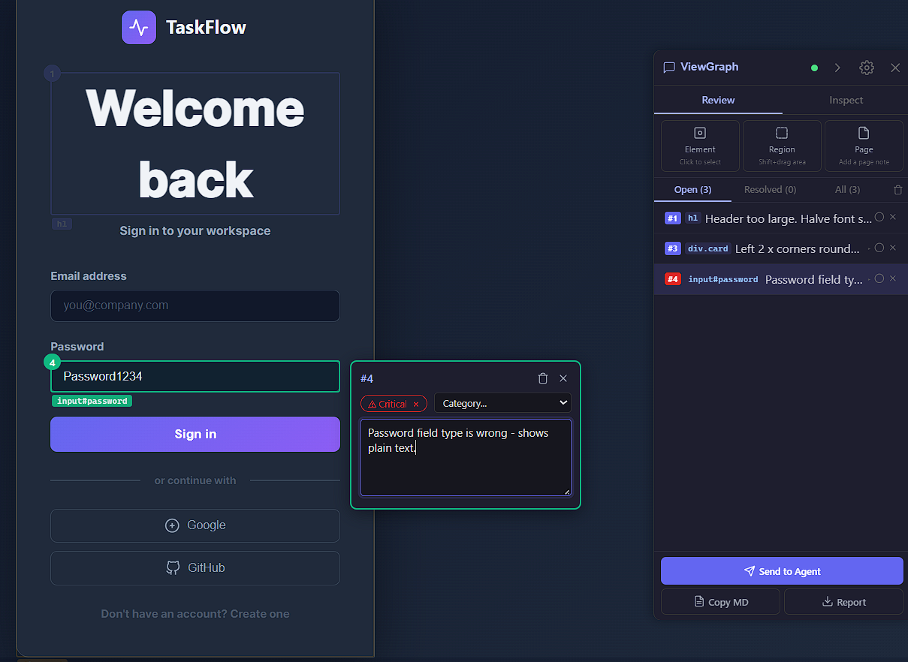
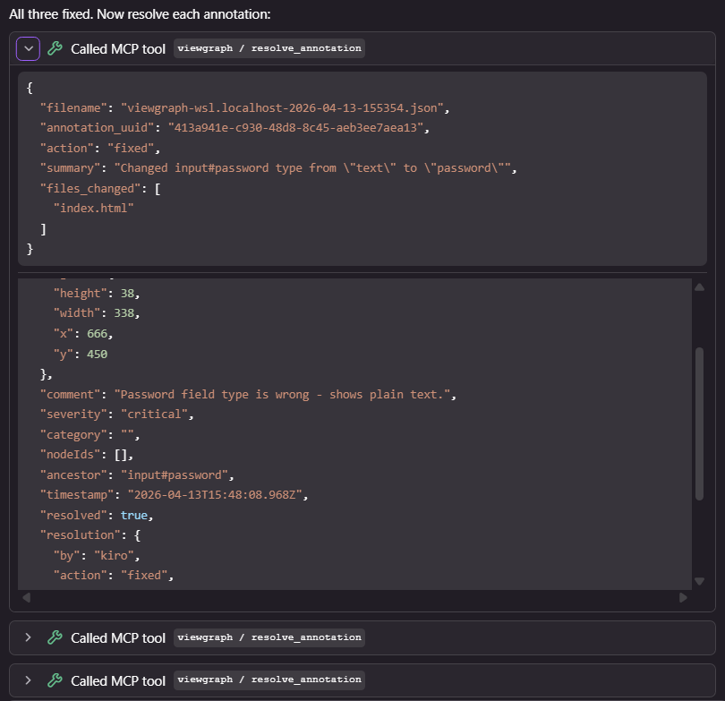
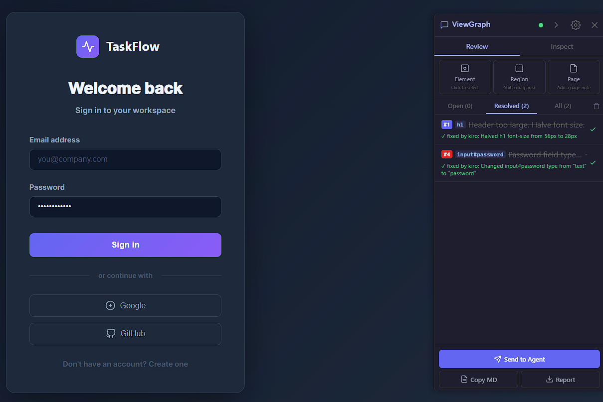

# Why ViewGraph?

ViewGraph strengthens UI-heavy workflows across development, testing, QA, review, and release. Here are the [23 problems](#common-problems) it solves, organized by workstream.

After annotating the issues and sending to the agent:

## At a Glance

| Workstream | Problems solved |
|---|---|
| **Common (1-7)** | Agent can't see UI, vague bug reports, symptom-only reports, responsive bugs, localization breaks, meaningless visual diffs, cross-page drift |
| **Development (8-13)** | Source file discovery, computed-state bugs, AI agent frontend support, source mapping, agent-driven self-healing, onboarding acceleration |
| **Testing & QA (14-19)** | Vague handoffs, disconnected a11y audits, visual regressions, "test passed but page is broken", Playwright triage, regression baselines |
| **Review & Release (20-23)** | Late design QA, PR review without rendered evidence, design-system drift, support escalation without context |

---

## Screenshots vs Structured Captures

The most common workaround for "the agent can't see my UI" is pasting a screenshot into the IDE. Here's why that doesn't work well:

| | Screenshot (pasted into IDE) | ViewGraph capture |
|---|---|---|
| **Token cost** | 100,000+ tokens (base64 PNG) | 500-2,000 tokens (summary or interactive elements) |
| **CSS selectors** | None - agent has to guess | Exact selector for every element |
| **Computed styles** | None - agent sees pixels, not values | `font-size: 56px`, `border-radius: 0`, `color: #475569` |
| **Accessibility state** | Invisible in pixels | ARIA roles, labels, missing alt text flagged |
| **Source file linking** | Impossible | `find_source` maps element to file:line |
| **Actionable by agent** | "I see a big heading" (vague) | "h1 has font-size 56px, selector `h1`, file `index.html:38`" (precise) |
| **Works across pages** | One screenshot per page | Structural diff, baseline comparison, consistency check |

A screenshot costs 50-200x more tokens than a ViewGraph capture and gives the agent almost nothing it can act on. The agent can describe what it sees in the image, but it can't generate a CSS fix from pixels alone. ViewGraph gives it the exact values, selectors, and source locations it needs.

---

## You Don't Need to Speak DOM

ViewGraph eliminates the need to be fluent in browser internals. You point at what's wrong and describe it in plain language. The tool captures the technical details automatically.

Junior developers, PMs, designers, QA testers, bootcamp graduates, career switchers, backend engineers doing frontend work - anyone who can see a problem can now report it with enough precision for an AI agent to fix it.

See [Who Benefits?](who-benefits.md) for the full list of audiences and how ViewGraph helps each one.

## Built-In Diagnostics - No DevTools Required

The Inspect tab surfaces browser-level diagnostics that normally require opening DevTools, navigating to the right panel, and knowing what to look for. ViewGraph puts it all in one sidebar:

- **Failed network requests** - click to expand the full URL, request type, and duration. You can see which API call failed without opening the Network tab.
- **Console errors** - JavaScript errors and warnings from the page, with the error message. No need to open the Console tab.
- **Accessibility issues** - missing labels, low contrast, keyboard traps. No need to run Lighthouse or install a separate extension.
- **Layout problems** - overflow, z-index conflicts, focus chain issues. Normally invisible without inspecting computed styles.

Each diagnostic section has a copy button. Click it, paste into a chat with your AI agent or a senior developer, and get help immediately. This is especially valuable for:

- **Junior developers** who haven't memorized DevTools workflows yet
- **QA testers** who need to report technical details without being frontend experts
- **Career switchers** from non-tech backgrounds learning to debug web apps
- **Backend engineers** doing occasional frontend work who don't live in the browser
- **PMs and designers** who can now include technical evidence in their feedback

The diagnostics are captured at the moment you click the ViewGraph icon - they reflect the exact state of the page you're looking at, not a stale snapshot.

## One-Click Error Reporting to Your IDE

Traditional bug reporting: notice something broken, open DevTools, find the Network tab, locate the failed request, screenshot it, switch to Console, copy the error, open Jira, write a description, attach the screenshots, assign it, wait for a developer to reproduce it.

ViewGraph: click the note icon next to the error. Done.

Every diagnostic section in the sidebar - network failures, console errors, accessibility issues, layout problems - has a note button. One click creates an annotation pre-populated with the technical details. It shows up in your annotation list alongside your visual bug reports. When you click "Send to Agent", everything goes to your AI coding assistant together - the visual issues you pointed at AND the technical errors the browser detected.

**For non-technical users:** You don't need to know what a "failed network request" means. You see a red badge that says "2 failed" - click the note icon, and the error details are packaged for the developer or AI agent automatically. You just added a technical bug report without writing a single technical word.

**For developers:** The diagnostic note contains the full URL, request type, duration, and failure reason. Your agent receives it as structured annotation data in the capture, alongside the DOM context. It can correlate the failed API call with the broken UI element and fix both the frontend error handling and the root cause.

**For QA teams:** Copy the diagnostic section to clipboard and paste into Jira. Or create a note and send the whole capture to the developer's agent. Either way, the bug report arrives with evidence instead of "something is broken on the dashboard."

---

## Common Problems

### 1. The agent can't see what I see
Something is clearly wrong on the screen, but the agent only sees source code and has to guess what the browser actually rendered.

**What it solves:** ViewGraph captures rendered DOM structure, selectors, computed styles, layout geometry, accessibility state, console warnings, network issues, and component names so the agent works from browser reality instead of source-only assumptions.

**Why it matters:** This is the foundation for every other workflow. If the agent cannot see the UI state, every frontend fix starts as guesswork.

### 2. I can't explain the bug precisely enough
People know something looks broken, but describing it clearly enough for a developer or agent is harder than it sounds.

**What it solves:** ViewGraph packages the exact element context, visual state, viewport-specific layout details, and runtime signals into a structured capture so the issue is described with evidence instead of vague language.

**Why it matters:** It cuts down the endless back-and-forth where people keep rephrasing the same bug and still miss the real issue.

### 3. Bug reports stop at symptoms, not causes
Most bug reports describe what feels wrong, not what is actually going wrong under the hood.

**What it solves:** ViewGraph links visible symptoms to browser-level evidence such as overflow clipping, bad stacking context, missing accessible names, failed network requests, or console-side runtime failures.

**Why it matters:** Teams spend less time translating vague symptoms into technical hypotheses and more time fixing the actual problem.

### 4. Responsive bugs are hard to reproduce
A layout can look fine on desktop and fall apart on tablet or mobile, but the report usually lands as "it's weird on smaller screens."

**What it solves:** ViewGraph records breakpoint-specific DOM, bounding boxes, computed styles, and layout structure so responsive issues can be captured and compared at the exact viewport where they occur.

**Why it matters:** Responsive bugs stop being ghost stories and become concrete, reproducible technical artifacts.

### 5. Localization quietly breaks layouts
Everything seems fine until longer translated text arrives and suddenly buttons, menus, and cards start misbehaving.

**What it solves:** ViewGraph makes it easier to detect text expansion issues, wrapped labels, clipped content, broken grids, and layout instability across language variants by capturing actual rendered structure.

**Why it matters:** It helps teams catch global product issues before users do the QA for them.

### 6. Visual diffs show change, not meaning
A screenshot diff can tell you that pixels changed, but not whether the change is harmless, critical, or which element caused it.

**What it solves:** ViewGraph adds structural context, element-level comparison, and source-oriented clues so regressions can be analyzed beyond image noise.

**Why it matters:** It reduces false alarms and improves confidence in what actually needs attention.

### 7. Cross-page consistency breaks silently
Products rarely become inconsistent overnight. They slowly drift until everything feels slightly off.

**What it solves:** ViewGraph enables structural comparison across pages and flows so teams can detect drift in shared components, spacing rules, interaction patterns, and accessibility conventions.

**Why it matters:** Consistency problems are easier to prevent than to clean up once they spread across the product.

---

## Development

### 8. I don't know which file renders this element
In a large frontend codebase, finding the file behind one stubborn element can take more time than fixing the bug itself.

**What it solves:** ViewGraph uses selectors, data-testid values, component hints, and React fiber source paths to connect rendered elements back to implementation files.

**Why it matters:** It shortens one of the most annoying parts of frontend debugging: locating ownership before making a fix.

### 9. I can't debug z-index, focus, or scroll issues from code
Some bugs look tiny on screen but turn into a swamp the moment you open the code.

**What it solves:** ViewGraph captures computed browser state such as geometry, overflow relationships, focus chains, and stacking behavior that are invisible in source files but decisive in runtime behavior.

**Why it matters:** It helps solve the class of bugs where source code alone tells only half the story.

### 10. AI agents can actually work on frontend bugs
Frontend work is where many AI coding agents start looking clever right up until the browser gets involved.

**What it solves:** ViewGraph gives agents the rendered context they need to reason about UI failures, style issues, interaction breakage, and source mapping instead of blindly editing CSS or component code.

**Why it matters:** It turns AI-assisted frontend debugging from hopeful experimentation into something teams can actually rely on.

### 11. Source mapping without DevTools archaeology
Nobody enjoys clicking through layers of DOM and component wrappers just to find where one button comes from.

**What it solves:** ViewGraph reduces manual browser-to-source tracing by attaching machine-usable metadata around the selected element and its surrounding structure.

**Why it matters:** It cuts investigation time and lowers the amount of manual browser spelunking needed before a fix can begin.

### 12. Agent-driven self-healing
For small, low-risk UI issues, teams would love a patch before the coffee gets cold.

**What it solves:** With a capture as input, an agent can inspect the failing UI state, infer the likely source file, propose a targeted code change, and resolve the annotation - all without human intervention.

**Why it matters:** This is where AI coding agent support becomes real workflow value instead of just a flashy promise.

### 13. Frontend onboarding acceleration
New engineers should not need tribal rituals to understand which piece of UI comes from where.

**What it solves:** ViewGraph externalizes browser-to-component knowledge that usually lives only in senior engineers' heads, making source discovery and UI inspection more repeatable for new contributors.

**Why it matters:** It reduces ramp-up time and lowers dependency on tribal memory.

---

## Testing & QA

### 14. QA handoffs are vague
Testers often know exactly what looks wrong, but the handoff still arrives as a screenshot plus a sentence that leaves engineering guessing.

**What it solves:** ViewGraph lets QA capture element-level evidence, styles, layout data, runtime signals, and annotations that can be exported as markdown reports or ZIP archives.

**Why it matters:** Better bug reports mean less triage churn and faster ownership.

### 15. Accessibility audits are disconnected from fixes
Accessibility tools are good at finding violations, but they often leave teams to do the painful last mile by hand.

**What it solves:** ViewGraph connects accessibility findings to DOM context, element metadata, and source-location clues so remediation starts closer to the right fix path.

**Why it matters:** It compresses the most frustrating part of accessibility work: turning audit output into engineering action.

### 16. Visual regressions slip through
A small UI break on one page can sneak through because nothing functionally failed and no one happened to notice.

**What it solves:** ViewGraph supports structural comparison, baseline checking, and layout-aware analysis so teams can detect missing elements, drift, and page-level regressions earlier.

**Why it matters:** It improves confidence in releases without relying only on human eyeballs.

### 17. The test passed, but the page is still broken
A button can technically be clickable and still look like it survived a bar fight.

**What it solves:** ViewGraph complements functional automation with structural UI evidence, layout audits, and rendered-state inspection so teams can catch "works but looks wrong" failures.

**Why it matters:** It fills the gap between behavioral correctness and actual user-visible quality.

### 18. Playwright failure triage with real browser context
A failing E2E test gives you a broken assertion, but not always the full story behind the failure.

**What it solves:** ViewGraph captures DOM state, layout data, console errors, network failures, and related UI context during Playwright runs so failures are easier to inspect and route.

**Why it matters:** It turns cryptic test failures into richer debugging artifacts.

### 19. Regression baselines for key journeys
Not every page needs heavy monitoring, but the critical journeys absolutely do.

**What it solves:** ViewGraph supports baseline and diff workflows for high-value paths such as onboarding, authentication, settings, and checkout so teams can protect the pages that matter most.

**Why it matters:** It gives targeted release confidence where the business impact is highest.

---

## Review & Release

### 20. Design QA happens too late
Visual and interaction issues are often discovered only after a feature is already "done" in engineering terms.

**What it solves:** ViewGraph enables earlier capture and review of rendered UI state so design quality checks can happen closer to PR and staging workflows instead of only at the end.

**Why it matters:** The earlier UI issues are found, the cheaper and less annoying they are to fix.

### 21. PR review with rendered evidence
A pull request can look neat in code and still quietly ship visual nonsense.

**What it solves:** ViewGraph can enrich code review with rendered-state context, structural diffs, and layout-oriented clues so frontend changes are reviewed as UI outcomes, not just code deltas.

**Why it matters:** It makes frontend review less theoretical and more grounded in what users will actually see.

### 22. Design-system drift detection
A design system does not usually fail all at once. It slowly leaks consistency across teams, flows, and apps.

**What it solves:** ViewGraph makes it easier to compare component behavior and structure across surfaces so spacing drift, attribute inconsistencies, and interaction mismatches can be detected earlier.

**Why it matters:** This is a strong angle for platform teams trying to keep shared UI systems from gradually mutating into chaos.

### 23. Support-to-engineering escalation with evidence
Users report what they experienced, not the technical conditions that caused it.

**What it solves:** ViewGraph helps capture rendered production-state evidence with UI structure and runtime diagnostics so support escalations arrive with more than vague reproduction notes.

**Why it matters:** It reduces the gap between "customer says this is broken" and "engineering can finally reproduce it."
